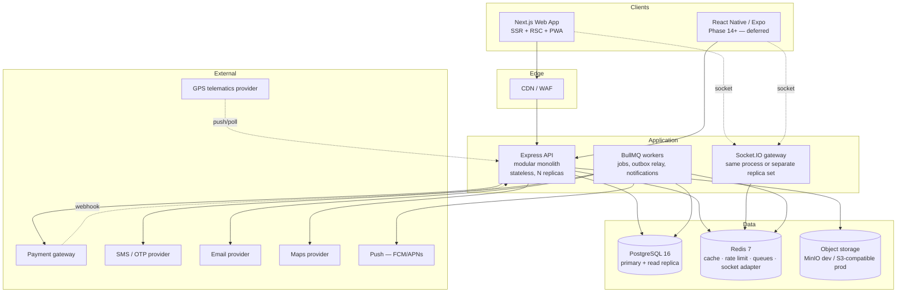
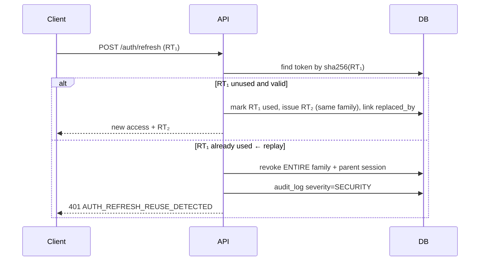
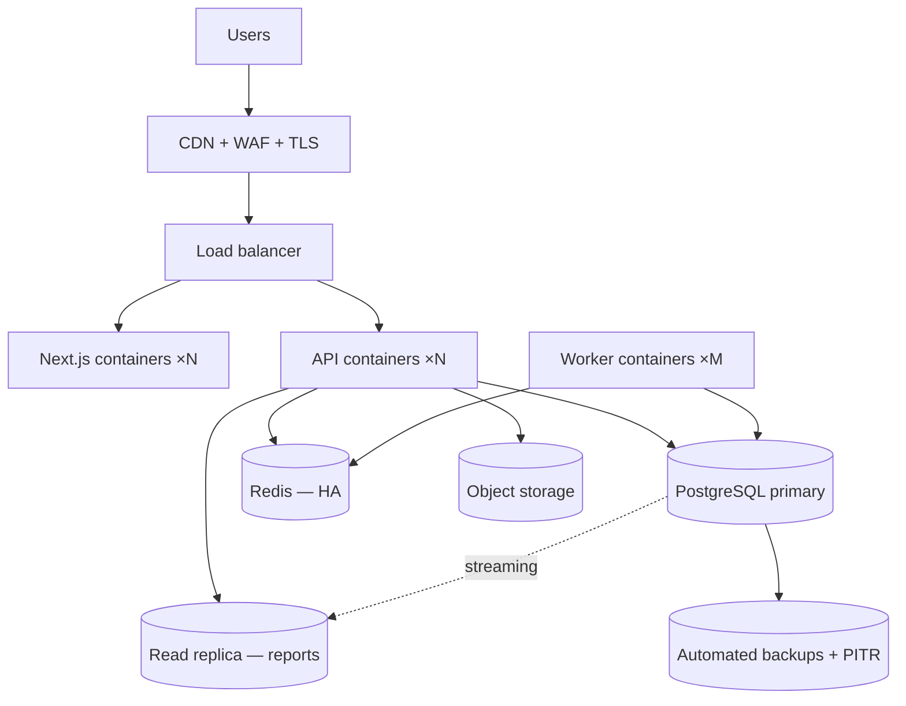

# UniGate — System Architecture

**Status:** Phase 1 — proposed, pending confirmation of the open questions in [assumptions.md](assumptions.md)
**Scope:** Vehicle Hiring & Management Platform (passenger + goods transport), Kingdom of Saudi Arabia
**Last updated:** 2026-09-14

Companion documents: [requirements-analysis.md](requirements-analysis.md) · [database.md](database.md) · [api.md](api.md) · [security.md](security.md) · [assumptions.md](assumptions.md) · [IMPLEMENTATION_STATUS.md](IMPLEMENTATION_STATUS.md)

---

## 1. What is being built

A two-sided marketplace with a heavy operational back-office.

- **Demand side** — customers (individual and corporate) raise *trip requests* for passenger or goods transport.
- **Supply side** — vehicle owners (companies and owner-operators) run fleets and drivers, and *bid* on requests.
- **The platform** — matches supply to demand, takes payment, holds a commission, executes and tracks the trip, and settles the owner.

Three characteristics drive every architectural decision that follows:

| Characteristic | Consequence |
|---|---|
| **It moves money.** Commission, VAT, refunds and owner payouts. | Financial facts must be immutable, snapshotted and reconstructible from a ledger. Never floats. Never recomputed. |
| **It has a contention point.** Many owners bid; one vehicle can serve one trip at a time. | Correctness under concurrency must be enforced by the database, not by application checks. |
| **It is multi-tenant with sensitive data.** Owners must not see each other; customers must not see each other; location is tracked in real time. | Authorization is two-layered and enforced in the data-access layer, not the controller. |

---

## 2. Architecture style and the decisions behind it

**A modular monolith API + separate web application, in a monorepo.**



### Why a modular monolith rather than microservices

This is the most consequential decision in the document, so it is argued rather than asserted.

The domain is transactional and highly coupled. The single most important operation in the system — **bid acceptance** — must atomically: validate a bid, reserve a vehicle against a time window, create a booking, freeze a commission calculation, reject sibling bids and emit notifications. In a monolith that is one PostgreSQL transaction with an exclusion constraint doing the hard part. Split across services it becomes a saga with compensating transactions, and the "one vehicle, one trip" invariant degrades from a database guarantee to an eventually-consistent hope. For a platform whose core value is *not double-booking vehicles*, that trade is a bad one.

The modular monolith keeps strict module boundaries — so the parts that genuinely need independent scaling (tracking ingestion, notification dispatch, report generation) can be extracted later without a rewrite — while keeping the transactional core in one place. Full reasoning in [ADR-001](decisions/ADR-001-monorepo-and-modular-monolith.md).

**What is already separated:** background workers run as their own process (same image, different entrypoint), so a flood of notification jobs or a heavy report export cannot starve the request path. Socket.IO can be deployed as its own replica set behind the same Redis adapter when tracking volume justifies it.

### Module boundary rules

1. A module owns its tables. No other module writes them.
2. Cross-module reads go through the owning module's **service**, never its repository and never a direct join into its tables. The one sanctioned exception is read-only reporting queries, which are isolated in the `reporting` module and documented as such.
3. Cross-module side effects go through **domain events**, not direct calls — `bidding` does not call `notifications`; it emits `bid.accepted`.
4. Shared kernel (`common/`) holds only genuinely universal concerns: errors, the response envelope, pagination, the audit writer, money utilities, the scope type.
5. **Core modules never branch on `transport_type`.** Anything that differs between passenger and goods is reached through the `VerticalPlugin` registry ([ADR-010](decisions/ADR-010-vertical-modules-over-a-shared-core.md)). Core may import the plugin interface and registry, never `modules/passenger/*` or `modules/goods/*`; verticals may import core services, never each other. A `transport_type` comparison inside a core module is a lint error.

These rules are enforced by an ESLint `no-restricted-imports` boundary configuration, not by discipline alone.

---

## 3. Monorepo structure

```
unigate/
├── apps/
│   ├── api/                          Express 5 + TypeScript (Node 22 LTS)
│   │   ├── prisma/
│   │   │   ├── schema.prisma
│   │   │   ├── migrations/           incl. hand-written SQL for EXCLUDE/partial/CHECK
│   │   │   └── seed/                 reference.ts · permissions.ts · demo.ts (dev only)
│   │   └── src/
│   │       ├── main.ts               HTTP entrypoint
│   │       ├── worker.ts             BullMQ entrypoint (same image)
│   │       ├── app.ts                express app assembly
│   │       ├── config/               env schema + typed config object
│   │       ├── common/               errors · envelope · pagination · money · scope · audit
│   │       ├── middleware/           auth · permission · scope · validate · rateLimit
│   │       │                         · requestId · errorHandler · idempotency · audit
│   │       ├── modules/              ← the 18 business modules (§4)
│   │       ├── integrations/         payment/ sms/ email/ push/ storage/ maps/ tracking/
│   │       ├── events/               bus · outbox relay · handlers
│   │       ├── jobs/                 queues · processors · schedulers
│   │       ├── realtime/             socket server · namespaces · room authorization
│   │       ├── database/             prisma client · extensions · transaction helper
│   │       └── utils/
│   └── web/                          Next.js 15 App Router
│       ├── messages/{en,ar}.json
│       └── src/
│           ├── app/[locale]/(public|auth|customer|owner|driver|spo|admin)/…
│           ├── components/           feature components
│           ├── features/             per-domain hooks + api clients + schemas
│           ├── lib/                  api client · auth · query client · i18n · format
│           └── stores/               Zustand — only where genuinely needed
├── packages/
│   ├── types/                        DTO interfaces · domain enums · transition maps
│   ├── validation/                   Zod schemas shared by API and forms
│   ├── ui/                           shadcn/ui based component library
│   ├── config/                       shared runtime config helpers
│   ├── eslint-config/ · tsconfig/
├── docs/                             this documentation set + decisions/
├── docker/                           Dockerfile.api · Dockerfile.web · init scripts
├── docker-compose.yml                postgres · redis · minio · mailhog
├── .env.example · pnpm-workspace.yaml · turbo.json · package.json
```

### The shared-types rule (brief §4 — "shared DTOs without coupling frontend to database entities")

This is easy to get wrong, so it is stated as a hard rule:

- `packages/types` contains **hand-written** interfaces. It has **no dependency on Prisma**. `import type { Vehicle } from '@prisma/client'` outside `apps/api` is an ESLint error.
- Every API response is produced by an explicit **mapper** (`toVehicleDto(entity, scope)`). Mappers allow-list fields. They never spread an entity.
- The practical consequence: adding a column to a Prisma model **cannot** cause it to appear in an API response. Someone has to add it to the DTO and the mapper on purpose. This is the structural defence against the PII leaks described in [security.md](security.md).
- `packages/validation` holds Zod schemas for **inputs**. The API validates with them; React Hook Form resolves with them. One definition, no drift, and validation rules cannot disagree between client and server.

### Build orchestration

Turborepo pipeline: `build` depends on `^build`; `typecheck`, `lint`, `test` run in parallel with remote caching. `packages/types` and `packages/validation` build first because everything depends on them. CI runs `turbo run typecheck lint test build` — the same command a developer runs locally.

---

## 4. Domain modules

Twenty modules: **eighteen core modules that never branch on `transport_type`, and two vertical modules that own everything that differs** — [ADR-010](decisions/ADR-010-vertical-modules-over-a-shared-core.md), agreed with UniGate 2026-09-15. Each owns its tables, exposes a service, and publishes domain events.

| Module | Owns | Core responsibility | Phase |
|---|---|---|---|
| **`passenger`** *(vertical)* | passenger_trip_details, the passenger trip transition map, passenger document checklist, passenger invoice-line wording and VAT decision | Everything specific to moving people: pilgrim/group manifests, seat capacity matching, ≥10-seat zero-rating test, TGA passenger regime hooks | 6–11 (built first) |
| **`goods`** *(vertical)* | goods_trip_details, the goods trip transition map, freight document checklist, Bayan hook, goods invoice-line wording and VAT decision | Everything specific to moving freight: payload/volume matching, loading/POD lifecycle, Bayan transport document (OQ-29), cross-border zero-rating evidence (OQ-27) | **11b** — schema in Phase 2, module after the core is proven |
| `iam` | users, sessions, refresh_tokens, otp_requests, roles, permissions, user_roles | Authentication, token lifecycle, RBAC resolution | 3 |
| `profiles` | customer/corporate/owner/driver/spo profiles, saved_locations, owner_bank_accounts | Actor identity and onboarding state | 4 |
| `reference` | regions, cities, categories, makes/models, document types, settings | Admin-editable master data | 2 |
| `documents` | documents | Upload, verification, expiry, signed access | 4 |
| `fleet` | vehicles, driver assignments, calendar entries, service areas, gps_devices | Vehicle lifecycle, approval, **availability** | 5 |
| `demand` | trip_requests, invitations | Request lifecycle and opportunity matching — **delegates detail schema, validation and matching predicates to the vertical plugin** | 6 |
| `bidding` | bids | Bid submission, comparison, **acceptance** | 7 |
| `bookings` | bookings, status history, cancellations | Commercial contract lifecycle | 8 |
| `trips` | trips, status history, proofs | Operational execution, POD — **executes whichever transition map the vertical plugin supplies** | 10 |
| `tracking` | tracking_sessions, current locations, location points | Location ingestion and authorized fan-out | 10 |
| `payments` | payments, transactions, tokens, webhooks, refunds | Gateway orchestration | 9 |
| `finance` | commission rules, snapshots, ledger, settlements, invoices, expenses | Money truth | 11 |
| `maintenance` | maintenance records and schedules | Servicing, reminders, availability impact | 12 |
| `engagement` | ratings, complaints | Post-trip feedback and disputes | 13 |
| `notifications` | templates, notifications, preferences, device tokens | Multi-channel delivery | 3 (OTP) → 13 |
| `reporting` | export_jobs (read-only elsewhere) | Aggregations and exports | 13 |
| `admin` | — (orchestrates others) | Back-office operations, dashboards | 13 |
| `platform` | audit_logs, outbox_events, idempotency_keys | Cross-cutting infrastructure | 2 |

### Layering inside a module

```
routes.ts        path → middleware chain → controller method. No logic.
controller.ts    parse (Zod) → call service → map to DTO → envelope. Thin, ~10 lines/handler.
service.ts       business rules, transactions, event emission. The only place rules live.
policy.ts        can this actor do this to this record? Pure functions, unit-tested.
repository.ts    Prisma access. Every list/read takes an ActorScope and applies it.
mapper.ts        entity → DTO, allow-listed, scope-aware.
schema.ts        re-export of the module's Zod schemas from packages/validation.
```

A controller that contains an `if` on business state is a review rejection. A repository method without an `ActorScope` parameter fails a type check.

---

## 5. Authentication architecture

### 5.1 Token model

| Token | Lifetime | Storage (web) | Storage (mobile) | Revocable |
|---|---|---|---|---|
| Access JWT | 15 min | `httpOnly; Secure; SameSite=Lax` cookie | secure storage, sent as Bearer | No (short life instead) |
| Refresh token | 30 days, rotating | `httpOnly; Secure; SameSite=Lax; Path=/api/v1/auth` cookie | platform secure storage | **Yes** — hash stored in DB |

Access JWT claims: `sub`, `sid` (session), `roles` (codes), `pv` (permission version), `typ`, `iat`, `exp`, `iss`, `aud`.

**Permission codes are deliberately NOT in the token.** A user with 60 permissions would produce a large token sent on every request, and — worse — revoking a permission would not take effect until the token expired. Instead the token carries a `pv` (permission version); the API loads the permission set from Redis (`perm:{userId}:{pv}`, TTL 15 min) on each request, falling back to Postgres. Any role or permission change bumps `users.permission_version`, which instantly invalidates every cached set and every in-flight token's authority. Revocation is immediate; the token stays small.

### 5.2 Refresh rotation with family reuse detection



If a refresh token is stolen, either the attacker or the legitimate user will present an already-used token. That single event proves compromise, and the response is to kill the whole family. This is the highest-value control in the auth design and it costs one nullable column.

### 5.3 Dual-mode clients

The same API serves a cookie-based web app and a Bearer-based mobile app. The auth middleware reads `Authorization: Bearer` first, then falls back to the cookie. The client declares itself via `X-Client-Type`, which determines how tokens are returned.

Cookie mode introduces CSRF exposure on the refresh and mutation endpoints. Mitigations: `SameSite=Lax` (blocks cross-site form POSTs), a required `X-Requested-With: unigate-web` header on state-changing requests (a value a cross-origin form cannot set without a preflight the CORS allow-list will refuse), and a strict CORS origin list with `credentials: true` and **no wildcard**. Detailed in [security.md](security.md).

### 5.4 OTP

`OtpProvider` interface with `send(destination, code, purpose, locale)`. Development uses `ConsoleOtpProvider` (logs the code). Production adapter is deferred pending provider selection (**OQ-10**) — Unifonic, Twilio, Taqnyat and Msegat are all viable KSA options; the interface is what matters now.

Codes are 6 digits, 5-minute expiry, 5 attempts, HMAC-SHA256 hashed with a server pepper, constant-time compared. Throttles: per destination (3/hour, 10/day), per IP (10/hour), per account. The throttle counters live in Redis; `otp_requests` is the durable audit record. **SMS toll fraud is a real cost risk** — an unthrottled OTP endpoint is an attacker's free SMS gateway — so the throttle is a launch requirement, not a hardening item.

---

## 6. Authorization architecture

Brief §5 asks for permission-based RBAC extensible without code changes. That is necessary but **not sufficient** for a marketplace, and the gap is where most implementations leak data.

### 6.1 Two layers

**Layer 1 — Permission.** *May this actor perform this kind of action at all?*

```ts
router.get('/bookings', authenticate, requirePermission('bookings.read'), ctrl.list)
```

Permissions are seeded rows following `resource[.subresource].action` (~110 codes — most are two-segment, e.g. `vehicles.approve`; a minority need a third, e.g. `payments.config.manage`, `notifications.templates.manage`, `reports.financial.read`). Roles are rows. `UserRole` is a row. Creating a "Fleet Supervisor" role with a chosen permission subset is an **admin action, not a deployment** — satisfying the brief's requirement. There is no `if (role === 'ADMIN')` anywhere in the codebase; that pattern is banned by lint rule.

**Layer 2 — Scope.** *Which records of that kind?*

`bookings.read` lets you read bookings. It does not say *whose*. A customer holding `bookings.read` must see only their own; an owner only theirs; an ops manager holds `bookings.read_any` and sees all.

```ts
// repository — the ActorScope parameter is REQUIRED by the type signature
async list(scope: ActorScope, filters: BookingFilters, page: Pagination) {
  return this.prisma.booking.findMany({
    where: { ...buildFilters(filters), ...scopePredicate(scope) },
    ...
  })
}
```

`scopePredicate` returns `{}` only when the actor holds the matching `*_any` permission; otherwise it returns a mandatory ownership predicate (`customer_profile_id = scope.customerProfileId`, `owner_profile_id = scope.ownerProfileId`, and for drivers a join on the assigned trip).

**Why the scope belongs in the repository, not the controller.** A controller check is a thing a developer must remember to write on every new endpoint. A required parameter on every repository method is a thing the compiler will not let them forget. Insecure-direct-object-reference is the highest-likelihood flaw class in a two-sided marketplace, and the only reliable defence is structural.

### 6.2 The permission catalogue

118 seeded codes. This table is the authoritative source; the seed file is generated from it and the migration test asserts the two match.

| Group | Codes |
|---|---|
| users | `users.read` `users.create` `users.update` `users.delete` `users.suspend` `users.impersonate` |
| roles | `roles.read` `roles.manage` `permissions.read` `permissions.assign` |
| customers | `customers.read` `customers.create` `customers.update` `customers.verify` |
| owners | `owners.read` `owners.create` `owners.update` `owners.approve` `owners.suspend` `owners.pii.reveal` |
| drivers | `drivers.read` `drivers.read_any` `drivers.create` `drivers.update` `drivers.approve` `drivers.assign` `drivers.pii.reveal` |
| spo | `spo.read` `spo.create` `spo.update` `spo.leads.manage` `spo.commissions.read` |
| vehicles | `vehicles.read` `vehicles.read_any` `vehicles.create` `vehicles.update` `vehicles.delete` `vehicles.approve` `vehicles.suspend` `vehicles.availability.manage` |
| reference | `reference.read` `reference.manage` `geo.use` |
| documents | `documents.read` `documents.read_any` `documents.upload` `documents.verify` `documents.delete` `documents.download_any` |
| trip-requests | `trip_requests.read` `trip_requests.read_any` `trip_requests.create` `trip_requests.update` `trip_requests.cancel` `opportunities.dismiss` |
| bids | `bids.read` `bids.read_any` `bids.create` `bids.update` `bids.withdraw` `bids.accept` |
| bookings | `bookings.read` `bookings.read_any` `bookings.create` `bookings.manage` `bookings.cancel` `bookings.assign_driver` |
| trips | `trips.read` `trips.read_any` `trips.update_status` `trips.manage` |
| tracking | `tracking.read` `tracking.read_any` `tracking.publish` |
| payments | `payments.read` `payments.read_any` `payments.create` `payments.manage` `payments.refund` `payments.config.manage` |
| finance | `commissions.read` `commissions.manage` `commissions.override` `settlements.read` `settlements.create` `settlements.approve` `settlements.pay` `invoices.read` `invoices.issue` `ledger.read` |
| expenses | `expenses.read` `expenses.read_any` `expenses.create` `expenses.update` `expenses.delete` |
| maintenance | `maintenance.read` `maintenance.read_any` `maintenance.create` `maintenance.update` `maintenance.delete` |
| engagement | `ratings.read` `ratings.create` `ratings.moderate` `complaints.read` `complaints.read_any` `complaints.create` `complaints.manage` |
| notifications | `notifications.read` `notifications.send` `notifications.templates.manage` |
| reports | `reports.read` `reports.export` `reports.financial.read` |
| platform | `dashboard.read` `audit_logs.read` `settings.read` `settings.manage` `system.health.read` `platform.jobs.manage` |

**Conventions:**

- Format is `resource[.subresource].action`. Most codes are two segments; a minority need a third where the action targets a sub-resource rather than the resource itself (`payments.config.manage` governs gateway configuration, not payments).
- **`*_any`** is the cross-tenant escalation of a code that non-admin actors legitimately hold. `vehicles.read` is held by every owner for their own fleet, so it cannot double as the admin code — hence `vehicles.read_any`. A code only gets an `_any` variant where a non-admin actor holds the base code.
- **`*.pii.reveal`** governs decrypting and displaying a full National ID, Iqama, licence number or IBAN — as opposed to the masked `•••• 4821` form, which `*.read` covers. It is separated because revealing a single identity document is a qualitatively different act from listing profiles, and it additionally requires step-up re-authentication and writes a `SECURITY` audit entry (see [security.md](security.md)).
- **`documents.read_any`** covers cross-tenant document *metadata* (the verification queue); **`documents.download_any`** covers fetching the bytes. Separating them lets a reviewer triage a queue without being able to bulk-download identity scans.

### 6.3 Field-level privacy (brief §28)

Authorization decides *which records*. Privacy decides *which fields of that record*. Four projections per sensitive entity:

| Projection | Contains | Visible to |
|---|---|---|
| `public` | Business name, category, rating, city, photos | Anyone, incl. unauthenticated public pages |
| `business` | Above + business contact, CR number, service areas, fleet size | Counterparties in an active commercial relationship |
| `private` | Above + personal phone/email, masked national ID | The subject themselves |
| `administrative` | Everything + verification notes, suspension history, raw audit references | Admin roles holding the relevant `*_any` permission |

The mapper takes the projection: `toOwnerDto(owner, projection)`. `owner_profiles.privacy_settings` (jsonb) lets an owner further restrict non-business fields, which is the literal RFP §3 requirement ("data privacy controls allowing owners to restrict non-business information") and the only privacy clause the RFP actually states.

Concrete example of the rule working: during an active booking a customer sees the driver's name, photo, rating and a **masked** phone number routed through a proxy; after completion the phone is no longer returned at all. The driver's national ID is never in any projection below `administrative`.

---

## 7. Core workflow — request to settlement

```mermaid
sequenceDiagram
    autonumber
    actor CU as Customer
    participant API
    participant MATCH as demand.matching
    actor OW as Owner
    participant BID as bidding
    participant BK as bookings
    participant PAY as payments
    actor DR as Driver
    participant TRK as tracking
    participant FIN as finance

    CU->>API: POST /trip-requests  (PASSENGER|GOODS)
    API->>MATCH: publish request
    MATCH->>MATCH: eligible vehicles = category ∧ capacity ∧ dispatchable<br/>∧ service area ∧ calendar free
    MATCH-->>OW: trip_request_invitations + notifications
    OW->>BID: POST /bids  (base amount; VAT+total computed server-side)
    BID-->>CU: bid.received
    CU->>BID: POST /bids/{id}/accept
    Note over BID,BK: ONE transaction — locks in order request→bid→vehicle<br/>EXCLUDE constraint decides the vehicle
    BID->>BK: booking + calendar reservation + financial snapshot + outbox
    BK-->>CU: PENDING_PAYMENT
    CU->>PAY: POST /payments
    PAY-->>CU: redirect / SDK handoff
    PAY->>PAY: gateway webhook → verified → PAID
    PAY->>BK: booking CONFIRMED  (never from the client)
    OW->>BK: POST /bookings/{id}/assign-driver → DRIVER_ASSIGNED → READY
    DR->>API: POST /trips/{id}/status  (EN_ROUTE → ARRIVED → STARTED …)
    DR->>TRK: POST /tracking/ping  (10 s)
    TRK-->>CU: socket trip.location
    DR->>API: COMPLETED (+ trip proof for goods)
    API->>FIN: ledger postings from the frozen snapshot
    FIN->>FIN: settlement batch → owner payout
```

### The bid-acceptance invariant

Two customers accepting bids that would put the same vehicle on overlapping trips is the scenario the system must never get wrong. The guarantee is a PostgreSQL exclusion constraint:

```sql
EXCLUDE USING gist (vehicle_id WITH =, period WITH &&) WHERE (status <> 'RELEASED')
```

on `vehicle_calendar_entries`. The loser of the race receives `23P01`, which the service maps to `409 BID_VEHICLE_UNAVAILABLE`. Maintenance windows and owner-declared blackouts live in the same table, so they participate in the same guarantee automatically. Full transaction script in [database.md §9.2](database.md); rationale in [ADR-004](decisions/ADR-004-vehicle-availability-and-concurrency.md).

---

## 8. Integration architecture

Every third party sits behind an interface in `apps/api/src/integrations/`. No provider SDK type appears in a service signature.

| Interface | Methods | Dev implementation | Production | Open question |
|---|---|---|---|---|
| `PaymentGateway` | `createPayment` · `getPaymentStatus` · `refundPayment` · `processWebhook` | `MockGateway` — deterministic, scriptable success/failure/timeout | Adapter TBD | **OQ-03** |
| `OtpProvider` / `SmsProvider` | `send` | `ConsoleOtpProvider` | TBD | **OQ-10** |
| `EmailProvider` | `send` | MailHog (SMTP) | SES / SendGrid | — |
| `PushProvider` | `send` · `sendMulticast` | no-op logger | FCM + APNs | — |
| `StorageProvider` | `getUploadUrl` · `getDownloadUrl` · `head` · `delete` | MinIO (S3 API) | S3-compatible | — |
| `MapsProvider` | `geocode` · `reverseGeocode` · `autocomplete` · `route` · `distanceMatrix` | cached fixtures | Google Maps / Mapbox | — |
| `TrackingProvider` | `subscribe` · `getLatest` · `normalize` | driver-app ingestion only | telematics adapter | **OQ-11** |
| `EInvoicingProvider` | `buildXml` · `stamp` · `clear` · `report` · `status` | `MockClearanceProvider` — deterministic clear/reject/timeout | ZATCA-integrated solution or direct | **OQ-04** |

### E-invoicing (brief §30, and the consequence of A-49)

Because UniGate issues VAT-reclaim invoices, clearance sits **inside** the issue path for B2B invoices rather than after it — an invoice that reaches the buyer uncleared cannot be made compliant retrospectively. The abstraction therefore wraps the whole sequence: build UBL 2.1 XML → hash and chain to the previous invoice → cryptographically stamp → clear (standard) or report (simplified) → persist the returned artefact as the legal copy.

`MockClearanceProvider` implements the full interface including rejection and timeout paths, so the blocking-clearance flow, the `PENDING_CLEARANCE` queue and the "undeliverable until cleared" gate are all exercised in tests without a live integration. As with payments ([ADR-005](decisions/ADR-005-payment-abstraction.md)), environment validation refuses to boot a production configuration with the mock selected.

Full field-level design in [database.md §12.7](database.md); decision record in [ADR-007](decisions/ADR-007-e-invoicing.md). **No compliance is claimed** — applicability and wave remain with UniGate's tax advisor (OQ-04).

### Payments (brief §17, §45)

```
POST /payments → PaymentGateway.createPayment() → provider session/redirect
                 payments row = PENDING, payment_transactions row = INITIATED

provider → POST /webhooks/payments/:provider
  1. verify signature                    → invalid ⇒ persist, alert, DO NOT process
  2. INSERT payment_webhook_events       → unique (provider, event_id) ⇒ duplicate returns 200
  3. return 200 immediately
  4. BullMQ job processes asynchronously → payment PAID → booking CONFIRMED → ledger postings
```

Three rules, each of which prevents a class of real incident:

1. **Payment success comes only from the gateway.** The browser returning to a success URL updates nothing. A client that claims success is ignored.
2. **Persist before processing.** A crash during processing loses nothing, and the provider always gets a fast `200` so it stops retrying.
3. **Idempotency is a unique constraint,** not a code path. `UNIQUE (provider_code, provider_event_id)` makes duplicate delivery structurally harmless.

`MockGateway` is explicitly a *development* gateway: it implements the full interface including signed webhook callbacks so the entire payment flow — including the webhook path, idempotency and failure branches — is exercised end-to-end in tests without pretending a production integration exists (brief §49).

### Maps and the API-key nuance

Private map keys stay server-side behind `/api/v1/geo/*` proxy endpoints, which add authentication, rate limiting and Redis caching of geocode results. Map *rendering* in the browser does require a browser-visible key — but a referrer-restricted, render-only key is not the private secret, and conflating the two leads either to a broken map or to a leaked billing key. Both keys are separate environment variables with different restrictions. Unbounded map calls are a "denial of wallet" risk; the proxy's cache and rate limit are the control.

---

## 9. Reliability: events, outbox and jobs

### The problem

`bid.accepted` must notify the owner. If the service commits the transaction and *then* enqueues a notification job, a crash in between loses the notification silently. If it enqueues first, a rollback sends a notification for a booking that does not exist.

### The solution — transactional outbox

The business transaction writes an `outbox_events` row alongside the state change. A relay worker polls `status='PENDING' AND available_at <= now()`, publishes to BullMQ, and marks the row published. At-least-once delivery; handlers are idempotent.

```ts
await prisma.$transaction(async (tx) => {
  const booking = await createBooking(tx, …)
  await reserveVehicle(tx, …)            // EXCLUDE constraint enforces the invariant
  await freezeFinancials(tx, …)
  await tx.outboxEvent.create({ data: { eventType: 'booking.created', … } })
})
```

Either everything happened or nothing did. No two-phase commit, no message broker, no lost notifications.

### Queues

| Queue | Work | Concurrency |
|---|---|---|
| `outbox-relay` | Publish pending events | 1 (ordered) |
| `notifications` | Render template, dispatch to channel provider | 10 |
| `payments` | Webhook processing, status reconciliation | 5 |
| `documents` | Post-upload verification, magic-byte check, scan hook | 5 |
| `reports` | Async exports → object storage → signed URL | 2 |
| `tracking` | Sampled location persistence | 5 |

Scheduled jobs: bid expiry, trip-request expiry, document-expiry warnings (30/14/7/1 days), maintenance-due reminders, settlement batch generation, rating-aggregate recomputation, location-partition maintenance, session cleanup.

Retries use exponential backoff with jitter. Exhausted jobs land in a dead-letter queue that is monitored, not silently dropped.

---

## 10. Realtime and tracking

### Ingestion

| Source | Path |
|---|---|
| Driver mobile app | `POST /tracking/ping` (batched, 10 s) |
| GPS hardware | Telematics adapter → normalised → same pipeline (**OQ-11**) |
| External tracking API | Polled by a job → same pipeline |

All three normalise to one `LocationUpdate` and enter the same write path, so the rest of the system is provider-agnostic.

### Storage tiering (brief §15 — "avoid writing every GPS coordinate into the primary transactional tables")

| Layer | Written | Purpose |
|---|---|---|
| Redis `loc:{vehicleId}` | every ping | live position, socket fan-out, 60 s TTL |
| `current_vehicle_locations` | every ping (UPSERT) | one bounded row per vehicle |
| `vehicle_location_points` | **sampled** — ≥30 s **or** ≥50 m **or** >30° heading change | durable track for replay and dispute; monthly RANGE partitions |

At 1,000 concurrently-tracked vehicles: ~100 UPSERT/s against a bounded table and ~33 append/s to a partitioned one. A single Postgres instance handles this comfortably, and the partition strategy means retention is a `DETACH PARTITION`, not a `DELETE` over millions of rows.

### Socket.IO

Redis adapter for horizontal scale. JWT verified at handshake. Rooms: `trip:{tripId}`, `owner:{ownerProfileId}`, `user:{userId}`.

**Authorization happens at room join, server-side**, against the same policy functions the REST API uses: a customer may join `trip:{id}` only while they are the booking's customer and the trip is in an active state. The socket layer is a *delivery channel* — it never makes an authorization decision of its own, and it never broadcasts a payload the recipient could not have fetched over REST. Location fan-out stops the moment the trip completes.

---

## 11. Frontend architecture

### Rendering strategy

| Surface | Strategy | Why |
|---|---|---|
| Marketing / public pages | Static + ISR | SEO (brief §1) |
| Auth pages | Server Components + server actions | No client bundle for forms |
| Dashboards, lists | RSC shell + client islands | First paint from the server; interactivity where needed |
| Live tracking | Client Component + socket | Inherently stateful |
| Admin tables | Client Components + TanStack Query | Filter/sort/paginate without round-trip re-render |

### Route structure (brief §35)

```
app/[locale]/
  (public)/            /  ·  /about  ·  /how-it-works  ·  /contact
  (auth)/              /auth/{login,register,verify-otp,forgot-password,reset-password}
  (customer)/customer/ dashboard · trip-requests[/new,/[id]] · bids · bookings[/[id]]
                       · trips/[id]/track · payments · invoices · profile · complaints
  (owner)/owner/       dashboard · vehicles[/new,/[id]] · drivers · opportunities · bids
                       · bookings · trips · earnings · settlements · expenses
                       · maintenance · documents · profile
  (driver)/driver/     dashboard · trips[/[id]] · profile · documents
  (spo)/spo/           dashboard · customers · leads · referrals · bookings · commissions
  (admin)/admin/       dashboard · users · customers · owners · drivers · spo · vehicles
                       · trip-requests · bids · bookings · trips · payments · refunds
                       · commissions · settlements · invoices · reports · audit-logs
                       · notifications · settings
```

Each route group has its own layout (navigation, permission gate, shell). Middleware handles locale negotiation and a **soft** auth redirect — unauthenticated users are sent to login for UX, but this is explicitly *not* a security control. Every authorization decision is made by the API. The frontend hides what you cannot do; the backend refuses it.

### State

- **Server state** → TanStack Query. Query keys mirror API resources. Mutations invalidate precisely.
- **Client state** → Zustand, and only where it earns its place: the active locale/direction, the trip-request draft wizard, notification toasts, table filter panels. Everything else is URL state (`searchParams`) so filtered views are shareable and back/forward work.
- **Form state** → React Hook Form with `zodResolver` over the shared `packages/validation` schema.

### Internationalization and RTL

`next-intl`, locale segment `[locale]`, `messages/en.json` + `messages/ar.json`, `<html lang dir>` set per locale. Additional languages are a new message file plus a locale registry entry — no code change (brief §1).

Concrete RTL rules, because "supports RTL" usually means "mostly works":

- **Tailwind logical properties only.** `ms-/me-/ps-/pe-/start-/end-/text-start/text-end`. Physical `ml-/mr-/pl-/pr-/left-/right-/text-left/text-right` are banned by an ESLint rule — a mistake fails CI rather than shipping a broken Arabic layout.
- Directional icons (chevrons, arrows, back buttons) flip via `rtl:-scale-x-100`; non-directional icons must not.
- Numbers, currency and dates via `Intl.NumberFormat` / `Intl.DateTimeFormat` with the active locale. SAR formatting differs meaningfully between `en` and `ar-SA`.
- Western Arabic numerals as the default for `ar-SA` (the prevailing convention in Saudi commercial software), configurable per user.
- Hijri display support via `Intl.DateTimeFormat('ar-SA-u-ca-islamic-umalqura')` — **display only**; storage is always UTC Gregorian.
- Arabic typography: IBM Plex Sans Arabic, self-hosted with `next/font` for both locales.
- Playwright runs the critical journeys in both locales; RTL layout regressions are caught by visual diff, not by manual review.

### API errors and i18n

The API returns `error.code` plus structured `details`. The frontend translates the code. The `message` field is for developers and logs. Rendering a server's English prose in an Arabic interface is the classic way an "Arabic-ready" application leaks English at its worst moment.

### PWA and accessibility

Service worker for asset caching and an offline shell (the driver app surface is the one that genuinely loses signal); web manifest; installable. Accessibility target WCAG 2.2 AA: semantic landmarks, keyboard-operable tables and dialogs (shadcn/Radix provides correct focus management), visible focus rings, labelled controls, 4.5:1 contrast, `aria-live` for async status. `eslint-plugin-jsx-a11y` in CI, axe checks in Playwright.

---

## 12. Cross-cutting concerns

### Errors

`AppError` base with `code`, `httpStatus`, `details`, `isOperational`. Subclasses: `ValidationError` 422, `UnauthorizedError` 401, `ForbiddenError` 403, `NotFoundError` 404, `ConflictError` 409, `BusinessRuleError` 422, `RateLimitError` 429. One terminal error middleware maps them to the envelope, attaches the `requestId`, logs at the right level, and **never emits a stack trace in production**. Unrecognised errors become `500 INTERNAL_ERROR` with the request ID as the only detail — enough to find it in the logs, nothing for an attacker.

### Logging and observability

`pino` structured JSON. `requestId` (from `X-Request-Id` or generated) propagated through `AsyncLocalStorage` so every log line, audit row and error response shares it. A **redaction allow-list** — not a deny-list — governs what may be logged; `password`, `token`, `refreshToken`, `code`, `authorization`, `cookie`, `iban`, `nationalId`, `cardNumber`, `cvv` and every `*_encrypted` field are unloggable by construction.

`GET /health` — liveness, no dependencies, always cheap. `GET /ready` — checks Postgres, Redis and object storage; the orchestrator uses it to gate traffic. OpenTelemetry instrumentation is wired but exports to a no-op until a backend is chosen (Sentry / OTLP / Application Insights), so adopting one is configuration rather than code.

### Auditing

A shared `audit()` helper called from services (not middleware — middleware cannot know the business meaning of a change). Writes actor, action, entity, before/after, changed fields, IP, user agent, request ID, severity. The application's database role holds `INSERT`/`SELECT` on `audit_logs` and explicitly not `UPDATE`/`DELETE`: an append-only trail enforced by database grants rather than by application discipline. Before/after values pass through the same redaction allow-list.

### Money

`Prisma.Decimal` server-side; **never** a JavaScript number. `string` on the wire with a sibling `currency`. `Intl.NumberFormat` for display. A lint rule bans arithmetic operators on decimal-typed values; all money math goes through `packages/types/money.ts` helpers with explicit half-up rounding at each named step. Reasoning: `0.1 + 0.2 !== 0.3` in IEEE-754, and a marketplace that rounds inconsistently will eventually owe an owner a different number than it paid them.

### Time

UTC in the database (`TIMESTAMPTZ`), ISO-8601 with `Z` on the wire, rendered in the user's timezone (`Asia/Riyadh` default). Never a formatted date string in a date column.

---

## 13. Deployment architecture



Both applications ship as containers; nothing is bound to a specific cloud (brief §16 phase). Postgres, Redis and object storage are consumed through standard interfaces, so a managed service on any provider works. Environments: local (Docker Compose) → dev → staging → production, promoted by the same image with different configuration.

Migrations run as a pre-deploy job, not on application boot — a boot-time migration with N replicas is a race. Backward-compatible (expand/contract) migrations allow rolling deploys without downtime.

**Data residency is an open question (OQ-12).** Saudi PDPL may impose localization requirements on personal data. This is a legal determination, not a technical one; it must be answered before the production region is chosen, because it constrains provider selection. **No compliance is claimed** with PDPL, ZATCA, TGA or PCI-DSS anywhere in this design — see [security.md](security.md).

### Environment configuration

All configuration comes from environment variables, validated at startup by a Zod schema in `apps/api/src/config`. The process **refuses to boot** on a missing or placeholder-valued secret rather than starting and failing at the first payment. `.env.example` documents every variable with a placeholder; no real secret is ever committed.

---

## 14. Testing architecture (brief §38)

| Level | Tool | Scope |
|---|---|---|
| Unit | Vitest | Services, policies, money math, transition maps. No I/O. |
| Integration | Vitest + **Testcontainers** (real PostgreSQL) | Repositories, transactions, and **the constraints** — an exclusion constraint tested against a mock proves nothing. |
| API | Supertest | Full middleware chain: auth, permission, scope, validation, envelope. |
| Component | Vitest + Testing Library | Shared UI, forms, RTL rendering. |
| E2E | Playwright | The golden path, in **both locales**. |

Three test classes are treated as release-blocking:

1. **The golden path** — request → bid → accept → book → pay (mock gateway incl. webhook) → assign driver → start → track → complete → financial snapshot → ledger balance.
2. **The concurrency test** — N parallel acceptances against the same vehicle and overlapping window; exactly one `201`, the rest `409 BID_VEHICLE_UNAVAILABLE`; no orphan booking; the calendar holds exactly one entry. This runs against real PostgreSQL, because it is testing a database guarantee.
3. **The authorization matrix** — for every role × every resource, assert that cross-tenant access returns `404`. Generated from the permission table so a new endpoint without scoping fails the suite.

---

## 15. Implementation phases

| Phase | Deliverable | Exit criteria |
|---|---|---|
| 0 | Requirements analysis | ✅ [requirements-analysis.md](requirements-analysis.md) |
| 1 | Architecture & data design | ✅ this document + [database.md](database.md) + [api.md](api.md) + [security.md](security.md) |
| 2 | Foundation | Monorepo builds; Docker Compose up; Prisma migrates; envelope, errors, logging, Swagger, env validation, CI green |
| 3 | Auth & RBAC | Login, OTP, refresh rotation + reuse detection, sessions, permissions seeded, middleware, **authorization matrix test** |
| 4 | Profiles & documents | All five actor types onboarding; document upload/verify/expiry; privacy projections |
| 5 | Fleet | Categories, vehicles, approval, driver assignment history, **calendar + exclusion constraint** |
| 6 | Trip requests | Passenger and goods requests, lifecycle, matching, invitations |
| 7 | Bidding | Submission, comparison, **acceptance transaction**, expiry, **concurrency test green** |
| 8 | Bookings | Lifecycle, status history, driver assignment, cancellation |
| 9 | Payments | Gateway abstraction + MockGateway, webhook pipeline, refunds |
| 10 | Trips & tracking | Trip workflow, driver status updates, Socket.IO, tracking authorization, customer tracking page |
| 11 | Finance | Commission resolution, snapshots, ledger, settlements, expenses, invoices |
| 12 | Maintenance | Records, schedules, reminders, availability integration |
| 13 | Admin & reporting | Dashboards, administration, reports + exports, audit log viewer, settings |
| 14 | Hardening | Security, authorization, performance, a11y and RTL review |
| 15 | Testing | Full suite green; critical/high defects closed |
| 16 | Deployment | Containerized deployment, runbook, deployment documentation |

**Phases 2–5 are the critical path.** Everything downstream depends on authorization scoping (3) and the vehicle calendar (5) being right. Those two are where review effort should concentrate.

---

## 16. Architecture decision records

| ADR | Decision |
|---|---|
| [ADR-001](decisions/ADR-001-monorepo-and-modular-monolith.md) | pnpm/Turborepo monorepo with a modular-monolith API |
| [ADR-002](decisions/ADR-002-database.md) | PostgreSQL + Prisma; raw-SQL escape hatch for constraints Prisma cannot express |
| [ADR-003](decisions/ADR-003-authentication.md) | JWT access + rotating refresh with family reuse detection; permissions resolved server-side |
| [ADR-004](decisions/ADR-004-vehicle-availability-and-concurrency.md) | Unified vehicle calendar with a GiST exclusion constraint |
| [ADR-005](decisions/ADR-005-payment-abstraction.md) | Gateway abstraction, persist-then-process webhooks, no production integration at MVP |
| [ADR-006](decisions/ADR-006-tracking-storage.md) | Three-tier location storage with sampled durable history |

---

## 17. Known architectural risks

| # | Risk | Impact | Mitigation |
|---|---|---|---|
| AR-1 | Prisma cannot express exclusion/partial/CHECK constraints; hand-written SQL migrations can drift from `schema.prisma` | Silent loss of the core booking invariant | A migration test asserts every hand-written constraint exists in a freshly-migrated database; reviewed on every migration PR |
| AR-2 | Payment gateway unselected — **choice deferred by UniGate to the payment phase** (**OQ-03**, 2026-09-15) | Phase 9 cannot reach production; merchant onboarding and sandbox access have external lead time that the deferral does not shorten | Interface-first; `MockGateway` exercises the whole flow; adapter is ~1–2 weeks once chosen. **Decision date agreed 2026-09-15: no later than the start of Phase 8** (milestone M-PAY), so onboarding runs in parallel with Phase 8 |
| AR-3 | ~~GPS vendor unselected~~ **Resolved 2026-09-15** (**OQ-11**): no trackers fitted; driver-app GPS at launch | Hardware path deliberately unbuilt | `TrackingProvider` adapter slots into the same normalised pipeline when hardware is procured; no redesign |
| AR-4 | ZATCA e-invoicing **applicability and wave** unknown (**OQ-04**) | Legal exposure on invoicing | Now designed for rather than merely reserved — full clearance/reporting model in [database.md §12.7](database.md) and [ADR-007](decisions/ADR-007-e-invoicing.md). Remaining risk is which obligations apply and from when; requires a tax advisor |
| AR-9 | **Clearance provider availability becomes a revenue dependency** | If clearance is down, B2B invoices cannot be issued at all — billing stops | Invoices queue in `PENDING_CLEARANCE` with retry, backoff and alerting rather than failing the billing run; simplified invoices are unaffected (report-after); treated as a revenue-affecting incident in the runbook |
| AR-10 | **Dual VAT treatment across the owner base** (**OQ-24**, reframed 2026-09-14) | Research indicates UniGate is the *deemed supplier* for VAT-unregistered owners and not for registered ones, so two VAT models must run side by side and each owner's status must be evidenced. The earlier fear — stranded input VAT — appears to be answered by the deemed-supplier mechanism itself; the real exposure is operating both treatments correctly | `vat_treatment` snapshotted per booking; owner VAT status verified from a certificate rather than self-declared; advisor confirmation outstanding |
| AR-11 | **E-invoicing integration status — now an operational check, not a deadline risk** (**OQ-04**, closed) | UniGate stated on 2026-09-14 that its sales invoices already issue through **Wafeq Premium connected to Fatoora** (**A-52**), so the wave deadline is behind it rather than ahead of it. What was a live regulatory exposure is now a verification: that the Wafeq device is registered in **production** (not the simulation portal), that it has been live since UniGate's wave date, and that no sales invoices were issued outside it in the gap. Original analysis retained for traceability: Wave 24 (> SAR 375,000 in 2022–2024) deadline 30 June 2026; Wave 25 (> SAR 187,500 in 2022–2025) deadline 1 Feb 2027; the violation ladder is warning-first (notice → 1,000 / 5,000 / 10,000 / 40,000 SAR, three-month correction, 12-month reset) | Ask UniGate for the Fatoora portal device list (production) and the date of the first cleared invoice; reconcile against sales-invoice numbering for the same period. Do **not** bulk back-fill any gap without a written ZATCA position. **Self-billed documents (OQ-25/OQ-30) will ride UniGate's existing certificate**, so no new onboarding is created by that work |
| AR-12 | **Per-owner VAT treatment implies per-owner ZATCA certificate onboarding** (**OQ-24**) — **downgraded 2026-09-15:** UniGate confirmed it contracts with the client and subcontracts capacity, invoicing the whole service itself ([ADR-008](decisions/ADR-008-vat-operating-model.md) now Accepted). The per-owner path is now the *unlikely* branch rather than the default | A CSID is bound to one VAT number, so an invoice naming the owner as seller would need the owner's certificate and a manual Fatoora OTP per owner. That only arises if ZATCA rejects the principal model for the registered-owner leg | Adviser confirms the narrow point; `vat_treatment` retained so the branch stays expressible; **per-owner CSID onboarding not built** |
| AR-13 | **Up to three mandatory external artefacts land on the booking path** (**OQ-13**, **OQ-04**, **OQ-29**) | ZATCA clearance blocks B2B invoice issuance (AR-9); TGA's **unified electronic contract system** appears mandatory for rental contracts, with the brokerage platform technically integrated into the Authority's platform; and for **goods transport**, TGA's **Bayan** transport document (وثيقة النقل) has been compulsory for all road carriers since **1 March 2023** and is a separate, non-tax artefact with no published API. Three blocking third-party dependencies on one user-facing path is a materially different availability design from none | Confirm the TGA obligation with Saudi counsel before Phase 7 booking design. Neither call may run inline in the confirmation request: both belong behind the transactional outbox with durable retry, and the UI must express "confirmed, documents pending" as a first-class state rather than an error |
| AR-5 | Location write volume grows faster than modelled | Database pressure | Sampling + monthly partitions; documented migration path to TimescaleDB or a dedicated store |
| AR-6 | Modular monolith boundaries erode under delivery pressure | Extraction becomes expensive | ESLint import boundaries + event-only cross-module side effects, enforced in CI from Phase 2 |
| AR-7 | ~~Mobile scope divergence between RFP §5 and the brief~~ **Resolved 2026-09-15** (**OQ-14**): web first, mobile in a later phase | Residual exposure is documentary — RFP §5.2 still lists mobile as a deliverable | API stays client-agnostic with published OpenAPI; **reflect the phasing in the SOW** |
| AR-8 | Data residency undetermined (**OQ-12**) | Hosting region may need to change late | Cloud-agnostic containers; no managed-service lock-in |
