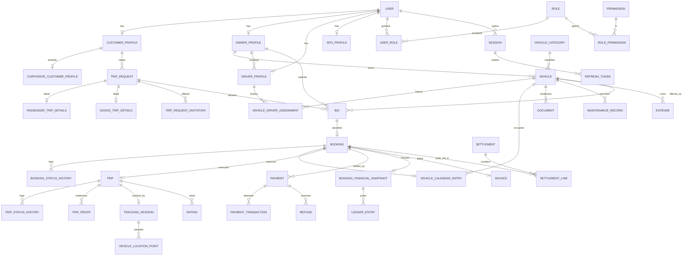
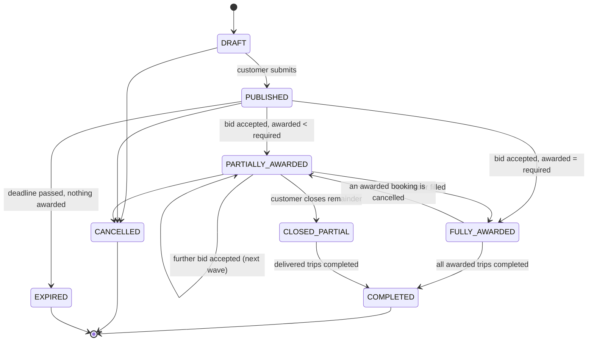
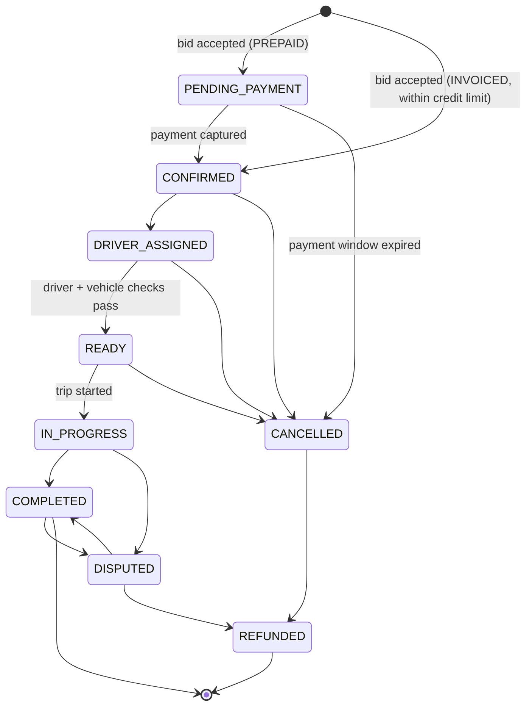

# UniGate — Database Design

**Status:** Phase 1 (Architecture) — approved for implementation pending open questions in [assumptions.md](assumptions.md)
**Engine:** PostgreSQL 16
**ORM:** Prisma 5.x
**Last updated:** 2026-09-13

---

## 1. Design principles

| # | Principle | Rationale |
|---|---|---|
| D1 | UUID v7 primary keys (`uuid` column type) | Globally unique, safe to expose, no enumeration; **v7** rather than v4 so keys are time-sortable and B-tree inserts stay sequential (v4 causes index fragmentation at volume). Generated in the application layer. |
| D2 | All money is `NUMERIC(14,2)`; all rates are `NUMERIC(6,4)` | Never floating point. `14,2` supports up to 999,999,999,999.99 — far beyond need, but cheap. Rates at 4dp support e.g. VAT 0.1500 and commission 0.1250. |
| D3 | Every money column is accompanied by a `currency CHAR(3)` column | Explicit currency, never implied. Default `SAR`. |
| D4 | All timestamps are `TIMESTAMPTZ`, stored UTC | Display timezone is a presentation concern (`Asia/Riyadh` default). |
| D5 | `created_at`, `updated_at` on every table; `deleted_at` only where soft deletion is genuinely required | Soft-delete is applied selectively (see §10), not blanket — blanket soft-delete breaks unique constraints and silently corrupts reports. |
| D6 | Financial and commercial facts are **snapshotted**, never recomputed | A booking's commission is frozen at confirmation. Changing a commission rule must never alter history. |
| D7 | Enums are PostgreSQL native enums, mirrored as TypeScript union types in `packages/types` | Single definition, DB-enforced. Adding a value is a migration (deliberate friction — good). |
| D8 | Lookup/reference data lives in tables, not enums | Vehicle categories, document types, expense categories change with business needs and are admin-editable. Enums are for *lifecycle states* only. |
| D9 | Correctness under concurrency is enforced by the **database**, not by application checks | Exclusion constraints, partial unique indexes and row locks — not `SELECT` then `INSERT`. |
| D10 | No polymorphic `(entity_type, entity_id)` foreign keys | They forfeit referential integrity. Use typed nullable FKs + a `CHECK` that exactly one is set. |

### Naming

- Tables: `snake_case`, plural (`trip_requests`).
- Columns: `snake_case`.
- Prisma models: `PascalCase` singular, mapped with `@@map` / `@map`.
- Enums: `SCREAMING_SNAKE_CASE` values, PascalCase type name.
- Indexes: `idx_<table>_<cols>`; uniques `uq_<table>_<cols>`; checks `ck_<table>_<rule>`; exclusions `ex_<table>_<rule>`.

### Required PostgreSQL extensions

```sql
CREATE EXTENSION IF NOT EXISTS "btree_gist";  -- vehicle calendar exclusion constraint (§7.3)
CREATE EXTENSION IF NOT EXISTS "citext";      -- case-insensitive email
CREATE EXTENSION IF NOT EXISTS "pgcrypto";    -- digest()/hmac() for blind indexes
CREATE EXTENSION IF NOT EXISTS "pg_trgm";     -- fuzzy search on names/plates in admin lists
```

> **Prisma limitation — must be handled in raw SQL migrations.** Prisma's schema language cannot express: `EXCLUDE` constraints, partial (`WHERE`) unique indexes, `CHECK` constraints, table partitioning, or `citext`. These are added via `prisma migrate dev --create-only` followed by hand-written SQL in the generated migration. This is called out in [ADR-002](decisions/ADR-002-database.md) because it is a recurring source of drift if the team forgets.

---

## 2. Deviations from the entity list in the engagement brief

Section 33 of the brief supplied a candidate entity list and asked for analysis rather than literal transcription. The following are deliberate changes, each justified.

| # | Change | Justification |
|---|---|---|
| V1 | **`Vehicle.status` split into three orthogonal columns** (`approval_status`, `lifecycle_status`, `operational_status`) | The suggested flat list (`DRAFT`, `PENDING_APPROVAL`, `ACTIVE`, `INACTIVE`, `AVAILABLE`, `RESERVED`, `ON_TRIP`, `UNDER_MAINTENANCE`, `SUSPENDED`) conflates three independent axes. A vehicle can simultaneously be *approved*, *active* and *on a trip*. A single column forces the system to lose information on every transition — e.g. suspending an on-trip vehicle would erase the fact it is on a trip. See §7.1. |
| V2 | **Availability is not a status at all** — it is computed from `vehicle_calendar_entries` | "Is this vehicle available?" is only meaningful for a *time window*. A boolean or status column cannot answer "is it free next Tuesday 08:00–14:00" and is guaranteed to go stale. See §7.3. |
| V3 | **`VehicleReservation` generalised to `VehicleCalendarEntry`** | Reservations, maintenance windows and owner-declared blackouts all mean "this vehicle is occupied". Modelling them as one table lets a *single* PostgreSQL `EXCLUDE` constraint guarantee no overlap across all three causes. Three tables would need three pairwise checks in application code — which would eventually be wrong. |
| V4 | **`Bid` status `UPDATED` removed** | It conflates lifecycle with mutation. A bid that was revised is still `SUBMITTED`. Revisions are captured by `version` + `last_revised_at` on the bid and full before/after rows in `audit_logs`. Keeping `UPDATED` would make "all live bids" queries require `status IN (SUBMITTED, UPDATED)` everywhere — a bug waiting to happen. |
| V5 | **`Document` uses typed nullable FKs + `CHECK`, not `(owner_type, owner_id)`** | Preserves referential integrity and cascade behaviour. See §6.1 and D10. |
| V6 | **`LedgerAccount` + `LedgerEntry` added** | Brief §19 asks for "a basic ledger-oriented structure". Without double-entry lines, owner balances are derived by summing snapshots across several tables and will drift. See §12.4. |
| V7 | **`OutboxEvent` + `IdempotencyKey` added** | Required to make notifications, webhooks and payment side-effects reliable without losing them on crash, and to make client retries safe. See [architecture.md §9](architecture.md). |
| V8 | **`Invoice` added, with `invoice_lines` and a full e-invoicing field set** | A KSA platform charging VAT must issue tax invoices. UniGate confirmed on 2026-09-14 that it is the issuer and supplies VAT-reclaim invoices (**A-49**), so invoices became header + lines (consolidated corporate billing) and carry the clearance/reporting model in §12.7. Applicability of the e-invoicing regime remains **OQ-04**; no compliance is claimed. |
| V9 | **`TripProof` added** | Brief §14 asks to "architect proof-of-delivery support for future use". A table with no UI is cheaper now than a schema migration on a live trips table later. |
| V10 | **`TripRequestInvitation` added** | Makes opportunity matching auditable — "which owners were shown this request, and when" — and drives the owner Opportunities screen without re-running the match query. |
| V11 | **`Region` / `City` reference tables added** | Needed for owner service areas, admin filtering and reporting. Free-text city names make reports unusable. |
| V12 | **A `User` may hold both `OwnerProfile` and `DriverProfile`** | The RFP itself names the role "Vehicle Owner / Driver" (RFP §4) — the owner-operator who drives their own vehicle is a first-class case, not an edge case. |
| V13 | **`SPOProfile` extended with `SpoCustomerAssignment` and `SpoLead`** | The RFP mentions SPOs exactly once and defines no rules. A minimal but real attribution chain is modelled; commission rules are deliberately left configurable. See **OQ-09**. |
| V14 | **Multi-stop trips deferred**; pickup/dropoff are embedded columns on `trip_requests` | The RFP describes point-to-point hire. Normalising to a `stops` table now complicates every query for a speculative requirement. Documented migration path in [assumptions.md](assumptions.md) (A-14). |
| V15 | **`Session` and `RefreshToken` separated** | One session (device) issues many refresh tokens over its life through rotation. Merging them makes reuse-detection and "log out this device" mutually awkward. |
| V16 | **`trip_status` renames the goods in-transit state to `IN_TRANSIT` and adds `CANCELLED` and `EXCEPTION`** | Brief §14 lists `IN_PROGRESS` for both transport types and no terminal-failure states. `IN_TRANSIT` is used for goods because `IN_PROGRESS` is ambiguous once `LOADING`/`LOADED` exist — "in progress" would be true during loading too, which makes the status useless for dispatch screens. `CANCELLED` and `EXCEPTION` (breakdown, accident, refused delivery) are operational realities a transport platform cannot model as an absence of state; without them a broken-down vehicle has no valid status. |
| V17 | **Three additional seeded admin-side roles** — `OPS_MANAGER`, `FINANCE_OFFICER`, `SUPPORT_AGENT` | The brief names only "Super Admin / Admin", but §5 lists duties that clearly separate (settlements and refunds vs. complaint handling vs. vehicle approval). These are additive, share the `/admin` portal, and exist to demonstrate that least-privilege role construction works without code changes. They are seed data and may be deleted or replaced by UniGate. |

---

## 3. Schema map by module

```
iam            users, sessions, refresh_tokens, otp_requests, password_reset_tokens,
               login_attempts, roles, permissions, role_permissions, user_roles
profiles       customer_profiles, corporate_customer_profiles, owner_profiles,
               driver_profiles, spo_profiles, spo_customer_assignments, spo_leads,
               saved_locations
reference      regions, cities, vehicle_categories, vehicle_makes, vehicle_models,
               document_types, expense_categories, maintenance_service_types,
               system_settings
documents      documents
fleet          vehicles, vehicle_driver_assignments, vehicle_calendar_entries,
               owner_service_areas, gps_devices
demand         trip_requests, passenger_trip_details, goods_trip_details,
               trip_request_invitations
bidding        bids
bookings       bookings, booking_status_history, booking_cancellations
trips          trips, trip_status_history, trip_proofs
tracking       tracking_sessions, current_vehicle_locations, vehicle_location_points
payments       payments, payment_transactions, payment_method_tokens,
               payment_webhook_events, refunds
finance        commission_rules, booking_financial_snapshots, ledger_accounts,
               ledger_entries, settlements, settlement_lines, invoices,
               invoice_lines, expenses, owner_bank_accounts
maintenance    maintenance_records, maintenance_schedules
engagement     ratings, complaints, complaint_notes
notifications  notification_templates, notifications, notification_preferences,
               device_tokens
platform       audit_logs, outbox_events, idempotency_keys, export_jobs
```

**77 tables.** Schemas are logical (module prefixes in documentation), physically all in `public` — multiple PostgreSQL schemas add migration friction for no benefit at this scale.

---

## 4. Entity relationship overview



---

## 5. Identity & access (`iam`)

### 5.1 `users`

| Column | Type | Notes |
|---|---|---|
| `id` | uuid PK | v7 |
| `email` | citext NULL | `uq_users_email` unique where not null |
| `email_verified_at` | timestamptz NULL | |
| `phone_e164` | varchar(20) NULL | E.164, e.g. `+9665XXXXXXXX`. `uq_users_phone` unique where not null |
| `phone_verified_at` | timestamptz NULL | |
| `password_hash` | text NULL | Argon2id. NULL permitted for OTP-only accounts |
| `password_changed_at` | timestamptz NULL | Invalidates sessions older than this |
| `full_name_en` | varchar(160) | |
| `full_name_ar` | varchar(160) NULL | |
| `status` | `user_status` | `PENDING_VERIFICATION`, `ACTIVE`, `SUSPENDED`, `DEACTIVATED` |
| `preferred_locale` | varchar(5) | `en` \| `ar`, default `ar` |
| `timezone` | varchar(64) | default `Asia/Riyadh` |
| `permission_version` | int | Bumped on any role/permission change; invalidates cached permission sets |
| `last_login_at` | timestamptz NULL | |
| `created_at` / `updated_at` / `deleted_at` | timestamptz | soft delete supported |

**Constraint:** `ck_users_identifier` — `email IS NOT NULL OR phone_e164 IS NOT NULL`. An account must be reachable.

> `email` and `phone_e164` are unique **where not null** — a partial unique index, so multiple soft-deleted or phone-only rows do not collide. Note this means soft-deleted users still hold their phone number; deactivation that must release a number sets `phone_e164 = NULL` and records the old value in the audit log.

### 5.2 `sessions` and `refresh_tokens`

`sessions`: `id`, `user_id`, `device_id`, `device_name`, `client_type` (`WEB` \| `IOS` \| `ANDROID`), `user_agent`, `ip_address` (inet), `created_at`, `last_seen_at`, `expires_at`, `revoked_at`, `revoke_reason`.

`refresh_tokens`: `id`, `session_id`, `family_id` (uuid), `token_hash` (sha256 hex, **never the token**), `issued_at`, `expires_at`, `used_at`, `revoked_at`, `replaced_by_id` (self FK).

- `uq_refresh_tokens_token_hash` unique.
- **Rotation with reuse detection:** presenting a token whose `used_at` is already set means the token was stolen and replayed → revoke the entire `family_id` and the parent session, write a `SECURITY` audit entry, force re-authentication. This is the single most valuable control in the auth design.

### 5.3 `otp_requests`

`id`, `channel` (`SMS` \| `EMAIL`), `destination` (phone or email), `destination_hash` (for rate-limit lookup without scanning), `purpose` (`REGISTRATION`, `LOGIN`, `PHONE_VERIFICATION`, `PASSWORD_RESET`, `SENSITIVE_ACTION`), `code_hash`, `attempt_count`, `max_attempts` (default 5), `expires_at`, `consumed_at`, `ip_address`, `user_id` NULL, `created_at`.

- **`code_hash` is HMAC-SHA256(code, server_pepper)**, not the code. Argon2 is deliberately *not* used here: OTP verification happens on a hot path and the input space is small enough that hashing cost adds no meaningful protection compared to attempt limits + expiry. Constant-time comparison.
- Indexes: `idx_otp_destination_hash_created` for throttling windows.
- Throttling counters live in Redis (fast path); this table is the durable audit record.

### 5.4 `roles`, `permissions`, `role_permissions`, `user_roles`

`permissions`: `id`, `code` (unique, `resource.action`), `module`, `description_en`, `description_ar`, `is_assignable` (false for internal-only). **Seeded, never user-created** — permission codes are referenced in source.

`roles`: `id`, `code` (unique), `name_en`, `name_ar`, `description`, `is_system` (system roles cannot be deleted or have their code changed), `created_at`, `updated_at`.

`user_roles`: `user_id`, `role_id`, `granted_by`, `granted_at`, `expires_at` NULL. PK `(user_id, role_id)`.

> **New roles require no code change** (brief §5). Roles are rows; permissions are seeded constants; the authorization check is always `requirePermission('vehicles.approve')`, never `if (role === 'ADMIN')`. Adding a "Fleet Supervisor" role is an admin action, not a deployment.

### 5.5 `login_attempts`

`id`, `identifier` (email/phone as supplied), `identifier_hash`, `ip_address`, `user_agent`, `succeeded`, `failure_reason`, `created_at`. Drives progressive lockout and anomaly reporting. Retention is governed by **OQ-08** / **A-41** (interim: 90 days) along with every other retention period — it is not separately settled here.

---

## 6. Profiles, reference data, documents

### 6.1 `documents`

The reusable subsystem required by brief §10.

| Column | Type | Notes |
|---|---|---|
| `id` | uuid PK | |
| `document_type_id` | uuid FK → `document_types` | |
| `user_id` | uuid FK NULL | |
| `owner_profile_id` | uuid FK NULL | |
| `driver_profile_id` | uuid FK NULL | |
| `vehicle_id` | uuid FK NULL | |
| `corporate_customer_profile_id` | uuid FK NULL | |
| `expense_id` | uuid FK NULL | receipts |
| `maintenance_record_id` | uuid FK NULL | |
| `trip_proof_id` | uuid FK NULL | POD photos/signatures |
| `storage_bucket` | varchar(128) | |
| `storage_key` | text | opaque, server-generated; **never** derived from user filename |
| `original_filename` | varchar(255) | sanitised, display only |
| `mime_type` | varchar(128) | verified against magic bytes, not the client header |
| `size_bytes` | bigint | |
| `checksum_sha256` | char(64) | dedupe + integrity |
| `upload_status` | `document_upload_status` | `PENDING`, `UPLOADED`, `FAILED`, `QUARANTINED` |
| `verification_status` | `document_verification_status` | `PENDING`, `VERIFIED`, `REJECTED`, `EXPIRED` |
| `verified_by_user_id` | uuid FK NULL | |
| `verified_at` | timestamptz NULL | |
| `rejection_reason` | text NULL | |
| `issue_date` / `expiry_date` | date NULL | |
| `visibility` | `document_visibility` | `PRIVATE`, `INTERNAL`, `SHARED_WITH_COUNTERPARTY` — supports brief §28 privacy controls |
| `created_at` / `updated_at` / `deleted_at` | | |

**Constraint `ck_documents_single_owner`:**
```sql
CHECK (num_nonnulls(user_id, owner_profile_id, driver_profile_id, vehicle_id,
                    corporate_customer_profile_id, expense_id,
                    maintenance_record_id, trip_proof_id) = 1)
```

`document_types` (reference): `code`, `name_en`, `name_ar`, `applies_to` (enum matching the FK set), `requires_expiry`, `is_mandatory`, `max_size_bytes`, `allowed_mime_types` (text[]), `expiry_warning_days`, `sort_order`, `is_active`.

> Making document types **data** rather than an enum means the "required documents checklist" for a driver or a vehicle is a query, not a hard-coded list — and the compliance team can add e.g. a new insurance certificate type without a release.

### 6.2 Profiles

- **`customer_profiles`** — `user_id` (unique FK), `customer_type` (`INDIVIDUAL` \| `CORPORATE`), `vat_number` NULL, `vat_number_verified_at` NULL, `default_city_id`, `rating_avg`, `rating_count`, `total_bookings`, `acquired_by_spo_id` NULL, `created_at`…
  > `vat_number` sits here rather than on the corporate profile because VAT registration belongs to the invoiced party, not to being a company — sole traders register too. It drives invoice type (§12.6).
- **`corporate_customer_profiles`** — `customer_profile_id` (unique FK), `company_name_en`, `company_name_ar`, `cr_number` (Commercial Registration, 10 digits), **Saudi National Address** as structured fields — `address_building_number` (4 digits), `address_street_en/ar`, `address_district_en/ar`, `address_city_id`, `address_postal_code` (5 digits), `address_additional_number` (4 digits), `address_short_code` NULL (e.g. `RHAA1234`) — `contact_person_name`, `contact_person_phone`, `contact_person_email`, `credit_terms_days`, `is_verified`, `wafeq_contact_id` NULL, `wafeq_synced_at` NULL.
  > **UniGate, 2026-09-15:** a client is registered in Wafeq with **VAT number, CR number and national address**, all mandatory before an invoice can be generated. The platform therefore captures the same three at corporate onboarding and **validates them before a customer can be approved for `INVOICED` billing**: VAT number 15 digits starting and ending in `3`, CR 10 digits, national address in the structured form above (ZATCA BR-KSA-09/-66…-70 require buyer building number, street, district, city and postal code for a Saudi buyer on a standard tax invoice). The free-text `billing_address_line1/2` fields are **replaced** by the structured address. The record is mirrored to Wafeq as a contact (`external_id` = customer id) so the invoice buyer block is identical in both systems (FR-PROFILES-14).
- **`owner_profiles`** — `user_id` (unique FK), `owner_type` (`INDIVIDUAL` \| `COMPANY` \| **`PLATFORM`**), **`is_platform_fleet`** (true for exactly one row — UniGate's own vehicles; A-57: no commission, no settlement, no supplier invoice; trips are internal cost and appear in a separate margin report), `business_name_en/ar`, `cr_number`, `vat_number` NULL, `is_vat_registered` (derived, but stored — see **OQ-24**; an owner who cannot issue UniGate a tax invoice changes the platform's recoverable input VAT), `national_id_encrypted`, `national_id_last4`, `national_id_blind_index`, `onboarding_status` (`DRAFT`, `DOCUMENTS_SUBMITTED`, `UNDER_REVIEW`, `APPROVED`, `REJECTED`, `SUSPENDED`), `approved_by_user_id`, `approved_at`, `rejection_reason`, `rating_avg`, `rating_count`, `privacy_settings` (jsonb — brief §28), `default_payout_account_id`.
- **`owner_vertical_approvals`** — `owner_profile_id`, `transport_type` (`PASSENGER` \| `GOODS`), `status` (`NOT_APPLIED`, `UNDER_REVIEW`, `APPROVED`, `REJECTED`, `SUSPENDED`), `approved_by_user_id`, `approved_at`, `licence_document_id` NULL, `notes`; unique on (owner, transport_type). **An owner is approved per vertical** ([ADR-010](decisions/ADR-010-vertical-modules-over-a-shared-core.md)): a fleet with buses and trucks holds two rows, and may bid only in verticals where `status = APPROVED`. `onboarding_status` above remains the identity-level gate; this table is the operating-licence gate. `driver_vertical_eligibility` mirrors it for drivers (licence classes and TGA driver cards differ by vertical).
- **`driver_profiles`** — `user_id` (unique FK), `owner_profile_id` FK NULL (a driver may be independent), `national_id_encrypted` / `_last4` / `_blind_index`, `id_type` (`NATIONAL_ID` \| `IQAMA`), `date_of_birth`, `license_number_encrypted` / `_last4` / `_blind_index`, `license_expiry_date`, `license_categories` (text[]), `approval_status`, `availability_status` (`OFF_DUTY`, `AVAILABLE`, `ON_TRIP`), `rating_avg`, `rating_count`, `emergency_contact_name`, `emergency_contact_phone`.
- **`spo_profiles`** — `user_id` (unique FK), `employee_code` (unique), `region_id`, `manager_user_id` NULL, `commission_model` (jsonb, deliberately open — see **OQ-09**), `is_active`.
- **`spo_customer_assignments`** — `spo_profile_id`, `customer_profile_id`, `assigned_at`, `unassigned_at` NULL, `assigned_by`. Partial unique: one active assignment per customer.
- **`spo_leads`** — `spo_profile_id`, `contact_name`, `contact_phone`, `company_name` NULL, `status` (`NEW`, `CONTACTED`, `QUALIFIED`, `CONVERTED`, `LOST`), `converted_user_id` NULL, `notes`, `created_at`.

**PII encryption.** `national_id`, `license_number` and `iqama` are encrypted at rest with AES-256-GCM using an application-held key (KMS-managed in production). Alongside each are:
- `*_last4` — plaintext, for display (`•••• 4821`)
- `*_blind_index` — `HMAC-SHA256(normalised_value, pepper)`, indexed and unique, so uniqueness and exact-match lookup work **without** decrypting or exposing the value.

This is the mechanism that satisfies "never expose other users' personal information" (brief §27) at the storage layer rather than relying purely on DTO discipline. Detailed in [security.md](security.md).

### 6.3 Reference tables

`regions` (13 KSA administrative regions, seeded with `name_en`/`name_ar`), `cities` (`region_id`, `name_en`, `name_ar`, `latitude`, `longitude`, `is_active`).

`vehicle_categories`: `code`, `name_en`, `name_ar`, `transport_type` (`PASSENGER` \| `GOODS` — **the binding of a category to exactly one vertical**; a coach is passenger, a flatbed is goods, nothing is both — [ADR-010](decisions/ADR-010-vertical-modules-over-a-shared-core.md)), `description_en/ar`, `icon_key`, `min_passenger_capacity`, `max_passenger_capacity`, `min_payload_kg`, `max_payload_kg`, `requires_special_license`, `sort_order`, `is_active`.

Seeded: `SEDAN`, `SUV`, `VAN`, `MINIBUS`, `COASTER`, `BUS`, `LUXURY_CAR`, `PICKUP`, `LIGHT_TRUCK`, `HEAVY_TRUCK`, `FLATBED_TRAILER`, `CURTAIN_TRAILER`, `REFRIGERATED_TRUCK`, `TANKER`, `CAR_CARRIER`, `LOWBED_TRAILER`.

`vehicle_makes` / `vehicle_models` (`make_id`, `name`, `body_type`, `is_active`) — normalised so admin reports group cleanly instead of on free text (`Toyota` vs `TOYOTA` vs `تويوتا`).

`expense_categories`, `maintenance_service_types`: `code`, `name_en`, `name_ar`, `is_active`, `sort_order`.

`system_settings`: `key` (unique, `section.name`), **`section`** (enum: `booking`, `bidding`, `dispatch`, `settlement`, `billing`, `finance`, `onboarding`, `documents`, `spo`, `tracking`, `notifications`, `retention`, `platform`), `value` (jsonb), `value_type`, `scope` (`PUBLIC` \| `INTERNAL` \| `SECRET`), `description_en`, `description_ar`, `is_code_managed` (immutable via API), `updated_by_user_id`, `updated_at`. **Every key is listed in [settings-catalogue.md](settings-catalogue.md) with its type, seed, validation and whether it is snapshotted at use** — [ADR-009](decisions/ADR-009-configuration-over-constants.md), client-directed: no business value is a constant in code.

`spo_commission_models`: `id`, `name`, `basis` (`NONE` \| `FIRST_BOOKING` \| `ALL_BOOKINGS` \| `WINDOW_DAYS`), `window_days` NULL, `calculation_type` (`NONE` \| `PERCENTAGE` \| `FIXED`), `value` NULL, `vesting_days_after_completion`, `clawback_on_refund`, `is_default`, `is_active`. `spo_profiles.commission_model` (jsonb) is replaced by `commission_model_id` FK; the applied model is frozen into `booking_financial_snapshots.spo_rule_snapshot` (OQ-09). **`SECRET`-scoped settings are never returned by any API** — secrets belong in environment variables; this scope exists only to mark settings that hold sensitive non-secret config.

---

## 7. Fleet (`fleet`)

### 7.1 `vehicles`

| Column | Type | Notes |
|---|---|---|
| `id` | uuid PK | |
| `owner_profile_id` | uuid FK | |
| `vehicle_category_id` | uuid FK | |
| `vehicle_make_id` / `vehicle_model_id` | uuid FK NULL | |
| `model_year` | smallint | `ck_vehicles_year` 1980 ≤ year ≤ current+2 |
| `plate_number_en` | varchar(16) | Latin form, e.g. `ABC 1234` |
| `plate_number_ar` | varchar(24) NULL | Arabic plate form |
| `sequence_number` | varchar(32) NULL | Saudi vehicle sequence number (الرقم التسلسلي) |
| `registration_number` | varchar(64) | |
| `vin` | varchar(17) NULL | `uq_vehicles_vin` where not null |
| `color_code` | varchar(32) | reference key, translated in UI |
| `passenger_capacity` | smallint NULL | required when category is `PASSENGER` |
| `payload_capacity_kg` | numeric(10,2) NULL | required when category is `GOODS` |
| `cargo_volume_m3` | numeric(10,2) NULL | |
| `cargo_length_cm` / `_width_cm` / `_height_cm` | int NULL | |
| `body_type` | varchar(48) NULL | |
| `has_refrigeration` | boolean | default false |
| `has_tail_lift` | boolean | default false |
| `approval_status` | `vehicle_approval_status` | `DRAFT`, `PENDING_APPROVAL`, `APPROVED`, `REJECTED` |
| `lifecycle_status` | `vehicle_lifecycle_status` | `ACTIVE`, `INACTIVE`, `SUSPENDED`, `ARCHIVED` |
| `operational_status` | `vehicle_operational_status` | `IDLE`, `RESERVED`, `ON_TRIP`, `UNDER_MAINTENANCE`, `OUT_OF_SERVICE` |
| `approved_by_user_id` / `approved_at` / `rejection_reason` | | |
| `insurance_policy_number` | varchar(64) NULL | |
| `insurance_expiry_date` | date NULL | |
| `registration_expiry_date` | date NULL | |
| `inspection_expiry_date` | date NULL | |
| `odometer_km` | int NULL | |
| `gps_device_id` | uuid FK NULL | |
| `base_city_id` | uuid FK NULL | |
| `notes` | text NULL | |
| `rating_avg` / `rating_count` | | |
| `created_at` / `updated_at` / `deleted_at` | | |

**Uniqueness:** `uq_vehicles_plate` on `LOWER(REPLACE(plate_number_en,' ',''))` **where `deleted_at IS NULL`** — plates are reassigned by the traffic authority over time, so a global unique would eventually block a legitimate registration.

**Constraint `ck_vehicles_capacity`:** capacity fields must be consistent with the category's `transport_type` (enforced in the service layer against the category row, plus a DB check that at least one of `passenger_capacity` / `payload_capacity_kg` is set).

**Why three status columns (V1).** They answer different questions and change for different reasons:

| Column | Question | Changed by |
|---|---|---|
| `approval_status` | Has the platform vetted this vehicle? | Admin |
| `lifecycle_status` | Does the owner want it on the platform? | Owner / Admin (suspension) |
| `operational_status` | What is it doing right now? | System (bookings, trips, maintenance) |

A vehicle is **dispatchable** iff `approval_status = APPROVED` AND `lifecycle_status = ACTIVE` AND all mandatory documents are `VERIFIED` and unexpired. This predicate is implemented once, in `fleet/vehicle.policy.ts`, and used by matching, bidding and booking.

### 7.2 `vehicle_driver_assignments`

`id`, `vehicle_id`, `driver_profile_id`, `assigned_from` (timestamptz), `assigned_to` (timestamptz NULL = current), `is_primary`, `assigned_by_user_id`, `unassigned_reason`, `created_at`.

- **Never overwritten** (brief §9). Ending an assignment sets `assigned_to`; a new row starts the next one. Historical trips resolve their driver through `trips.driver_profile_id` (snapshotted at dispatch), so reassignment can never rewrite history.
- `uq_vehicle_primary_driver`: partial unique on `(vehicle_id)` where `assigned_to IS NULL AND is_primary = true`.
- `ck_assignment_period`: `assigned_to IS NULL OR assigned_to > assigned_from`.

### 7.3 `vehicle_calendar_entries` — the availability guarantee

This is the mechanism that makes "the same vehicle must not accidentally be booked for conflicting periods" (brief §45) a **database invariant** rather than an application hope.

| Column | Type | Notes |
|---|---|---|
| `id` | uuid PK | |
| `vehicle_id` | uuid FK | |
| `entry_type` | `calendar_entry_type` | `RESERVATION`, `MAINTENANCE`, `OWNER_BLOCK` |
| `period` | tstzrange | **occupied window, inclusive-exclusive `[)`** |
| `booking_id` | uuid FK NULL | set when `entry_type = RESERVATION` |
| `maintenance_record_id` | uuid FK NULL | set when `entry_type = MAINTENANCE` |
| `status` | `calendar_entry_status` | `HELD`, `CONFIRMED`, `RELEASED` |
| `created_by_user_id` | uuid FK NULL | |
| `notes` | text NULL | |
| `created_at` / `updated_at` | | |

```sql
ALTER TABLE vehicle_calendar_entries
  ADD CONSTRAINT ex_vehicle_calendar_no_overlap
  EXCLUDE USING gist (
    vehicle_id WITH =,
    period     WITH &&
  ) WHERE (status <> 'RELEASED');
```

**Properties:**
- Two concurrent bid acceptances for the same vehicle and overlapping window: one commits, the other gets a `23P01 exclusion_violation`, which the service maps to `BID_VEHICLE_UNAVAILABLE` (HTTP 409). No lost updates, no double booking, no advisory-lock bookkeeping.
- Maintenance automatically makes a vehicle unbookable, because it lives in the same constraint (V3).
- `RELEASED` entries are excluded from the constraint but retained for audit — a cancelled booking's reservation stays visible.

**Turnaround buffer.** The stored `period` is the booked window **plus** a configurable buffer (`booking.turnaround_buffer_minutes`, default 60 — assumption **A-07**) applied at both ends, so a vehicle is not booked back-to-back across the city. The customer-facing window and the calendar window therefore differ; both are stored (`bookings.scheduled_start_at` / `scheduled_end_at` vs `period`).

**Open-ended bookings.** A trip with no firm end time gets `period = [start, start + estimated_duration + buffer)` using the bid's estimate, and the entry is extended when the trip actually runs long. Extension uses the same constraint and can fail — handled as an operational conflict surfaced to admin.

### 7.4 `owner_service_areas` and `gps_devices`

`owner_service_areas`: `owner_profile_id`, `city_id`, `is_active`. PK `(owner_profile_id, city_id)`. Drives opportunity matching without geospatial queries in v1.

> Radius-based matching (PostGIS `geography` + GiST) is the natural evolution and is noted in [assumptions.md](assumptions.md) (A-11). City-level matching is sufficient for launch and far simpler to reason about.

`gps_devices`: `id`, `provider_code`, `device_identifier` (unique per provider), `vehicle_id` NULL, `sim_number_encrypted`, `sim_number_last4`, `sim_number_blind_index`, `status` (`ACTIVE`, `INACTIVE`, `FAULTY`), `last_seen_at`, `installed_at`, `metadata` jsonb.

---

## 8. Demand — trip requests (`demand`)

### 8.1 `trip_requests`

| Column | Type | Notes |
|---|---|---|
| `id` | uuid PK | |
| `request_number` | varchar(24) unique | `TR-2026-000123`, from a PostgreSQL sequence |
| `customer_profile_id` | uuid FK | |
| `created_by_user_id` | uuid FK | may differ from customer (admin- or SPO-raised) |
| `attributed_spo_profile_id` | uuid FK NULL | SPO attribution at source |
| `transport_type` | `transport_type` | `PASSENGER` \| `GOODS` — the discriminator |
| `vehicle_category_id` | uuid FK NULL | specific category requested |
| `vehicles_required` | smallint | default 1, `ck` ≥ 1 |
| `allow_partial_fulfilment` | boolean | default `true` for `GOODS`, `false` for `PASSENGER` — see §8.6 |
| `trip_direction` | `trip_direction` | `ONE_WAY` \| `ROUND_TRIP` |
| `pickup_address_line` | text | |
| `pickup_city_id` | uuid FK | |
| `pickup_latitude` / `pickup_longitude` | numeric(10,7) / numeric(10,7) | |
| `pickup_place_id` | varchar(255) NULL | map-provider place reference |
| `dropoff_address_line` | text | |
| `dropoff_city_id` | uuid FK | |
| `dropoff_latitude` / `dropoff_longitude` | numeric(10,7) | |
| `dropoff_place_id` | varchar(255) NULL | |
| `estimated_distance_km` | numeric(10,2) NULL | from maps provider at creation |
| `estimated_duration_minutes` | int NULL | |
| `pickup_at` | timestamptz | |
| `return_at` | timestamptz NULL | required when `ROUND_TRIP` |
| `bidding_closes_at` | timestamptz | Deadline for the **current** round. Extended automatically while a partially-fulfilled request still has an open remainder — see §8.6 |
| `remainder_closes_at` | timestamptz NULL | Hard deadline for the unfilled remainder. `NULL` = open until the customer closes it (**OQ-22**) |
| `status` | `trip_request_status` | see §8.4 |
| `vehicles_awarded` | smallint | default 0; `ck` ≤ `vehicles_required`. **Decremented when an awarded booking is cancelled**, which reopens the remainder |
| `vehicles_dispatched` | smallint | default 0; trips that have started |
| `vehicles_completed` | smallint | default 0; trips that finished |
| `vehicles_cancelled` | smallint | default 0; cumulative, never decremented — a fulfilment-reliability signal |
| `budget_amount` | numeric(14,2) NULL | optional customer indication |
| `currency` | char(3) | `SAR` |
| `special_instructions` | text NULL | |
| `cancellation_reason` | text NULL | |
| `created_at` / `updated_at` | | |

**Constraints:**
- `ck_trip_requests_return` — `trip_direction = 'ONE_WAY' OR return_at IS NOT NULL`
- `ck_trip_requests_times` — `pickup_at > created_at` and `return_at IS NULL OR return_at > pickup_at`
- `ck_trip_requests_counters` — `vehicles_awarded <= vehicles_required` and `vehicles_completed <= vehicles_awarded` and `vehicles_dispatched <= vehicles_awarded`. **`vehicles_cancelled` is deliberately unconstrained:** it is cumulative over the order's whole life and never decremented, so on a troubled order — 5 vehicles awarded, 4 cancelled and re-awarded twice — it legitimately exceeds `vehicles_required`. Constraining it would reject exactly the churn it exists to measure. It is a fulfilment-reliability signal, not a count of anything currently live.
- `ck_trip_requests_partial` — `allow_partial_fulfilment = true OR vehicles_required = 1 OR status <> 'PARTIALLY_AWARDED'` (an all-or-nothing request can never rest in a partially-awarded state)

> **Removed:** the earlier `ck_trip_requests_bidding_window` (`bidding_closes_at <= pickup_at`). It is incompatible with partial fulfilment — a later wave is bid on and awarded *after* the original pickup time has passed, which is the whole point. Bidding on the remainder is now bounded by `remainder_closes_at`, not by the first wave's pickup.

**Indexes:** `(status, pickup_at)`, `(customer_profile_id, created_at DESC)`, `(pickup_city_id, transport_type, status)` for matching, `(bidding_closes_at) WHERE status = 'PUBLISHED'` for the expiry job.

### 8.2 `passenger_trip_details` (1:1, required when `transport_type = PASSENGER`)

`trip_request_id` (PK/FK), `passenger_count`, `luggage_count`, `luggage_notes`, `trip_purpose` (`AIRPORT_TRANSFER`, `INTERCITY`, `CITY_TOUR`, `EMPLOYEE_TRANSPORT`, `HAJJ_UMRAH`, `EVENT`, `OTHER`), `requires_female_driver` (a genuine requirement in the KSA market), `requires_wheelchair_access`, `child_seats_required`, `waiting_time_minutes`, `is_multi_day`, `driver_language_preference` (text[]).

### 8.3 `goods_trip_details` (1:1, required when `transport_type = GOODS`)

`trip_request_id` (PK/FK), `cargo_type` (`GENERAL`, `FRAGILE`, `PERISHABLE`, `HAZARDOUS`, `LIVESTOCK`, `VEHICLE`, `BULK`, `CONTAINER`, `OTHER`), `cargo_description`, `cargo_weight_kg` (numeric(12,2)), `cargo_volume_m3`, `package_count`, `package_length_cm` / `_width_cm` / `_height_cm`, `requires_refrigeration`, `required_temperature_min_c` / `_max_c`, `requires_tail_lift`, `requires_crane`, `loading_responsibility` (`CUSTOMER`, `DRIVER`, `THIRD_PARTY`), `unloading_responsibility` (same), `loading_instructions`, `unloading_instructions`, `declared_value_amount`, `requires_insurance`, `hazmat_class` NULL, `shipper_contact_name` / `_phone`, `consignee_contact_name` / `_phone`.

> **Why two tables and not 40 nullable columns** (brief §11). The discriminator `transport_type` plus table-per-subtype means: NOT NULL constraints actually apply within each subtype; the passenger form and goods form map to genuinely different shapes; and a query for "refrigerated loads over 10 tonnes" touches a small table. The service layer enforces that exactly one detail row exists and matches the discriminator — a DB-level guarantee would require a trigger, which is documented as an accepted gap (**A-20**).

### 8.4 `trip_request_status` lifecycle



**`PARTIALLY_AWARDED` is a stable resting state, not a transition.** A request for 5 vehicles with 2 awarded sits here indefinitely, continuing to attract bids for the remaining 3, and is **not** closed, expired or hidden from owners. This is the behaviour UniGate confirmed on 2026-09-14 (**A-45**): take the order with whatever capacity exists, dispatch it, and fill the balance as vehicles free up.

Three consequences worth being explicit about:

| Behaviour | Rule |
|---|---|
| **Reopening** | Cancelling an awarded booking decrements `vehicles_awarded`, which moves `FULLY_AWARDED → PARTIALLY_AWARDED` and puts the request back in front of owners automatically. No manual re-publish. |
| **No expiry while partially awarded** | The expiry job skips any request with `vehicles_awarded > 0`. Only a request that attracted nothing expires. A partially fulfilled order is a live commercial commitment, not a stale request. |
| **Closing the balance** | Only the customer (or an admin acting for them) moves `PARTIALLY_AWARDED → CLOSED_PARTIAL`. The system never abandons the remainder on its own. |

`BIDDING_CLOSED` was removed as a status — with a rolling remainder, "bidding is closed" is a property of a deadline, not a state of the order.

### 8.5 `trip_request_invitations`

`id`, `trip_request_id`, `owner_profile_id`, `vehicle_id` NULL, `match_score` numeric(5,2) NULL, `match_reason` jsonb, `notified_at`, `notification_channels` (text[]), `viewed_at` NULL, `dismissed_at` NULL, `created_at`. Unique `(trip_request_id, owner_profile_id, vehicle_id)`.

Records **who was offered what and why** — essential when an owner disputes not having seen a request, and the input to tuning the matching algorithm later.

---

### 8.6 Partial fulfilment — why it is a flag, not a global behaviour

Confirmed requirement (**A-45**): a request for 5 vehicles must be accepted when only 2 are available, those 2 dispatched, and the remaining 3 supplied later as capacity frees up. The order stays open throughout.

That is correct for most goods movements — 5 truckloads of cargo can leave in waves, and a partial delivery still has value. It is **wrong** for a large class of passenger work. A company shuttle needing 5 buses at 07:00, or a wedding needing 5 cars at once, does not benefit from 2 now and 3 tomorrow; a partial award there is a failed booking that the customer must scramble to cover, and the platform has taken payment for it.

Hence `allow_partial_fulfilment` on the request:

| Value | Behaviour |
|---|---|
| `true` | Waves allowed. Each accepted bid creates its own booking with its own schedule. Request rests in `PARTIALLY_AWARDED`. **Default for `GOODS`.** |
| `false` | All-or-nothing. Bids accumulate but awarding is blocked until enough live bids exist to cover `vehicles_required`; they are then accepted as one atomic group inside a single transaction — all bookings created, or none. **Default for `PASSENGER`.** |

The customer can override the default; the UI surfaces it as a plain question ("Can we send these in batches, or do you need them all together?") rather than a technical toggle.

**Wave scheduling.** Later waves have different pickup times by definition, so a booking's schedule comes from the **accepted bid**, not from the request's original `pickup_at`. `trip_requests.pickup_at` is the customer's requested start for the first wave and a constraint used in matching; `bookings.scheduled_start_at` is authoritative for what actually happens. `bookings.fulfilment_sequence` records which wave a booking belongs to (1-based, assigned at award) so the customer's order view can group dispatches without inferring it from timestamps.

**Pricing across waves.** Each wave is separately bid and separately priced. A later wave may cost more or less than the first. This is intentional — market conditions change — but it means the customer's total for an order is the sum of its bookings and is not known until the order closes. Reporting therefore treats the **booking** as the unit of revenue, and the order as a grouping.

## 9. Bidding (`bidding`)

### 9.1 `bids`

| Column | Type | Notes |
|---|---|---|
| `id` | uuid PK | |
| `bid_number` | varchar(24) unique | `BD-2026-000123` |
| `trip_request_id` | uuid FK | |
| `owner_profile_id` | uuid FK | |
| `vehicle_id` | uuid FK | |
| `driver_profile_id` | uuid FK NULL | may be assigned later |
| `base_amount` | numeric(14,2) | |
| `extras_amount` | numeric(14,2) | default 0 |
| `extras_breakdown` | jsonb NULL | `[{labelEn, labelAr, amount}]` — display only |
| `vat_rate` | numeric(6,4) | snapshot, e.g. `0.1500` |
| `vat_amount` | numeric(14,2) | **server-computed** |
| `total_amount` | numeric(14,2) | **server-computed**, `= base + extras + vat` |
| `currency` | char(3) | `SAR` |
| `estimated_arrival_at` | timestamptz NULL | |
| `estimated_duration_minutes` | int NULL | |
| `valid_until` | timestamptz | |
| `owner_notes` | text NULL | |
| `status` | `bid_status` | `SUBMITTED`, `WITHDRAWN`, `ACCEPTED`, `REJECTED`, `EXPIRED` |
| `version` | int | incremented on each revision (V4) |
| `last_revised_at` | timestamptz NULL | |
| `rejected_reason` | text NULL | |
| `submitted_at` | timestamptz | |
| `decided_at` | timestamptz NULL | |
| `created_at` / `updated_at` | | |

**Constraints and indexes:**
- `uq_bids_active_vehicle_per_request`: partial unique `(trip_request_id, vehicle_id) WHERE status = 'SUBMITTED'` — the same vehicle cannot be offered twice on one request.
- `ck_bids_amounts`: `base_amount > 0 AND extras_amount >= 0 AND vat_amount >= 0`.
- `ck_bids_valid_until`: `valid_until > submitted_at`.
- `idx_bids_request_total` on `(trip_request_id, total_amount)` — the customer comparison list.
- `idx_bids_owner_status` on `(owner_profile_id, status, submitted_at DESC)`.

> **Totals are never trusted from the client.** The API accepts `base_amount` and `extras_breakdown`; `extras_amount`, `vat_amount` and `total_amount` are derived server-side from the snapshotted `vat_rate`. A client-supplied total is ignored, not validated — validating it invites a mismatch bug that becomes a pricing exploit.

### 9.2 Bid acceptance — the concurrency-critical path

Brief §12 and §45 both single this out. The full transaction:

```
BEGIN ISOLATION LEVEL READ COMMITTED;

-- 1. Serialise all acceptances against this request
SELECT * FROM trip_requests WHERE id = :requestId FOR UPDATE;
   -> assert status IN ('PUBLISHED','PARTIALLY_AWARDED')
   -> assert vehicles_awarded < vehicles_required
   -> if allow_partial_fulfilment = false:
        assert this call is the atomic group-award covering the FULL remainder
        (a single-bid acceptance on an all-or-nothing request is rejected
         with RULE_PARTIAL_AWARD_NOT_ALLOWED)

-- 2. Lock and validate the bid
SELECT * FROM bids WHERE id = :bidId FOR UPDATE;
   -> assert status = 'SUBMITTED'
   -> assert valid_until > now()
   -> assert trip_request_id = :requestId

-- 3. Re-validate the vehicle is still dispatchable (docs may have expired)
SELECT * FROM vehicles WHERE id = :vehicleId FOR UPDATE;

-- 4. Resolve the commission rule effective NOW and freeze it
-- 5. Create the booking (snapshotting all commercial terms)
INSERT INTO bookings (...);

-- 6. Reserve the vehicle — the exclusion constraint decides
INSERT INTO vehicle_calendar_entries
  (vehicle_id, entry_type, period, booking_id, status)
VALUES (:vehicleId, 'RESERVATION',
        tstzrange(:start - :buffer, :end + :buffer, '[)'), :bookingId, 'HELD');
   -> 23P01 here => the vehicle was taken concurrently => ROLLBACK, 409

-- 7. Freeze finance
INSERT INTO booking_financial_snapshots (...);

-- 8. Update states
UPDATE bids SET status='ACCEPTED', decided_at=now() WHERE id = :bidId;
UPDATE trip_requests SET vehicles_awarded = vehicles_awarded + 1,
       status = CASE WHEN vehicles_awarded + 1 >= vehicles_required
                     THEN 'FULLY_AWARDED' ELSE 'PARTIALLY_AWARDED' END
 WHERE id = :requestId;
-- Sibling bids are rejected ONLY when the request is fully awarded.
-- While a remainder is open they stay live and keep competing for the next wave.
UPDATE bids SET status='REJECTED', decided_at=now()
 WHERE trip_request_id = :requestId AND status='SUBMITTED'
   AND :fullyAwarded;

-- 9. Outbox (same transaction — guarantees the notification is not lost)
INSERT INTO outbox_events (...);

COMMIT;
```

Locks are always taken in the order **trip_request → bid → vehicle**, globally, to make deadlock structurally impossible. This ordering rule is documented in `bidding/bid-acceptance.service.ts` and enforced by review.

> **Confirmed by UniGate on 2026-09-14 (OQ-16 closed, see A-45).** Awarding each vehicle independently — one booking per accepted bid, sibling bids staying live while a remainder is open — is the agreed behaviour, not an interim position. The all-or-nothing alternative still exists, but as a **per-request option** (`allow_partial_fulfilment = false`) rather than as the global rule: on such a request this single-bid path is rejected with `RULE_PARTIAL_AWARD_NOT_ALLOWED` and the group-award transaction is used instead. See §8.6.

---

## 10. Bookings (`bookings`)

### 10.1 `bookings`

| Column | Type | Notes |
|---|---|---|
| `id` | uuid PK | |
| `booking_number` | varchar(24) unique | `BK-2026-000123` |
| `trip_request_id` / `bid_id` (unique) | uuid FK | |
| `customer_profile_id` / `owner_profile_id` / `vehicle_id` | uuid FK | for joins and scoping |
| `driver_profile_id` | uuid FK NULL | assigned before dispatch |
| `attributed_spo_profile_id` | uuid FK NULL | |
| **Snapshots (immutable after creation)** | | |
| `vehicle_plate_snapshot` | varchar(16) | |
| `vehicle_description_snapshot` | varchar(160) | "Toyota Hiace 2022 — Van" |
| `vehicle_category_code_snapshot` | varchar(48) | |
| `owner_name_snapshot` | varchar(160) | |
| `transport_type` | `transport_type` | |
| `pickup_*` / `dropoff_*` | (same shape as trip_requests) | copied, not joined |
| `scheduled_start_at` / `scheduled_end_at` | timestamptz | |
| `agreed_base_amount` / `agreed_extras_amount` | numeric(14,2) | |
| `vat_rate` / `vat_amount` / `total_amount` | | |
| `currency` | char(3) | |
| **State** | | |
| `billing_mode` | `billing_mode` | `PREPAID` \| `INVOICED` — **snapshotted at award**. Determines the booking's entry state (§10.2) |
| `credit_terms_days_snapshot` | smallint NULL | For `INVOICED` bookings only: the customer's payment term **as agreed at the moment the trip was confirmed** (UniGate, 2026-09-15: "payment term is already agreed upon receiving the trip"). A later change to the customer's terms never alters a trip already taken; the consolidated invoice's due date is computed from the terms snapshotted on the bookings it covers (the longest, so no line falls due before its own term) |
| `fulfilment_sequence` | smallint | Which dispatch wave of the parent order this booking is (1-based) — see §8.6 |
| `status` | `booking_status` | §10.2 |
| `payment_status` | `booking_payment_status` | `UNPAID`, `INVOICED`, `PARTIALLY_PAID`, `PAID`, `REFUNDED`, `PARTIALLY_REFUNDED` |
| `payment_due_by` | timestamptz NULL | Deadline for `PENDING_PAYMENT → CONFIRMED`. **Stored, not derived** — the expiry job that cancels unpaid bookings and releases the vehicle reservation queries this column, and a derived value cannot be indexed for that scan. Set at bid acceptance from `system_settings.booking.payment_window_minutes` when `billing_mode = 'PREPAID'`; **always `NULL` for `INVOICED`**, which is what keeps the expiry job from ever cancelling a corporate booking that was never going to be prepaid |
| `confirmed_at` / `completed_at` / `cancelled_at` | timestamptz NULL | |
| `created_at` / `updated_at` | | |

> **Why snapshot rather than join** (brief §13). A booking is a commercial contract. If the owner renames their business, swaps the vehicle's plate or the admin edits a category, the historical contract, invoice and dispute record must still read as it did on the day. FKs are retained *in addition* for operational joins and authorization scoping — but every customer-facing and financial rendering uses the snapshot columns.

### 10.2 `booking_status` lifecycle

**The entry state depends on `billing_mode`** (confirmed 2026-09-14, **A-46**):

| `billing_mode` | Entry state | Rationale |
|---|---|---|
| `PREPAID` | `PENDING_PAYMENT` | Individual customers pay per booking before the vehicle is committed |
| `INVOICED` | `CONFIRMED` | Corporate customers are billed in arrears against an approved credit limit. There is no payment to wait for, so a payment gate would only delay dispatch |

An `INVOICED` booking therefore **never enters `PENDING_PAYMENT`** and is never cancelled by the payment-expiry job. Its money is collected later via an invoice (§12.6). The legal transition map is keyed on `billing_mode`, exactly as the trip map is keyed on `transport_type`.

**Where the receivable lives.** Once billed, an `INVOICED` booking's `payment_status` stays at `INVOICED` permanently — it does **not** advance to `PAID`. The debt belongs to the invoice, not to the booking, because one invoice covers many bookings and a partial payment against it cannot be attributed to particular lines without inventing an allocation rule. `invoices.outstanding_amount` and the `CUSTOMER_RECEIVABLE` ledger account are the single source of truth for what a customer owes; `bookings.payment_status = 'INVOICED'` means only "this booking has been billed and is no longer awaiting direct payment". Reports that ask "is this booking paid?" resolve it through the invoice, and the anomaly query worth having is the reverse one: an `INVOICED` booking with no live invoice line is a billing gap.



Legal transitions live in `packages/types/src/domain/booking.transitions.ts` as a `Record<BookingStatus, BookingStatus[]>` and are asserted in the service. Every transition writes `booking_status_history`.

### 10.3 `booking_status_history` and `booking_cancellations`

`booking_status_history`: `id`, `booking_id`, `from_status`, `to_status`, `changed_by_user_id` NULL, `actor_type` (`USER`/`SYSTEM`/`JOB`), `reason`, `metadata` jsonb, `occurred_at`. Append-only.

`booking_cancellations`: `booking_id` (unique FK), `cancelled_by_user_id`, `cancelled_by_role` (`CUSTOMER`/`OWNER`/`DRIVER`/`ADMIN`/`SYSTEM`), `event_type` (`CANCELLATION` \| `NO_SHOW`), `reason_code` (includes `CUSTOMER_NO_SHOW`, `OWNER_NO_SHOW`), `reason_text`, `hours_before_pickup` numeric(8,2), `fee_payer` (`CUSTOMER` \| `OWNER` \| `NONE`), `cancellation_fee_amount`, `refund_amount`, `fee_source` (`RULE` \| `OVERRIDE` \| `NONE`), `fee_rule_snapshot` jsonb, `fee_override_snapshot` jsonb NULL, `fee_waived_at` NULL, `fee_waived_by_user_id` NULL, `fee_waived_reason` NULL, `cancelled_at`.

> **UniGate's answer to OQ-05 (2026-09-15): whether a cancellation or a no-show is charged at all is the admin's decision.** Same shape as commission (§12.3): standing policies the admin configures, plus a per-case decision, both frozen onto the record.

`cancellation_policies` (admin-managed): `id`, `name`, `event_type` (`CANCELLATION` \| `NO_SHOW`), `cancelled_by_role` (`CUSTOMER` \| `OWNER`), `scope` (`GLOBAL`, `VEHICLE_CATEGORY`, `CUSTOMER`, `OWNER`), `vehicle_category_id` NULL, `customer_profile_id` NULL, `owner_profile_id` NULL, `charge_type` (**`NONE`**, `PERCENTAGE`, `FIXED`), `value` numeric(14,4) NULL, `tiers` jsonb NULL — an optional ordered list of `{ minHoursBeforePickup, chargeType, value }` for notice-based charging; when present it replaces the flat `charge_type`/`value` — `no_cancel_window_hours` NULL, `priority`, `effective_from`, `effective_to` NULL, `is_active`, `created_by_user_id`, `created_at`. Resolution mirrors commission rules: most specific scope, highest priority, effective at the time of the event. **Production seeds `GLOBAL / NONE` for every (event_type, cancelled_by_role) pair** — nobody is charged for anything until an admin decides to. Dev/test fixtures seed a tiered customer policy so the quote endpoint has something to show.

**Who the fee flows to** is fixed by `cancelled_by_role`, not by the admin: a fee charged to a cancelling **customer** is retained against the booking (kept by the platform, or passed to the owner as compensation — the split is a `system_settings` percentage, default 100 % to the owner, since it is the owner whose vehicle sat idle); a fee charged to a cancelling or no-show **owner** is a `settlement_lines` adjustment deducted from the owner's next settlement, and the customer is refunded in full. An owner no-show is recorded by ops from the trip exception (`FR-TRIPS-07`) and creates the `NO_SHOW` cancellation row.

**Per-case decision.** An admin holding `bookings.cancel` with global scope may (a) pass `feeOverride { type, value, reason }` when cancelling on someone's behalf, or (b) **waive** an already-computed fee (`fee_waived_*`) any time before the refund is processed or the owner settlement line is approved — after that it is a settlement adjustment, not an edit. The quote endpoint shows the customer exactly what the current policy will charge before they confirm.

---

## 11. Trips, tracking (`trips`, `tracking`)

### 11.1 `trips`

`id`, `trip_number` (unique, `TP-2026-000118`), `booking_id` (unique FK), `vehicle_id`, `driver_profile_id` (**snapshotted at dispatch — never rewritten**), `transport_type`, `status` (`trip_status`), `actual_start_at`, `actual_end_at`, `start_odometer_km`, `end_odometer_km`, `actual_distance_km`, `driver_notes`, `customer_notes`, `delay_minutes`, `created_at`, `updated_at`.

> **Why `Trip` is separate from `Booking`.** They have different owners, lifetimes and audiences. `Booking` is the commercial agreement (finance, invoicing, disputes, immutable); `Trip` is the operational execution (driver app, tracking, status pings, high write volume). Merging them would put a hot, frequently-updated operational row in the same table as frozen financial facts. 1:1 today; the split also leaves room for multi-leg trips per booking later.

### 11.2 `trip_status` — shared enum, type-gated transitions

```
BOOKED → DRIVER_ASSIGNED → DRIVER_EN_ROUTE → ARRIVED_AT_PICKUP
  ├─ PASSENGER: → TRIP_STARTED → IN_PROGRESS → ARRIVED_AT_DESTINATION → COMPLETED
  └─ GOODS:     → LOADING → LOADED → IN_TRANSIT → ARRIVED_AT_DESTINATION
                → UNLOADING → DELIVERED → COMPLETED
Any state → CANCELLED (with reason)
Any active state → EXCEPTION (breakdown/accident; resolves back or to CANCELLED)
```

One enum, **two transition maps** — each owned by its vertical module and supplied to `trips` through `VerticalPlugin.tripStateMachine` ([ADR-010](decisions/ADR-010-vertical-modules-over-a-shared-core.md)); `trips` itself never inspects `transport_type`:

```ts
// modules/passenger/trip.transitions.ts and modules/goods/trip.transitions.ts each export one of these
export type TripTransitionMap = Record<TripStatus, TripStatus[]>
```

A goods trip cannot skip `LOADED`; a passenger trip has no `LOADING` state available at all. Separate enums per type were considered and rejected — they would double every query, index and DTO for no gain.

`trip_status_history`: `trip_id`, `from_status`, `to_status`, `changed_by_user_id`, `actor_type`, `latitude`, `longitude`, `accuracy_m`, `note`, `occurred_at`, `recorded_at`. Capturing **where** a status change happened is what makes a delivery dispute resolvable.

### 11.3 `trip_proofs` (proof of delivery — architected now, UI later)

`id`, `trip_id`, `proof_type` (`PICKUP_CONFIRMATION`, `DELIVERY_CONFIRMATION`, `DAMAGE_REPORT`, `EXCEPTION`), `recipient_name`, `recipient_id_last4`, `signature_document_id` FK NULL, `latitude`, `longitude`, `notes`, `captured_by_user_id`, `captured_at`. Photos attach as `documents` rows via `trip_proof_id`.

### 11.4 Tracking — three tables, three access patterns

| Table | Cardinality | Access pattern | Storage |
|---|---|---|---|
| `current_vehicle_locations` | 1 row **per vehicle** | UPSERT on every ping; read constantly | Postgres (tiny, always hot) + Redis mirror for socket fan-out |
| `tracking_sessions` | 1 per trip | Opened at trip start, closed at completion | Postgres |
| `vehicle_location_points` | Append-only history | Written **sampled**, read rarely (replay/dispute) | Postgres, **RANGE-partitioned monthly** on `recorded_at` |

`current_vehicle_locations`: `vehicle_id` (PK), `latitude`, `longitude`, `accuracy_m`, `heading_deg`, `speed_kmh`, `source` (`DRIVER_APP`/`GPS_DEVICE`/`EXTERNAL_API`), `trip_id` NULL, `recorded_at`, `updated_at`.

`tracking_sessions`: `id`, `trip_id` FK, `vehicle_id`, `driver_profile_id`, `provider_code`, `started_at`, `ended_at`, `point_count`, `total_distance_km`, `status` (`ACTIVE`, `ENDED`, `INTERRUPTED`).

`vehicle_location_points`: `id`, `tracking_session_id`, `vehicle_id`, `latitude`, `longitude`, `accuracy_m`, `heading_deg`, `speed_kmh`, `recorded_at`, `received_at`. PK `(id, recorded_at)` (partition key must be in the PK).

**Write-volume control** (brief §15 — "avoid writing every GPS coordinate permanently into the primary transactional tables"):

| Layer | Behaviour |
|---|---|
| Device/app → API | Ping every 10 s while on trip |
| API → Redis | **Every** ping (live position, 60 s TTL) → Socket.IO fan-out |
| API → `current_vehicle_locations` | UPSERT every ping (1 row/vehicle, bounded) |
| API → `vehicle_location_points` | **Sampled**: persist only if ≥30 s elapsed **or** ≥50 m moved **or** heading changed >30° since the last persisted point |

At 1,000 concurrently-tracked vehicles this is ~100 writes/s to a bounded table and ~33 appends/s to a partitioned one — comfortable for a single Postgres instance. Retention: detach and archive partitions older than 12 months (**A-12**).

---

## 12. Payments and finance

### 12.1 `payments`, `payment_transactions`, `refunds`

`payments` (the intent/aggregate): `id`, `payment_number` (unique), `booking_id` FK, `customer_profile_id`, `purpose` (`BOOKING_PAYMENT`, `ADDITIONAL_CHARGE`, `PENALTY`), `amount`, `currency`, `status` (`payment_status`), `provider_code`, `provider_payment_id`, `payment_method_type` (`MADA`, `VISA`, `MASTERCARD`, `STC_PAY`, `APPLE_PAY`, `BANK_TRANSFER`, `CASH`), `payment_method_last4`, `authorized_at`, `paid_at`, `failed_at`, `failure_code`, `failure_message`, `expires_at`, `idempotency_key`, `metadata` jsonb, `created_at`, `updated_at`.

`payment_status`: `PENDING`, `AUTHORIZED`, `PAID`, `FAILED`, `CANCELLED`, `REFUNDED`, `PARTIALLY_REFUNDED`.

`payment_transactions` (every gateway interaction): `id`, `payment_id`, `type` (`AUTHORIZE`, `CAPTURE`, `VOID`, `REFUND`, `INQUIRY`), `amount`, `currency`, `status` (`INITIATED`, `SUCCEEDED`, `FAILED`), `provider_transaction_id`, `provider_response_code`, `request_payload_redacted` jsonb, `response_payload_redacted` jsonb, `occurred_at`.

> `*_payload_redacted` passes through a redaction serializer before storage. **No PAN, CVV, full token or provider secret is ever written**, even to a debugging column. Enforced by a shared `redact()` used by both the payment repo and the logger.

`refunds`: `id`, `refund_number` (unique, `RF-2026-000311`, from a sequence — same gapless human-reference treatment as bookings and invoices), `payment_id`, `booking_id`, `amount`, `currency`, `reason_code`, `reason_text`, `status` (`REQUESTED`, `APPROVED`, `PROCESSING`, `COMPLETED`, `FAILED`, `REJECTED`), `requested_by_user_id`, `approved_by_user_id`, `provider_refund_id`, `processed_at`. **`ck_refunds_amount`: refund total per payment may not exceed the captured amount** (enforced in-transaction with a `FOR UPDATE` on the payment).

`payment_method_tokens`: `id`, `customer_profile_id`, `provider_code`, `provider_token`, `method_type`, `brand`, `last4`, `expiry_month`, `expiry_year`, `is_default`, `created_at`, `deleted_at`. **Gateway tokens only — no card data ever touches UniGate systems.** The intent is to minimise PCI-DSS scope, but the applicable SAQ type is a determination only the acquirer can make and **no compliance is claimed here** — see [security.md](security.md) and **OQ-03**.

### 12.2 `payment_webhook_events` — idempotent by construction

`id`, `provider_code`, `provider_event_id`, `event_type`, `signature_header`, `signature_valid` boolean, `raw_payload` jsonb, `http_headers` jsonb, `received_at`, `processing_status` (`RECEIVED`, `PROCESSING`, `PROCESSED`, `FAILED`, `IGNORED`), `processed_at`, `attempt_count`, `last_error`, `related_payment_id` NULL.

- `uq_webhook_provider_event`: unique `(provider_code, provider_event_id)`. A duplicate delivery hits the unique violation, is recognised as already-received and returns `200` immediately. **Idempotency is a database constraint, not a code path that can be forgotten.**
- The handler **persists first, processes second** (in a job), so a crash mid-processing never loses the event and the provider always gets a fast `200`.
- `signature_valid = false` events are stored and alerted on, never processed — forged webhooks are evidence, not errors to discard.

### 12.3 `commission_rules` and `booking_financial_snapshots`

> **UniGate's answer to OQ-01 (2026-09-15):** commission is **not a fixed business constant**. Whether to charge at all, and whether as a percentage or a fixed amount, is an **admin decision** — set as standing rules, and **overridable per trip** when someone books. Nothing about the rate is hard-coded; the production seed charges **nothing** until an admin configures it.

`commission_rules`: `id`, `name`, `scope` (`GLOBAL`, `VEHICLE_CATEGORY`, `OWNER`, `OWNER_CATEGORY`), `vehicle_category_id` NULL, `owner_profile_id` NULL, `transport_type` NULL, `calculation_type` (**`NONE`**, `PERCENTAGE`, `FIXED`), `percentage_rate` numeric(6,4) NULL, `fixed_amount` numeric(14,2) NULL, `basis` (`GROSS` \| `NET_OF_VAT`), `min_amount` NULL, `max_amount` NULL, `currency`, `priority` int, `effective_from` timestamptz, `effective_to` timestamptz NULL, `is_active`, `created_by_user_id`, `created_at`.

`calculation_type = NONE` means *charge no commission* — it is a first-class value, not a zero-rate percentage, so "we chose not to charge" is distinguishable from "we charge 0%" in every report. A `CHECK` enforces that `PERCENTAGE` carries `percentage_rate` in `[0, 100]`, `FIXED` carries `fixed_amount ≥ 0`, and `NONE` carries neither.

**Resolution:** highest `priority` among rules whose scope matches and whose effective window contains the booking's confirmation time; ties broken by most-specific scope (`OWNER_CATEGORY` > `OWNER` > `VEHICLE_CATEGORY` > `GLOBAL`). Exactly one `GLOBAL` active rule is required at all times — **seeded in production as `NONE`** (charge nothing until an admin decides otherwise), and its deletion is blocked. Development and test fixtures seed a 10 % `NET_OF_VAT` rule so worked examples have a non-trivial split (A-02).

**Per-trip override — `trip_requests.commission_override`.** An admin holding `commissions.override` may set, on a specific trip request, any of `{ type: NONE | PERCENTAGE | FIXED, value, basis, reason }`. Stored as columns on `trip_requests`: `commission_override_type` NULL, `commission_override_value` numeric(14,4) NULL, `commission_override_basis` NULL, `commission_override_reason` text NULL, `commission_override_set_by_user_id` NULL, `commission_override_set_at` NULL. Semantics:

- An override on the request applies to **every booking awarded from it after the override was set** — including later dispatch waves (A-45). The same object may also be supplied inline on `POST /bids/{id}/accept` or `POST /trip-requests/{id}/award` by a caller holding the permission; an award-time override wins for that award only and is recorded per booking.
- **It beats every rule.** Resolution order is: award-time override → request-level override → `commission_rules` resolution above.
- **It is frozen at confirmation like everything else.** The snapshot records `commission_source` (`RULE` \| `OVERRIDE` \| `NONE`) and `commission_override_snapshot` jsonb (type, value, basis, reason, who, when). After confirmation nothing here changes — a commercial correction is a `settlement_lines` adjustment against the owner's next settlement, never an edit to the snapshot (D6).
- **Owners bid on a total; commission comes out of it.** So an override that would *raise* the commission above what the rules would have produced is accepted only while the request has **no submitted bids**; after that, overrides may only lower or remove the charge (`422 COMMISSION_OVERRIDE_AFTER_BIDS`). Lowering is always permitted. The request's effective commission (rule or override) is shown to invited owners before they bid.
- Every set/clear is audited at `severity = NOTICE` with before/after and the reason; a `NONE` override on a request whose rule would have charged is the one case finance most wants to see, so it is surfaced in the commission report as *waived*.

`booking_financial_snapshots` — **written once, never updated** (D6):

| Column | Notes |
|---|---|
| `booking_id` (unique FK) | |
| `gross_amount` | what the customer owes, VAT inclusive |
| `vat_rate`, `vat_amount`, `net_of_vat_amount` | |
| `commission_rule_id`, `commission_rule_snapshot` jsonb | the whole rule, frozen |
| `commission_basis`, `commission_rate`, `commission_amount` | `commission_rate` is NULL for `FIXED` and `NONE` |
| `commission_source`, `commission_override_snapshot` jsonb | `RULE` \| `OVERRIDE` \| `NONE` — which of the three resolution paths produced the figure; the override object frozen when it was one |
| `commission_vat_amount` | VAT **on the commission** — the platform's own taxable supply |
| `payment_fee_amount`, `payment_fee_snapshot` jsonb | |
| `owner_gross_amount`, `owner_net_amount` | what the owner is owed |
| `spo_commission_amount`, `spo_rule_snapshot` jsonb | |
| `vat_treatment` | `DEEMED_SUPPLIER` \| `OWNER_IS_SUPPLIER` — **which VAT model applied to this booking**, frozen at confirmation (§12.8) |
| `owner_vat_registered_snapshot` boolean | The owner's VAT status *at the time of this booking*. An owner who registers later does not change bookings already taken |
| `owner_vat_number_snapshot` | Present only when the owner was registered |
| `currency`, `computed_at`, `calculation_version` | |

`calculation_version` records which version of the calculation code produced the row — so a later fix to the formula is detectable in historical data rather than silently ambiguous.

> **Rounding.** All money is rounded half-up to 2dp at each named step, and the identity `owner_net + commission + commission_vat + payment_fee = gross` is asserted in code before the row is written. A failing assertion aborts the transaction rather than persisting a snapshot that does not balance.

### 12.4 Ledger

`ledger_accounts` (seeded): `code`, `name_en`, `name_ar`, `type` (`ASSET`, `LIABILITY`, `REVENUE`, `EXPENSE`), `is_active`.
Seeded: `CASH_GATEWAY`, `CASH_BANK`, `CUSTOMER_RECEIVABLE`, `OWNER_PAYABLE`, `PLATFORM_COMMISSION_REVENUE`, `VAT_PAYABLE`, `VAT_RECOVERABLE`, `PAYMENT_PROCESSING_FEES`, `SPO_COMMISSION_PAYABLE`, `REFUNDS_ISSUED`, `BAD_DEBT_EXPENSE`, `BAD_DEBT_PROVISION`.

> `BAD_DEBT_EXPENSE` / `BAD_DEBT_PROVISION` exist because of **A-48**. Once UniGate pays an owner before the customer has paid, an unrecoverable corporate invoice is a real cash loss against money already out the door — it needs a write-off path and a posting, not just an invoice marked `VOID`. `VAT_RECOVERABLE` is reserved for input VAT on owner invoices under the principal model (**OQ-24**).

`ledger_entries`: `id`, `transaction_group_id` (uuid — all lines of one event share it), `ledger_account_id`, `direction` (`DEBIT`/`CREDIT`), `amount` numeric(14,2), `currency`, `booking_id` NULL, `payment_id` NULL, `settlement_id` NULL, `refund_id` NULL, `description`, `occurred_at`, `created_at`. **Append-only** — corrections are reversing entries, never updates or deletes.

An integration test asserts `SUM(debits) = SUM(credits)` per `transaction_group_id` for every posting path. Owner balance = `SUM(credits) - SUM(debits)` over `OWNER_PAYABLE` for that owner — one query, always correct, never drifts from the snapshots.

### 12.5 `settlements`, `settlement_lines`, `owner_bank_accounts`, `invoices`, `expenses`

`settlements`: `id`, `settlement_number`, `owner_profile_id`, `period_start`, `period_end`, `gross_amount`, `commission_amount`, `adjustments_amount`, `net_payable_amount`, `currency`, `status` (`DRAFT`, `PENDING_APPROVAL`, `APPROVED`, `PROCESSING`, `PAID`, `FAILED`, `CANCELLED`), `bank_account_id`, `payment_reference`, `approved_by_user_id`, `paid_at`, `notes`.

`settlement_lines`: `id`, `settlement_id`, `booking_id` NULL, `line_type` (`BOOKING_EARNING`, `COMMISSION`, `ADJUSTMENT`, `PENALTY`, `REFUND_CLAWBACK`), `amount`, `currency`, `description`, **`hold_reason`** (`NONE` \| `SUPPLIER_INVOICE_MISSING` \| `BANK_ACCOUNT_COOLOFF` \| `DISPUTE` \| `MANUAL`), `held_since` NULL, `released_at` NULL, `supplier_invoice_id` NULL. Partial unique `(booking_id) WHERE line_type='BOOKING_EARNING'` — **a booking can never be settled twice**.

> **The supplier's invoice is enforced by the payout** ([ADR-008](decisions/ADR-008-vat-operating-model.md) addendum 2, FR-FINANCE-25). For a VAT-registered owner, a `BOOKING_EARNING` line is created with `hold_reason = SUPPLIER_INVOICE_MISSING` and is released only when a `supplier_invoices` row for that booking is `VERIFIED` (supplier-issued: uploaded PDF/XML, QR decoded and cross-checked against the booking amount, seller VAT and UniGate as buyer) or `ACCEPTED` (self-billed under Art 53(2)). The settlement job pays released lines and carries held ones forward; `settlement.supplier_invoice_hold_periods_before_suspension` (seed `2`) escalates. Unregistered owners never carry this hold — there is no invoice to wait for.

**Settlement eligibility never consults customer payment status (A-48).** A completed booking past its hold period is settled whether or not the corporate invoice covering it has been paid. UniGate funds that gap deliberately. Two consequences the design must carry rather than discover:

1. **The credit limit is now the only thing protecting UniGate's cash.** In the prepaid model an unpaid customer simply meant no booking. Here, an over-extended corporate means money already paid to owners against an invoice that may never be collected. The award-time credit check (§12.6) stops being a policy nicety and becomes the primary financial control.
2. **The exposure must be visible.** `SUM(CUSTOMER_RECEIVABLE)` minus the portion not yet settled to owners is the working capital UniGate has tied up at any moment. Because both sides are posted to the ledger, this is one query rather than a spreadsheet — which is the practical payoff of the ledger design (V6). It is surfaced as an admin KPI and an aged-receivables report, with per-customer exposure so a single large debtor is visible before it becomes a problem.

`owner_bank_accounts`: `id`, `owner_profile_id`, `account_holder_name`, `bank_name`, `iban_encrypted`, `iban_last4`, `iban_blind_index`, `is_verified`, `verified_at`, `is_default`, `activation_at`, `last_changed_at`, `changed_by_user_id`, `created_at`, `deleted_at`.

IBAN is PII and fraud-sensitive → same encryption pattern as national IDs. **Payout redirection is the highest-value fraud vector in this platform**, so three controls apply together:

1. Adding or editing a payout account requires **OTP step-up re-authentication** and writes a `SECURITY`-severity audit entry.
2. A change notification is sent to the owner's *previous* contact details, so an attacker who has taken over the account cannot silently suppress the warning.
3. `activation_at` enforces a **cool-off period** (default 72 h — **A-47**) before the account may receive a payout. Settlement asserts `activation_at <= now()`; an account still in cool-off is skipped and the settlement line is held, not paid.

Without `activation_at` the first two controls only *detect* the fraud — this column is what actually prevents the money leaving.

### 12.6 Invoicing and corporate credit

Corporate customers are billed in arrears rather than charged per booking (**A-46**), so an invoice covers **many bookings over a billing period**, not one booking. That makes `invoices` a header/line structure.

`invoices`: `id`, `invoice_number` (unique, sequential, gapless), `invoice_type` (`TAX_INVOICE`, `SIMPLIFIED_TAX_INVOICE`, `CREDIT_NOTE`), `issued_to_customer_profile_id`, `corporate_customer_profile_id` NULL, `corrects_invoice_id` NULL, `billing_period_start` / `billing_period_end` date NULL, `seller_vat_number`, `buyer_vat_number` NULL, `subtotal_amount`, `vat_amount`, `total_amount`, `paid_amount`, `outstanding_amount`, `currency`, `issue_date`, `supply_date`, `due_date`, `status` (`invoice_status`), `pdf_document_id` NULL, plus the e-invoicing columns defined in **§12.7**.

> `corrects_invoice_id` (not `credit_note_of_invoice_id`) because the same link carries both correction instruments — a credit note reduces an issued invoice, a debit note increases it, and naming the column after one of them makes the other read as a mistake.

`invoice_status`: `DRAFT`, `PENDING_CLEARANCE`, `ISSUED`, `PARTIALLY_PAID`, `PAID`, `OVERDUE`, `VOID`, `CREDITED`, `CLEARANCE_FAILED`.

`invoice_type` gains `DEBIT_NOTE` alongside `TAX_INVOICE`, `SIMPLIFIED_TAX_INVOICE` and `CREDIT_NOTE` — the regime recognises both correction instruments and a debit note is the only way to *increase* an already-issued invoice.

### 12.7 E-invoicing (ZATCA / Fatoora) — designed, not yet claimed

> **Statement of position.** What follows is the delivery team's understanding of the Saudi e-invoicing regime, used to shape the design so that compliance is *achievable* without rework. **UniGate's tax advisor must confirm applicability, wave and obligations (OQ-04). No compliance is claimed, asserted or implied.**

The decision that UniGate issues VAT-reclaim invoices (**A-49**) means the platform generates tax invoices as a matter of course. Our understanding is that this activity is what the regime governs, and that it distinguishes two flows:

| Invoice type | Flow | Timing |
|---|---|---|
| `TAX_INVOICE` / `DEBIT_NOTE` / `CREDIT_NOTE` to a registered buyer (B2B) | **Clearance** — submitted to the authority and cleared **before** it may be given to the buyer | Synchronous, blocking |
| `SIMPLIFIED_TAX_INVOICE` (B2C) | **Reporting** — issued immediately, submitted afterwards | Asynchronous, within 24 hours |

**This is why clearance cannot be bolted on later.** For a standard invoice it sits *inside* the issue path, not after it. An architecture that generates a PDF and emails it, intending to "submit to ZATCA later", has already given the buyer a document that was never cleared.

Fields added to `invoices`:

| Column | Purpose |
|---|---|
| `einvoice_uuid` | Per-invoice UUID distinct from the row's `id` |
| `icv` bigint | Invoice counter value — strictly sequential per issuing device/solution, no gaps |
| `previous_invoice_hash` | Hash of the preceding invoice, chaining the sequence so omission or reordering is detectable |
| `invoice_hash` | This invoice's hash |
| `cryptographic_stamp` | Stamp applied using the onboarded credential |
| `qr_code_tlv` | TLV-encoded, base64 QR payload rendered on the document |
| `xml_document_id` FK | The generated UBL 2.1 XML, stored like any other document |
| `cleared_xml_document_id` FK | The authority-returned cleared XML — **this, not our own copy, is the legal artefact** |
| `clearance_status` | `NOT_REQUIRED`, `PENDING`, `CLEARED`, `REPORTED`, `REJECTED` |
| `clearance_submitted_at` / `clearance_completed_at` | |
| `clearance_response` jsonb | Warnings and errors returned, retained for audit |
| `clearance_attempt_count` | |
| `reporting_due_at` | Deadline by which a simplified invoice must be reported (issue + the regime's window). `NULL` for standard invoices, which clear synchronously |

**Rules this imposes on the rest of the design:**

1. **Invoices are immutable once past `DRAFT`.** No edit, no recalculation, no re-render. Corrections are a `CREDIT_NOTE` or `DEBIT_NOTE` referencing the original via `credit_note_of_invoice_id`. This is stricter than the general snapshot rule (D6) and is enforced by withholding `UPDATE` on financial columns after issue.
2. **`icv` and `previous_invoice_hash` make the sequence a chain**, so numbering must be gapless *and* generated under a lock. A failed invoice cannot silently consume a number and vanish — `CLEARANCE_FAILED` is a retained state, not a deletion.
3. **A standard invoice is undeliverable until cleared.** `GET /invoices/{id}/pdf-url` returns `409 INVOICE_NOT_CLEARED` while `clearance_status = PENDING`. The document a customer receives is rendered from the cleared artefact.
4. **The invoice must be in Arabic.** Our understanding is that Arabic is mandatory on the tax invoice, bilingual being permitted. This makes the Arabic rendering path a compliance surface rather than a localisation nicety, and it must be correct before any invoice is issued — see [architecture.md §11](architecture.md).
5. **An issued invoice is not voidable — it is corrected forward.** Void is permitted only where nothing has been filed: `DRAFT`, `CLEARANCE_FAILED`, or an invoice whose `clearance_status = NOT_REQUIRED` (reachable only if OQ-04 resolves negative). Once `CLEARED` **or `REPORTED`**, the document exists in the authority's records and the only correction is a `CREDIT_NOTE` or `DEBIT_NOTE` via `corrects_invoice_id`; attempting to void returns `INVOICE_ALREADY_CLEARED`. A *reported* simplified invoice is treated the same as a cleared one — it has been filed, and "we only reported it, we didn't clear it" is not a meaningful distinction once the record exists outside UniGate.

6. **A missed reporting deadline is an operational alert, not a silent state.** Simplified invoices are issued immediately and reported afterwards, so an un-reported invoice past `reporting_due_at` is a filing failure that nothing in the customer-facing flow will surface. It is therefore included in the same admin clearance queue as `PENDING_CLEARANCE` and `CLEARANCE_FAILED`, and alerts. Without this, the one failure mode that produces no user-visible symptom is also the one nobody sees.

7. **Third-party availability becomes a business dependency.** If clearance is unavailable, standard invoices cannot be issued at all. Invoices queue in `PENDING_CLEARANCE` with retry and alerting rather than failing the billing run, and the operational runbook must treat a clearance outage as a revenue-affecting incident. Recorded as risk **AR-9**.

`invoice_lines`: `id`, `invoice_id`, `line_type` (**`ORDER`**, `BOOKING`, `ADJUSTMENT`, `PENALTY`, `DISCOUNT`), `trip_request_id` NULL (for `ORDER` lines), `booking_id` NULL (for `BOOKING` lines), `description_en` / `description_ar`, `quantity`, `unit_amount`, `net_amount`, `vat_rate`, `vat_amount`, `total_amount`, `sort_order`. `invoice_line_bookings` (`invoice_line_id`, `booking_id`, unique on booking) records which bookings an `ORDER` line covers — **this is what keeps the one-live-invoice-per-booking guarantee (FR-FINANCE-17) intact when a line aggregates forty of them.**

> **UniGate, 2026-09-15: the client's tax invoice is for the service, not per vehicle.** "They took this service from us for X, and the VAT is Y" — the vehicle count need not appear. So the default line granularity is **one `ORDER` line per trip request** ("Goods transport, Riyadh → Jeddah, 2026-10-01", qty 1), which satisfies Art 53(5)(f) ("scope and nature of the services rendered"). Per-vehicle detail is delivered as a **service statement annex** to the PDF, not as tax-invoice lines. `finance.invoice_line_granularity` (`ORDER` \| `BOOKING`) switches the default; a customer-level override exists for corporates whose AP department wants a line per vehicle. Snapshotted on the invoice.

**Invoice type is decided at issue time, not on request (A-49).** UniGate is the invoice issuer and will supply VAT-reclaim invoices. The system therefore resolves the type when the invoice is created:

| Buyer | Type issued | Carries |
|---|---|---|
| Holds a VAT registration (`customer_profiles.vat_number` present) | `TAX_INVOICE` | Buyer VAT number, full VAT breakdown — the form a business needs to reclaim input VAT |
| No VAT registration | `SIMPLIFIED_TAX_INVOICE` | Seller details and VAT total only |

> **Why not generate a tax invoice on demand.** A request months later cannot be satisfied by producing a document retrospectively. Under ZATCA Phase 2, a B2B tax invoice must be **cleared before it is handed to the buyer**, and the buyer's entitlement to reclaim input VAT depends on holding a valid invoice issued at the time of supply. A system that mints tax invoices on request produces documents that look right and may not be. So the type is resolved up front from the buyer's registration status, and "on request" is served by **re-delivering** an invoice that already exists — `GET /invoices/{id}/pdf-url`, not a generation endpoint.
>
> Registration is a property of the **invoiced party**, not of being a company: `vat_number` therefore lives on `customer_profiles` and applies to individuals and corporates alike, since VAT-registered sole traders are common. It is validated as a 15-digit KSA VAT number and, once an invoice has been issued against it, is immutable without an admin correction and an audit entry — changing it retroactively would alter the tax character of documents already sent.

- `uq_invoice_lines_booking`: partial unique on `(booking_id) WHERE line_type = 'BOOKING' AND invoice is not VOID`. **A booking can never appear on two live invoices** — the same structural protection `settlement_lines` gives against double-paying an owner, applied to double-billing a customer.
- A `PREPAID` booking still gets an invoice; it is simply a single-line invoice issued at payment rather than a consolidated one issued at period end. One code path, two triggers.

**Corporate credit fields** added to `corporate_customer_profiles`: `credit_status` (`NONE`, `PENDING_APPROVAL`, `APPROVED`, `SUSPENDED`), `credit_limit_amount` numeric(14,2), `credit_terms_days` (existing — now used), `billing_cycle` (`PER_BOOKING`, `WEEKLY`, `MONTHLY`), `credit_approved_by_user_id`, `credit_approved_at`, `credit_suspended_reason`.

**The credit check happens inside the award transaction.** Before an `INVOICED` booking is created, the service asserts that **credit exposure** plus this booking's total stays within `credit_limit_amount`, with the customer row locked `FOR UPDATE` so two concurrent awards cannot each pass a check that only one of them fits. Exceeding the limit returns `RULE_CREDIT_LIMIT_EXCEEDED`; `credit_status <> 'APPROVED'` returns `RULE_CREDIT_NOT_APPROVED`.

> **UniGate's answer to OQ-21 (2026-09-15): the limit is the only gate.** A corporate that has exceeded its credit limit cannot book another trip. A corporate with **unpaid — even overdue — invoices** can keep booking **as long as the exposure stays under the limit**; the credit they have left is theirs to use. So there is **no automatic suspension on overdue**, no dunning gate at award time, and existing confirmed bookings are never affected by receivables. Overdue is a *reporting* concern (ageing, FR-FINANCE-19) and a *manual* one — an admin may still move `credit_status` to `SUSPENDED` with a reason, which blocks the next award regardless of headroom.

**Credit exposure is defined precisely, because the answer makes it the only protection UniGate has:**

```
exposure = unpaid balance of issued invoices          (ledger: CUSTOMER_RECEIVABLE for this customer, payments and credit notes netted)
         + total of INVOICED bookings that are live    (CONFIRMED … COMPLETED and not yet on an issued invoice)
```

**UniGate confirmed this explicitly (2026-09-15):** the payment term is agreed the moment the trip is confirmed, so the commitment exists from confirmation and the system must count it against the limit *from confirmation*, invoice or no invoice. The second term is therefore a requirement, not a precaution. Under a `MONTHLY` cycle a corporate could otherwise confirm a month of trips against a limit that only counts last month's invoice. Both terms are read live — the first from the ledger, the second from `bookings` joined against `invoice_lines` — never from a cached column, because a denormalised balance is exactly the field that drifts and quietly extends unapproved credit. The `RULE_CREDIT_LIMIT_EXCEEDED` payload returns `creditLimitAmount`, `outstandingInvoicedAmount`, `uninvoicedBookingsAmount`, `requestedAmount` and `availableAmount` so the customer (and ops) can see which term consumed the headroom.

> **`payments` now settles either a booking or an invoice.** `payments.booking_id` becomes nullable, `payments.invoice_id` is added, and `ck_payments_single_target` enforces `num_nonnulls(booking_id, invoice_id) = 1`. A corporate customer pays an invoice covering twenty bookings with one transaction; an individual pays one booking directly.

> **This decision raised the e-invoicing stakes.** Consolidated tax invoices to VAT-registered businesses are exactly where Saudi e-invoicing obligations bite hardest, and a corporate buyer expects an invoice they can reclaim VAT against. **OQ-04 moved from important to urgent**, and the response is §12.7 — the flow is now designed rather than reserved. Applicability and wave remain with UniGate tax advisor. **No compliance is claimed.**

`expenses`: `id`, `owner_profile_id`, `vehicle_id` NULL, `driver_profile_id` NULL, `trip_id` NULL, `expense_category_id`, `amount`, `vat_amount`, `total_amount`, `currency`, `expense_date`, `description`, `vendor_name`, `odometer_km`, `receipt_document_id` NULL, `is_reimbursable`, `created_by_user_id`, `created_at`, `updated_at`, `deleted_at`.

### 12.8 Marketplace VAT treatment — why it varies per owner

> **Research summary, not tax advice.** The following reflects publicly available ZATCA guidance reviewed on 2026-09-14 and is recorded so the design is shaped correctly. **UniGate's tax advisor must confirm the platform's position (OQ-24). No compliance is claimed.**

The original assumption (A-31) was that UniGate is uniformly the principal supplier. Research indicates the position is **not uniform — it depends on each vehicle owner's VAT registration status.**

Article 47 of the VAT Implementing Regulations governs electronic marketplaces. Our reading of the guidance is that an expansion under Article 47(3), effective **1 January 2026**, makes a platform the **deemed supplier** when it facilitates supplies by **resident suppliers who are not VAT-registered** — the platform is treated as having bought the supply and resupplied it in its own name, and the invoice must show the *platform* as supplier rather than the underlying merchant.

The carve-outs do not appear to help UniGate: a platform escapes deemed-supplier status only where its role is limited to payment processing, or listing/advertising without setting terms or demanding payment, and where it does not control pricing, contractual terms, customer interaction, complaints handling or discounts. UniGate does all of these. The guidance describes **degree of control as the decisive factor**, and UniGate's control is extensive by design.

| Owner's VAT status at booking | `vat_treatment` | Consequence |
|---|---|---|
| **Not registered** | `DEEMED_SUPPLIER` | UniGate accounts for output VAT on the **full fare** and invoices the customer as supplier. The owner's leg is **outside the scope of VAT entirely** — the owner issues no tax invoice and charges no VAT — so there is **no input VAT to strand**, and the concern raised as AR-10 is addressed by the mechanism rather than borne as a loss. The corollary is that UniGate gets **no input credit on the owner leg either**: it is liable for 15% of gross booking value with credit only against its own costs. |
| **Registered** | `OWNER_IS_SUPPLIER` | The owner makes a taxable supply; UniGate's own taxable supply is its commission. The correct invoice content and who issues it differ, and this is the case most needing advisor confirmation. |

**Engineering consequences, regardless of how the advisor resolves the detail:**

1. **VAT treatment is a per-booking, snapshotted fact**, not a platform-wide constant. It is resolved at confirmation from the owner's status and frozen in `booking_financial_snapshots.vat_treatment`. An owner who registers for VAT in March does not retroactively change January's bookings.
2. **Owner VAT registration becomes verified data, not a self-declared checkbox.** The guidance indicates platforms must verify and document suppliers' residency and registration status **on an ongoing basis, not once at onboarding**, so `owner_profiles.vat_number` requires a `VAT_CERTIFICATE` document type and admin verification, and `is_vat_registered` is derived from a verified document rather than user input.
3. **A change in owner status is an event with a forward-only effective date**, recorded so the transition point is auditable.
4. **Commission VAT differs by branch, and this was previously recorded incorrectly.** Under `OWNER_IS_SUPPLIER` the commission is a standard-rated supply of services to the owner — `commission_vat_amount` applies (A-03). Under `DEEMED_SUPPLIER` it is **not** separately VATable: the commission is the margin between the deemed purchase and the resale, already taxed inside the customer price. `commission_vat_amount` must therefore be **zero** on a deemed-supplier booking, and the balancing identity in §12.5 still holds because the term drops out rather than being omitted. *(SECONDARY sourcing only — verify verbatim before the billing engine is built.)*

> **⚠️ This branch is far more expensive than it looks, and that is now the open decision.** A ZATCA cryptographic stamp identifier is bound to **one VAT number**, and the authority cross-checks the certificate against the seller VAT inside the invoice XML. An invoice naming the *owner* as supplier must be signed with the *owner's* certificate — meaning a separate EGS unit, keypair, CSID and independent ICV/PIH chain per registered owner, onboarded through a Fatoora portal OTP that **the owner must generate personally** and that has no API. `OWNER_IS_SUPPLIER` is therefore not a schema branch but a multi-tenant PKI onboarding platform with a mandatory manual step, repeated at every certificate renewal.
>
> A uniform-principal model would collapse this to a single certificate and a single chain. The options, trade-offs and a recommendation are in **[research/2026-09-14-vat-and-einvoicing-options.md](research/2026-09-14-vat-and-einvoicing-options.md)**; the decision is **[ADR-008](decisions/ADR-008-vat-operating-model.md)**, which remains **Proposed** pending advisor confirmation. **Keep `vat_treatment` — it expresses either outcome. Do not build per-owner CSID onboarding until the advisor answers.**

This materially changes **A-31** and reframes **AR-10**: the exposure is not stranded input VAT but the obligation to operate two VAT treatments correctly and to evidence each owner's status.

---

## 13. Maintenance, engagement, notifications, platform

### 13.1 `maintenance_records` / `maintenance_schedules`

`maintenance_records`: `id`, `vehicle_id`, `maintenance_service_type_id`, `maintenance_kind` (`SCHEDULED`, `UNSCHEDULED`, `REPAIR`, `INSPECTION`), `status` (`PLANNED`, `IN_PROGRESS`, `COMPLETED`, `CANCELLED`), `scheduled_start_at`, `scheduled_end_at`, `actual_start_at`, `actual_end_at`, `odometer_km`, `cost_amount`, `vat_amount`, `total_amount`, `currency`, `workshop_name`, `workshop_contact`, `description`, `parts_replaced` jsonb, `next_service_date`, `next_service_odometer_km`, `calendar_entry_id` FK NULL, `created_by_user_id`.

> Creating a `PLANNED` or `IN_PROGRESS` maintenance record **also creates a `vehicle_calendar_entries` row of type `MAINTENANCE`** in the same transaction. The exclusion constraint then guarantees a vehicle under maintenance cannot be booked — brief §21's "vehicle availability should be affected" becomes structural rather than a remembered rule. If the maintenance window collides with an existing reservation, the insert fails and the owner is told which booking blocks it.

`maintenance_schedules`: `id`, `vehicle_id`, `maintenance_service_type_id`, `interval_km` NULL, `interval_days` NULL, `last_service_at`, `last_service_odometer_km`, `next_due_at`, `next_due_odometer_km`, `is_active`. Drives the reminder job.

### 13.2 `ratings`, `complaints`, `complaint_notes`

`ratings`: `id`, `booking_id`, `trip_id`, `rater_user_id`, `rater_role` (`CUSTOMER`, `OWNER`, `DRIVER`), `subject_type` (`DRIVER`, `VEHICLE`, `OWNER`, `CUSTOMER`, `TRIP`), `subject_id`, `score` smallint, `comment`, `status` (`PUBLISHED`, `PENDING_REVIEW`, `HIDDEN`), `moderated_by_user_id`, `created_at`.

- `ck_ratings_score`: `score BETWEEN 1 AND 5`.
- `uq_ratings_once`: unique `(booking_id, rater_user_id, subject_type, subject_id)`.
- **Eligibility (enforced in the service, brief §22):** the booking must be `COMPLETED`, the rater must be a party to that booking in the claimed role, and `now() <= completed_at + rating_window` (**A-10**, default 14 days). A rating request for a booking the user is not party to returns **404, not 403** — a 403 confirms the booking exists.
- Aggregates (`rating_avg`, `rating_count` on vehicles/drivers/owners) are recomputed by a job on rating publish, not by a trigger — triggers on this path create lock contention on hot rows.

`complaints`: `id`, `complaint_number`, `raised_by_user_id`, `booking_id` NULL, `trip_id` NULL, `against_type` (`DRIVER`, `OWNER`, `CUSTOMER`, `VEHICLE`, `PLATFORM`), `against_id` NULL, `category`, `subject`, `description`, `severity` (`LOW`,`MEDIUM`,`HIGH`,`CRITICAL`), `status` (`OPEN`, `IN_REVIEW`, `AWAITING_RESPONSE`, `RESOLVED`, `REJECTED`, `CLOSED`), `assigned_to_user_id`, `resolution`, `resolved_at`, `created_at`.

`complaint_notes`: `id`, `complaint_id`, `author_user_id`, `body`, `is_internal` (internal notes never leave the admin portal), `created_at`.

### 13.3 Notifications

`notification_templates`: `id`, `code`, `channel` (`IN_APP`, `EMAIL`, `SMS`, `PUSH`), `locale`, `subject`, `body`, `variables` (text[]), `category`, `is_active`, `version`. Unique `(code, channel, locale)`.

`notifications`: `id`, `user_id`, `template_code`, `channel`, `category`, `title`, `body`, `data` jsonb, `status` (`QUEUED`, `SENT`, `DELIVERED`, `FAILED`, `SUPPRESSED`), `provider_message_id`, `error_message`, `dedupe_key` NULL, `sent_at`, `read_at`, `created_at`.
- `uq_notifications_dedupe`: unique `(dedupe_key) WHERE dedupe_key IS NOT NULL` — prevents duplicate sends on job retry.

`notification_preferences`: `(user_id, category, channel)` PK, `is_enabled`. Transactional categories (OTP, payment, trip status) are **not** user-disableable; the service refuses to suppress them.

`device_tokens`: `id`, `user_id`, `token`, `platform` (`IOS`, `ANDROID`, `WEB`), `app_version`, `is_active`, `last_used_at`. Unique on `token`.

> Template bodies live in the database in both locales so operations can correct wording without a deploy. Notification text is **never** written inline in business logic (brief §23) — services emit `notify(user, 'BID_ACCEPTED', {bidNumber, amount})` and the renderer resolves template + locale.

### 13.4 Platform tables

`audit_logs`: `id`, `actor_user_id` NULL, `actor_type` (`USER`, `SYSTEM`, `JOB`, `ANONYMOUS`), `actor_roles` (text[] snapshot), `action` (e.g. `vehicle.approved`), `entity_type`, `entity_id`, `before_value` jsonb NULL, `after_value` jsonb NULL, `changed_fields` (text[]), `ip_address` inet, `user_agent`, `request_id`, `severity` (`INFO`, `NOTICE`, `WARNING`, `SECURITY`), `occurred_at`.
- **Append-only enforced at the database role level**: the application's DB role is granted `INSERT`/`SELECT` on this table and explicitly *not* `UPDATE`/`DELETE`. Application-level discipline is not sufficient for an audit trail.
- `before_value`/`after_value` pass through the shared redaction allowlist — `password_hash`, `token_hash`, `*_encrypted`, `code_hash`, `provider_token`, `raw_payload` are **never** written (brief §26).
- Partitioned monthly; retained per **OQ-08**.

`outbox_events`: `id`, `aggregate_type`, `aggregate_id`, `event_type`, `payload` jsonb, `status` (`PENDING`, `PUBLISHED`, `FAILED`), `attempt_count`, `available_at`, `published_at`, `last_error`, `created_at`. Index `(status, available_at)`. Written **inside the business transaction**; a relay worker publishes to BullMQ. This is what makes "bid accepted → owner notified" survive a crash between commit and enqueue.

`idempotency_keys`: `key` (PK), `user_id`, `endpoint`, `request_hash`, `response_status`, `response_body` jsonb, `status` (`IN_PROGRESS`, `COMPLETED`), `created_at`, `expires_at`. Applied to all non-GET money- or state-moving endpoints so a mobile client retrying over a flaky connection cannot double-book or double-pay.

`export_jobs`: `id`, `requested_by_user_id`, `report_code`, `format` (`CSV`, `XLSX`, `PDF`), `filters` jsonb, `status`, `row_count`, `document_id` NULL, `error_message`, `expires_at`, `created_at`. Reports run asynchronously; the result is a short-lived signed URL, never an inline unbounded response.

---

## 14. Cross-cutting conventions

### 14.1 Soft deletion (deliberately selective, D5)

| Soft-deleted (`deleted_at`) | Hard-deleted | Never deleted |
|---|---|---|
| `users`, `vehicles`, `documents`, `expenses`, `saved_locations`, `payment_method_tokens`, `owner_bank_accounts` | `otp_requests` (expired), `idempotency_keys` (expired), `device_tokens` (stale), `trip_request_invitations` (dismissed, after retention) | `audit_logs`, `ledger_entries`, `booking_financial_snapshots`, `*_status_history`, `payment_transactions`, `payment_webhook_events`, `invoices` |

Every soft-deleting model gets a Prisma extension that injects `deleted_at IS NULL` by default, with an explicit `withDeleted()` escape hatch for admin views — so "forgot the filter" cannot leak deleted rows.

### 14.2 Indexing baseline

Beyond PKs/FKs, every list endpoint gets a covering index matching its default sort and dominant filter. Concretely:
`bookings(customer_profile_id, created_at DESC)`, `bookings(owner_profile_id, status, scheduled_start_at)`, `bookings(status, scheduled_start_at)`, `trip_requests(status, pickup_at)`, `bids(trip_request_id, total_amount)`, `vehicles(owner_profile_id, lifecycle_status)`, `vehicles USING gin (plate_number_en gin_trgm_ops)`, `documents(expiry_date) WHERE verification_status='VERIFIED'`, `audit_logs(entity_type, entity_id, occurred_at DESC)`, `notifications(user_id, read_at, created_at DESC)`.

### 14.3 Seed data (brief §34)

| Seed | Contents | Environments |
|---|---|---|
| Permissions | ~110 codes (see [architecture.md §6](architecture.md)) | all |
| Roles | `SUPER_ADMIN`, `ADMIN`, `OPS_MANAGER`, `FINANCE_OFFICER`, `SUPPORT_AGENT`, `CUSTOMER`, `VEHICLE_OWNER`, `DRIVER`, `SPO` | all |
| Reference data | 13 regions, ~60 cities, 16 vehicle categories, ~40 document types, expense & maintenance categories, ledger accounts | all |
| System settings | VAT rate, default commission rule, buffer minutes, bid window defaults | all |
| Admin account | **Credentials read from `SEED_ADMIN_EMAIL` / `SEED_ADMIN_PASSWORD`; the seed aborts if unset** | dev/staging only |
| Demo data | Sample owners, vehicles, requests | **dev only**, guarded by `NODE_ENV !== 'production'` |

The production seed contains reference data and permissions **only**. There is no default password anywhere in the repository; the first production admin is created by a one-off CLI command that forces a password change on first login.

---

## 15. Open items owned by this document

| ID | Item | Blocking? |
|---|---|---|
| OQ-04 | ZATCA e-invoicing applicability and phase | Blocks invoice finalisation (Phase 11). **Raised in priority** — consolidated tax invoices to VAT-registered corporates (§12.6) are the highest-exposure case |
| OQ-19 | Corporate billing cycle and payment term; who approves a credit limit | Defaults `billing_cycle` and `credit_terms_days` (§12.6). Phase 9 |
| ~~OQ-20~~ | ~~Settlement vs customer payment~~ | ✅ **Closed 2026-09-14** — UniGate funds the gap (**A-48**); settlement never consults invoice status |
| OQ-24 | **Principal or agent for VAT?** Whether owners below the registration threshold can supply the platform without stranding input VAT | Determines what `booking_financial_snapshots` must compute and whether non-registered owners are viable. **Tax advisor required.** Phase 11 |
| OQ-21 | Credit-limit breach and overdue handling — hard block, manual approval, or warn | Determines whether the award-time check is fatal (§12.6). Phase 9 |
| OQ-22 | How long an unfilled remainder stays open | Defaults `remainder_closes_at` (§8.1). Phase 7 |
| OQ-23 | Does the customer approve each later wave, or may ops dispatch against the remainder | Changes who consents to the group/next-wave award (§8.6). Phase 7 |
| OQ-05 | Cancellation fee tiers and refund policy | Blocks Phase 8 completion |
| OQ-06 | Settlement cycle (weekly/biweekly/monthly) and minimum payout | Blocks Phase 11 |
| OQ-09 | SPO commission model | Deferred — schema is `jsonb`-flexible |
| A-20 | Detail-table/discriminator consistency enforced in service, not by trigger | Accepted |
| A-12 | Location history retention 12 months | Confirm with UniGate |

Full list in [assumptions.md](assumptions.md).
