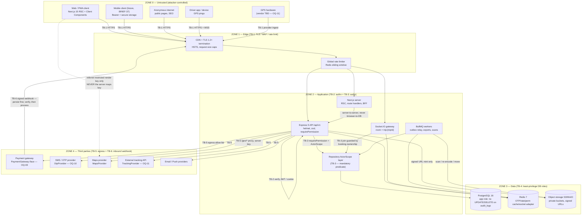
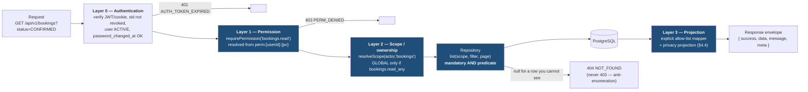
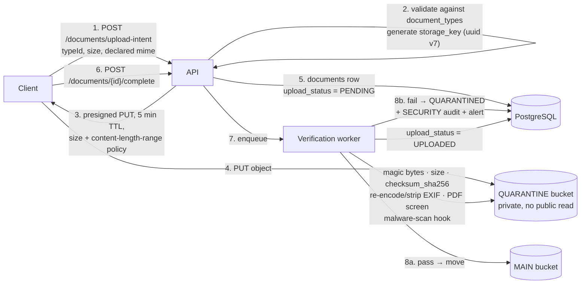

# UniGate — Security Design

**Status:** Phase 1 (Architecture) — design baseline, approved for implementation pending the open questions in [assumptions.md](assumptions.md)
**Phase:** 1 of 16 (security work is distributed across Phases 2–16 — see §11)
**Standard baselines referenced:** OWASP Top 10 2021 · OWASP ASVS 4.0.3 (target **Level 2**, Level 3 for the payment, payout and audit paths) · NIST SP 800-63B (authentication) · OWASP Cheat Sheet Series · CWE Top 25
**Compliance position:** **No compliance with PDPL, ZATCA, TGA, PCI-DSS, ISO 27001, SOC 2 or GDPR is claimed by this document.** Each is recorded as requiring formal review — see §5.7, §9.5 and §12.
**Last updated:** 2026-09-14

**Related:** [architecture.md](architecture.md) · [database.md](database.md) · [api.md](api.md) · [assumptions.md](assumptions.md) · [requirements-analysis.md](requirements-analysis.md)

> This document is the security counterpart to [database.md](database.md). Where that document says *what is stored*, this one says *who may reach it, how it is protected, and what happens when someone tries to take it.* Control names, permission codes, error codes and `ActorScope` semantics are used exactly as defined in [architecture.md](architecture.md) and [api.md](api.md) — they are not re-invented here.

---

## 1. Scope, assets and trust boundaries

### 1.1 What this document covers

UniGate is a **multi-tenant marketplace**: customers raise trip requests, vehicle owners bid, bookings and money move between strangers, and the platform holds regulated personal identifiers for every party. The security posture is therefore dominated by three problems that generic web-app hardening does not solve:

1. **Every row belongs to somebody.** Almost every table has a natural owner (`customer_profile_id`, `owner_profile_id`, `driver_profile_id`). Broken object-level authorization is not one bug class among ten — it is *the* dominant risk (§2.2).
2. **Money leaves the platform.** Owner payouts are the only flow where the platform sends funds to an attacker-controllable destination. Payout redirection is the highest-value single attack (T-17).
3. **The platform knows where people are, right now.** Live vehicle location plus driver identity is a physical-safety dataset, not just a privacy one (T-29).

### 1.2 Asset register

| ID | Asset | Where it lives | Classification (§5.1) | Primary loss scenario |
|---|---|---|---|---|
| AS-01 | Credentials — `users.password_hash` (Argon2id), `refresh_tokens.token_hash`, `otp_requests.code_hash` | `iam` tables, Redis counters | Restricted | Account takeover of an admin → total platform compromise |
| AS-02 | Session/refresh tokens in flight | Browser cookies, mobile secure storage | Restricted | Silent impersonation without password knowledge |
| AS-03 | National ID / Iqama / driving-licence numbers | `owner_profiles.*_encrypted`, `driver_profiles.*_encrypted` | Restricted | Identity fraud against Saudi residents; PDPL exposure (OQ-12) |
| AS-04 | Owner payout details — `owner_bank_accounts.iban_encrypted` | `finance` | Restricted | Direct financial loss; irreversible once settled |
| AS-05 | Payment method tokens — `payment_method_tokens.provider_token` | `payments` | Restricted | Fraudulent charges against a customer's saved instrument |
| AS-06 | Live vehicle location — `current_vehicle_locations`, Redis mirror, Socket.IO rooms | `tracking` | Confidential | Stalking, cargo theft targeting, competitor fleet intelligence |
| AS-07 | Location history — `vehicle_location_points` | `tracking` (partitioned) | Confidential | Pattern-of-life reconstruction for a driver |
| AS-08 | Identity documents (files) — ID scans, licences, CR certificates, insurance | Object storage + `documents` metadata | Restricted | Bulk identity-document breach; the single worst headline risk |
| AS-09 | Commercial terms — `bids.total_amount`, `bookings.*_snapshot`, `booking_financial_snapshots` | `bidding`, `bookings`, `finance` | Confidential | Bid-price leakage destroys marketplace fairness; snapshot tampering = fraud |
| AS-10 | Payment records and webhook evidence — `payments`, `payment_transactions`, `payment_webhook_events`, `refunds` | `payments` | Confidential | Fabricated payment success; unrecoverable refund abuse |
| AS-11 | Ledger and settlements — `ledger_entries`, `settlements`, `settlement_lines` | `finance` | Confidential | Financial misstatement; double payout |
| AS-12 | Audit trail — `audit_logs` | `platform` (append-only DB grants) | Restricted | Loss of forensic capability; insider actions become undetectable |
| AS-13 | Customer & corporate PII — names, phones, emails, CR/VAT numbers, addresses, `saved_locations` | `profiles` | Confidential | Mass PII disclosure; home addresses are in `saved_locations` |
| AS-14 | Authorization configuration — `roles`, `permissions`, `role_permissions`, `user_roles` | `iam` | Restricted | Self-granted `roles.manage` → permanent privileged foothold |
| AS-15 | Platform secrets — JWT secrets, encryption DEK/KEK, blind-index pepper, OTP pepper, gateway API keys and webhook secrets, server maps key, storage credentials | Environment / KMS only | Restricted | Forged tokens, mass decryption, forged webhooks, wallet drain |
| AS-16 | Availability of the booking path | Whole stack | Internal | Revenue loss; SLA breach (OQ-15) |
| AS-17 | Third-party spend — SMS, maps, storage egress | Provider accounts | Internal | Denial of wallet (T-33); real cash loss without any data breach |

### 1.3 Trust boundaries



| Boundary | Crossing | What is asserted at the crossing | Failure mode if the assertion is skipped |
|---|---|---|---|
| **TB-1** | Internet → Edge | TLS 1.2+ (1.3 preferred), HSTS, body-size caps, IP/identity rate limits, CORS allow-list | Credential replay over plaintext; volumetric abuse; denial of wallet |
| **TB-2** | Edge → Application (authentication) | Valid, unexpired, correctly-typed (`typ`), correctly-audienced JWT; session not revoked; `users.status = ACTIVE`; `password_changed_at` not newer than `iat` | Anonymous access to authenticated surface |
| **TB-3** | Application → Data (authorization) | `requirePermission('<code>')` **and** a non-optional `ActorScope` argument on every repository read/list/write | **IDOR — the single highest-likelihood flaw class in this system** (§2.2) |
| **TB-4** | Application → PostgreSQL / Redis / object storage | Least-privilege DB role (no `UPDATE`/`DELETE` on `audit_logs`, `ledger_entries`); Redis AUTH + private network; buckets private with public access blocked | Audit tampering; direct data exfiltration bypassing all app controls |
| **TB-5** | Application → third party (egress) | Outbound host allow-list, no user-controlled URLs, server-side keys never leave Zone 2, per-provider spend budget | SSRF (T-31); denial of wallet (T-33); key leakage to the browser |
| **TB-6** | Third party → Application (inbound callback) | HMAC signature verification before any state change; `uq_webhook_provider_event` idempotency; persist-then-process | Forged "payment succeeded" → free trips (T-14) |
| **TB-7** | Human → Administrative surface | Step-up authentication, `*_any` permissions, mandatory audit entry, impersonation banner + time box | Insider abuse invisible after the fact (T-09, T-10) |

### 1.4 Explicitly out of scope for this document

Physical data-centre security, hosting-region selection (**OQ-12**), DDoS scrubbing provider selection, corporate endpoint management, and the security of the client's existing systems. Deployment-time controls (WAF rules, network policy, secret store product, backup encryption verification) are owned by `docs/deployment.md` and listed as gaps in §12.

---

## 2. Threat model

### 2.1 Method, rating scale and how to read the tables

Threats are enumerated **STRIDE-per-boundary**, using the boundaries defined in §1.3. Each threat carries a STRIDE letter (**S**poofing, **T**ampering, **R**epudiation, **I**nformation disclosure, **D**enial of service, **E**levation of privilege).

| Scale | Likelihood (unmitigated, 12-month window) | Impact |
|---|---|---|
| **High** | Expected; commodity tooling exists; attempted routinely against any marketplace | Direct financial loss, restricted-data breach, or physical-safety consequence |
| **Medium** | Plausible with moderate effort or insider position | Confidential-data exposure, material fraud, or multi-tenant integrity loss |
| **Low** | Requires a chained precondition or privileged position | Limited to a single actor's data or recoverable operationally |

**Residual risk** is the risk *after* the listed controls are implemented as specified. Anything with residual **Medium** or above appears in §12 with an owner and a revisit trigger.

**38 threats** are enumerated: T-01 … T-38.

### 2.2 The dominant flaw class — broken object-level authorization (IDOR)

> OWASP A01:2021 Broken Access Control. ASVS V4.1, V4.2. CWE-639, CWE-566.

In a marketplace, almost every meaningful URL ends in someone else's identifier. `GET /api/v1/bookings/{id}`, `GET /api/v1/documents/{id}/download`, `GET /api/v1/tracking/trips/{id}/live`, `GET /api/v1/bids/{id}`, `GET /api/v1/settlements/{id}` — each is a correct, authenticated, permission-holding request that must nevertheless be refused because *the row belongs to a different tenant*. UUID v7 keys make guessing impractical, but IDs leak constantly and legitimately: in notification payloads, invoice PDFs, support tickets, screenshots, shared links, and — critically — in the attacker's **own** API responses, where a joined record may carry a sibling's identifier.

**Why controller-level checks alone fail.** They are not wrong; they are *unenforceable at scale*.

| Failure mode | Concrete instance in this system |
|---|---|
| **Opt-in and invisible when absent** | 18 modules × roughly 8–14 routes each ≈ 150+ endpoints. A missing `if (booking.customerProfileId !== actor.customerProfileId)` looks exactly like a route that legitimately has no ownership dimension. Review cannot reliably prove a negative. |
| **Check-after-fetch leaks existence** | The row is loaded, then compared, then a 403 is returned. The 403 itself confirms the record exists — the enumeration oracle survives the "fix" (hence the canonical **404-not-403** rule). |
| **New surfaces bypass it** | Report queries, export jobs, BullMQ workers, Socket.IO room joins, CSV generators and admin dashboards read the same tables through different code paths. Each one re-implements the check, or forgets it. |
| **Joins and `include` leak siblings** | `booking.include({ trip: { include: { trackingSession: true } } })` is scoped on the booking, not on the nested rows. A single careless `include` on `bids` exposes every competitor's `total_amount` on a shared trip request. |
| **Aggregates leak without returning rows** | `count`, `sum`, `groupBy` bypass row-level DTO mapping entirely. An unscoped `count` on `bookings` still reveals platform volume; an unscoped `sum` on `booking_financial_snapshots` reveals revenue. |
| **Sub-resource routes drift** | `/bookings/{id}/documents` is scoped on the booking; `/documents/{id}` is a different controller that must independently derive the owner through eight possible nullable FKs (`ck_documents_single_owner`, [database.md §6.1](database.md)). The second one is where the bug lives. |

**How the `ActorScope` layer structurally prevents it.** The fix is to move the predicate to the *only* place rows can be produced — the repository — and to make its absence a **compile-time error** rather than a review finding.

```ts
// packages/types/src/security/actor-scope.ts — hand-written, no Prisma types (canonical repo rule)
export type ActorScope =
  | { readonly kind: 'GLOBAL' }                                     // requires a *_any permission
  | { readonly kind: 'SELF';     readonly userId: string }
  | { readonly kind: 'CUSTOMER'; readonly customerProfileId: string }
  | { readonly kind: 'OWNER';    readonly ownerProfileId: string }
  | { readonly kind: 'DRIVER';   readonly driverProfileId: string }
  | { readonly kind: 'SPO';      readonly spoProfileId: string };

// Every repository read/list/aggregate/write takes it as a NON-OPTIONAL FIRST ARGUMENT.
export interface BookingRepository {
  findById(scope: ActorScope, id: string): Promise<BookingRow | null>;
  list(scope: ActorScope, filter: BookingFilter, page: PageArgs): Promise<Page<BookingRow>>;
  countByStatus(scope: ActorScope, filter: BookingFilter): Promise<Record<BookingStatus, number>>;
  updateStatus(scope: ActorScope, id: string, next: BookingStatus, ctx: TxContext): Promise<BookingRow>;
}
```

The repository converts the scope into a **mandatory `AND` predicate** before the caller's filter is applied:

```ts
function scopePredicate(scope: ActorScope): Prisma.BookingWhereInput {
  switch (scope.kind) {
    case 'GLOBAL':   return {};                                                   // only reachable with bookings.read_any
    case 'CUSTOMER': return { customerProfileId: scope.customerProfileId };
    case 'OWNER':    return { ownerProfileId:    scope.ownerProfileId };
    case 'DRIVER':   return { driverProfileId:   scope.driverProfileId };
    case 'SPO':      return { attributedSpoProfileId: scope.spoProfileId };
    case 'SELF':     return { customerProfile: { userId: scope.userId } };
    // no default — an added ActorScope variant is a TypeScript exhaustiveness error
    // in every repository at once, which is exactly the review signal we want.
  }
}
```

Five properties follow, and they are the whole argument for the design:

1. **You cannot forget it.** The argument is required and unions are exhaustively checked. A new `ActorScope` variant breaks the build in every repository until each one decides what that actor may see.
2. **`GLOBAL` is the only escape hatch, and it is granted, not assumed.** `resolveScope()` (§4.2) returns `{ kind: 'GLOBAL' }` **only** when the actor holds the matching `*_any` permission. There is no other producer of that value, and it is enforced by a unit test plus a lint rule banning `{ kind: 'GLOBAL' }` literals outside `common/security/resolve-scope.ts`.
3. **Aggregates are covered.** `count`, `sum` and `groupBy` live behind the same method signatures, so the predicate applies to them too.
4. **New endpoints inherit it for free.** A Phase-13 reporting endpoint calling `bookingRepository.list(scope, …)` is scoped whether or not its author thought about authorization.
5. **The 404 rule becomes automatic.** A scoped `findById` returns `null` for a row that exists but is not yours — indistinguishable from a row that does not exist. The service maps `null` to `NotFoundError` (`NOT_FOUND`, HTTP 404), so the enumeration oracle is closed *by construction*, not by remembering to choose the right status code.

**Belt and braces.** Three enforcement mechanisms back the type system:

| Mechanism | Rule |
|---|---|
| ESLint `unigate/no-prisma-outside-repository` | `import { prisma }` / `PrismaClient` is only permitted in `*.repository.ts` and `database/`. Services, controllers, jobs and mappers physically cannot open an unscoped query. |
| ESLint `unigate/require-actor-scope` | Every exported function in `*.repository.ts` must declare its first parameter as `ActorScope` (or be explicitly annotated `// @unscoped-repository-method: <justification>`, which fails CI unless the annotation is on the review allow-list). |
| **Scope conformance test suite** (Phase 3 onward) | A generated integration suite seeds two tenants (A and B) and, for **every** repository method, asserts that tenant A's scope returns zero rows / throws `NOT_FOUND` for tenant B's fixtures, and that `GLOBAL` returns both. Adding a repository method without a conformance case fails coverage gating. |

`requirePermission` and `ActorScope` are **two independent layers, not one control expressed twice** — see §4.1.

### 2.3 TB-3 — Authorization and multi-tenancy

| ID | STRIDE | Threat | Attacker | Affected asset | Likelihood | Impact | Control(s) | Residual |
|---|---|---|---|---|---|---|---|---|
| **T-01** | E, I | **IDOR on bookings** — authenticated customer or owner substitutes another party's `bookingId` on read, cancel, status transition or driver assignment | Any registered user | AS-09, AS-13 | **High** | High | `bookings.read` + `ActorScope{CUSTOMER\|OWNER\|DRIVER}` predicate in `bookings.repository.ts`; `bookings.read_any` required for `GLOBAL`; scoped `findById` → `null` → **404 `NOT_FOUND`**, never 403; transitions re-fetch under the same scope inside the transaction; scope conformance suite | Low |
| **T-02** | I | **IDOR on documents** — fetching or downloading another party's National ID scan, licence or CR certificate via `/documents/{id}` or a leaked/forwarded signed URL | Registered user; anyone holding a leaked URL | AS-08, AS-03 | **High** | **High** | Ownership derived from the eight typed FKs (`ck_documents_single_owner`) inside the repository, not the controller; `documents.read` + scope, `documents.download_any` for cross-tenant; `visibility` (`PRIVATE`/`INTERNAL`/`SHARED_WITH_COUNTERPARTY`) narrows further; signed GET URLs **120 s TTL**, minted per-request after the scope check, bound to `response-content-disposition=attachment`; never stored, never emailed, never logged; buckets private with public access blocked | Low |
| **T-03** | I | **IDOR on tracking** — subscribing to `trip:{tripId}` Socket.IO room or polling `/tracking/trips/{id}/live` for a vehicle the actor has no booking with | Registered user | AS-06, AS-07 | **High** | **High** | See T-29 (treated in full as a safety threat) | Low |
| **T-04** | I | **Competitor bid disclosure** — owner reads sibling bids on a shared `trip_request` to undercut by SAR 1 | Vehicle owner | AS-09 | **High** | Medium | `bids.read` + `ActorScope{OWNER}` → `owner_profile_id = :me`; the customer's comparison view is a **dedicated projection** that returns bids for *their own* request only; no endpoint returns another owner's `base_amount`/`total_amount`; aggregate "lowest bid" hints are deliberately **not** exposed (a bid count is, a bid price is not); `include` on `trip_requests` never nests `bids` | Low |
| **T-05** | I, T | **IDOR on finance** — reading or mutating another owner's `settlements`, `settlement_lines`, `booking_financial_snapshots`, `expenses` or `owner_bank_accounts` | Vehicle owner; compromised support account | AS-04, AS-11 | Medium | **High** | `settlements.read` + `ActorScope{OWNER}`; `settlements.create/approve/pay` are admin-only and additionally step-up gated (§3.6); `owner_bank_accounts` is never listed cross-tenant without `GLOBAL`; snapshots are read-only everywhere (D6) — no repository method exists to update them | Low |
| **T-06** | T, E | **Mass assignment** — `PATCH /owners/me` with `{ onboardingStatus: "APPROVED" }`, `PATCH /vehicles/{id}` with `{ approvalStatus: "APPROVED" }`, `PATCH /bookings/{id}` with `{ totalAmount: "1.00" }`, or `{ userId: "<other>" }` on any create | Any registered user | AS-09, AS-14 | **High** | **High** | Zod `.strict()` on **every** request schema — unknown keys are a **422 `VALIDATION_ERROR`**, not silently dropped; per-route input DTOs list only client-writable fields (state, money, ownership and approval columns are never in an input schema); services build the Prisma payload field-by-field from the parsed DTO, never `...body`; ESLint bans spread of a request object into a repository call; state changes go through named transition methods (`approve()`, `confirm()`) that take no free-form payload | Low |
| **T-07** | I | **Tenant data leakage through DTO drift** — a new Prisma column (`national_id_encrypted`, `privacy_settings`, `internal_notes`) silently appears in an API response because the mapper spreads the entity | Passive — any API consumer | AS-03, AS-13 | **High** | **High** | `packages/types` DTOs are **hand-written and never derived from Prisma** (canonical repo rule) — a new column cannot appear in a DTO type by itself; `*.mapper.ts` builds responses by **explicit allow-list assignment**; ESLint `no-restricted-syntax` bans `SpreadElement` in the return position of any `*.mapper.ts`; contract tests assert `Object.keys(dto).sort()` equals a frozen key list per DTO, so a hand-added field still fails until the test is deliberately updated; OpenAPI response schemas are `additionalProperties: false` and the generated spec is diffed in CI | Low |
| **T-08** | E | **Privilege escalation via role assignment** — an ops/support role edits a role it can already manage and adds `roles.manage`, `permissions.assign`, `users.impersonate`, `documents.download_any` or `settlements.pay` to it, or assigns itself a higher role | Compromised or malicious staff account | AS-14, all | Medium | **Critical** | `roles.manage` and `permissions.assign` are **`SUPER_ADMIN`-only** in the seed and are never included in `ADMIN`, `OPS_MANAGER`, `SUPPORT_AGENT` or `FINANCE_OFFICER`; **no-self-escalation invariant**: an actor may never grant a permission they do not themselves hold, and may never modify their own `user_roles` — enforced in `admin.policy.ts` and covered by tests; a **protected permission set** (`roles.manage`, `permissions.assign`, `users.impersonate`, `settlements.pay`, `payments.refund`, `documents.download_any`, `settings.manage`) requires **step-up OTP** (§3.6) and writes a `SECURITY` audit entry; `roles.is_system = true` rows cannot have their `code` changed or be deleted; every grant bumps `users.permission_version`, invalidating `perm:{userId}:{pv}` immediately; alert fires on any `role.permissions_changed` event | Low |
| **T-09** | S, R | **Insider abuse — impersonation** — an admin uses `users.impersonate` to act as a customer/owner, then denies it, or uses it to read PII outside a support case | Staff | AS-12, AS-13, AS-03 | Medium | High | `users.impersonate` is `SUPER_ADMIN` + explicitly-granted support role only; requires **step-up OTP** and a mandatory free-text `reason` recorded in `audit_logs`; issues a **distinct session** with `typ=impersonation`, a hard **30-minute** cap, no refresh rotation (cannot be extended), and a **denied-action list** (cannot change bank accounts, cannot pay settlements, cannot manage roles, cannot request exports); every request in the session carries `actor_user_id = admin` **and** `impersonated_user_id` in `audit_logs`; a persistent banner is rendered to the admin; impersonation start/stop is a `SECURITY`-severity alert routed to the security channel in real time | **Medium** — detective, not preventive; accepted with owner in §12 |
| **T-10** | I | **Bulk PII export by insider** — `reports.export` used to pull every customer's phone, or `documents.download_any` used to enumerate ID scans | Staff | AS-03, AS-08, AS-13 | Medium | **High** | Exports run as async `export_jobs` — never inline, never unbounded; every export writes an audit entry with `report_code`, `filters` and `row_count`; **step-up OTP** for any export whose projected `row_count` exceeds 1,000 or whose report touches a `Restricted`-classified column; National ID / IBAN / licence numbers are **never** exportable in cleartext — exports emit `*_last4` only, with no permission that unlocks the full value in bulk (single-record reveal is a separate, individually-audited endpoint); per-user export rate limit 5/hour, 2 concurrent; result is a signed URL with a short TTL and `export_jobs.expires_at`; alert on export volume anomaly and on any `documents.download_any` burst (>20 distinct documents / 10 min) | **Medium** — see §12 |
| **T-11** | I | **Enumeration** — probing `/users`, `/bookings/{id}`, `/vehicles?plate=`, `/auth/forgot-password` and registration to learn which identifiers, bookings or plates exist, via differential status codes, differential error bodies or response-time differences | Unauthenticated or low-privilege | AS-13, AS-09 | **High** | Medium | Canonical rule: **authorization failures on invisible records return 404, not 403** (and this falls out of the scoped `findById` automatically); `/auth/forgot-password`, `/auth/otp/request` and `/auth/register` return an identical **202** and identical body for known and unknown identifiers; login always performs a dummy Argon2id verify against a fixed hash when the user does not exist, so timing does not separate the cases; `AUTH_INVALID_CREDENTIALS` never distinguishes "no such user" from "wrong password"; per-IP and per-identifier throttles on all three endpoints; plate/VIN search requires `vehicles.read` and is scoped | Low |

### 2.4 TB-6 / payments — money integrity

| ID | STRIDE | Threat | Attacker | Affected asset | Likelihood | Impact | Control(s) | Residual |
|---|---|---|---|---|---|---|---|---|
| **T-12** | S, T | **Client-reported payment success** — client calls `POST /payments/{id}/confirm` or manipulates the gateway return URL to mark a booking `CONFIRMED` without money moving | Customer | AS-10, AS-16 | **High** | **High** | **The frontend can never move a payment to `PAID`** (BRIEF-17). The gateway redirect is treated as a *navigation hint only*: it triggers a server-side `getPaymentStatus()` inquiry, recorded as a `payment_transactions` row of type `INQUIRY`. `payments.status` transitions to `PAID` only from (a) a signature-verified webhook, or (b) a server-initiated inquiry that the gateway answers authoritatively. There is no API surface that accepts a client-asserted payment outcome; `bookings.status = CONFIRMED` is written by the payment service, not by a customer-callable endpoint | Low |
| **T-13** | T | **Tampered totals** — client submits its own `total_amount`, a negative `extras_amount`, a re-priced `base_amount` after bid acceptance, or a zero/negative payment amount | Customer or owner | AS-09, AS-10 | **High** | **High** | Totals are **derived, never accepted**: the API takes `base_amount` + `extras_breakdown`; `extras_amount`, `vat_amount` and `total_amount` are computed server-side from the snapshotted `vat_rate` ([database.md §9.1](database.md)) — a client-supplied total is **ignored, not validated**; `ck_bids_amounts` enforces `base_amount > 0 AND extras_amount >= 0 AND vat_amount >= 0` at the DB; the payment amount is read from `bookings.total_amount`, which is an immutable snapshot taken at bid acceptance — no request parameter influences it; the balance identity `owner_net + commission + commission_vat + payment_fee = gross` is asserted before `booking_financial_snapshots` is written, and a failed assertion aborts the transaction | Low |
| **T-14** | S, T | **Forged or replayed webhook** — attacker POSTs a fabricated `payment.succeeded` to `/payments/webhooks/{provider}`, or replays a genuine captured event to double-credit | Internet-wide (endpoint is necessarily public) | AS-10, AS-11 | **High** | **Critical** | HMAC signature verified against the provider secret using `crypto.timingSafeEqual` **before any state change**; provider timestamp checked within a **±300 s** window to bound replay; `payment_webhook_events` persists **first** (raw payload, headers, `signature_header`, `signature_valid`), returns `200` fast, and processes in a BullMQ job — so a crash never loses an event; `uq_webhook_provider_event (provider_code, provider_event_id)` makes idempotency a **database constraint**, not a code path; `signature_valid = false` rows are stored, **never processed**, and raise a `SECURITY` alert immediately (forged webhooks are evidence, not errors); state transitions are guarded by the payment state machine so a late `AUTHORIZED` cannot regress a `PAID` payment; provider source-IP allow-list where the gateway publishes one (OQ-03) | Low |
| **T-15** | T | **Refund abuse** — refund requested for more than was captured, refunds split across concurrent requests to exceed the capture, or refund issued on a booking that was never paid | Customer with social-engineering leverage; malicious/compromised staff | AS-10, AS-11 | Medium | **High** | `ck_refunds_amount` — cumulative refunds per payment may not exceed the captured amount, evaluated **in-transaction with `SELECT … FOR UPDATE` on the payment row**, so two concurrent partial refunds cannot both pass; violation maps to **`REFUND_EXCEEDS_CAPTURED`** (422); `payments.refund` is a privileged permission, not held by `SUPPORT_AGENT`; refunds above a configurable threshold require a second approver (`refunds.approved_by_user_id ≠ requested_by_user_id`) and **step-up OTP**; every refund posts reversing `ledger_entries` (never an update) and writes an audit entry | Low |
| **T-16** | T, D | **Double capture / double booking on retry** — a flaky mobile connection causes the same capture or the same bid acceptance to be submitted twice | Customer (usually unintentionally); deliberate racer | AS-10, AS-09 | Medium | High | `Idempotency-Key` header **required** on all non-GET money- or state-moving endpoints, persisted in `idempotency_keys` with `request_hash`; a replay with the same key and same hash returns the stored response, a replay with a *different* hash returns **`IDEMPOTENCY_KEY_REUSED`** (409); payment capture takes `FOR UPDATE` on the payment and rejects a second capture with **`PAYMENT_ALREADY_CAPTURED`**; bid acceptance serialises on `trip_requests … FOR UPDATE` and the `ex_vehicle_calendar_no_overlap` exclusion constraint decides the winner, the loser receiving **`BID_VEHICLE_UNAVAILABLE`** (409); settlement double-payment is blocked by the partial unique on `settlement_lines(booking_id) WHERE line_type='BOOKING_EARNING'` → **`SETTLEMENT_BOOKING_ALREADY_SETTLED`** | Low |
| **T-17** | T, S | **Payout redirection fraud** — attacker with a hijacked owner session (or an insider) changes `owner_bank_accounts.iban_encrypted` to their own account and waits for the next settlement to drain the owner's earnings. **The highest-value single attack on this platform**: it converts a session compromise directly into irreversible cash. | Session hijacker; phisher; malicious staff | AS-04, AS-11 | Medium | **Critical** | **Six layered controls, all required:** (1) **Step-up OTP re-authentication** (`otp_requests.purpose = SENSITIVE_ACTION`) to a *previously verified* destination — never to a destination supplied in the same request; (2) **mandatory audit entry** at `SECURITY` severity with `before_value`/`after_value` carrying `iban_last4` only (never the ciphertext or plaintext, per the redaction allow-list); (3) **change-notification to the previous contact** — SMS + email to the phone/email on file *before* the change, and again after, with a "this wasn't me" link that suspends payouts; (4) **cool-off period** — a new or edited bank account is not usable as a settlement destination until `activation_at` (default **72 h**, assumption **A-47**) has passed and `is_verified = true`; settlements referencing a cooling account are blocked, not silently redirected to the old one; (5) **finance approval on settlement** — `settlements.status` must pass `PENDING_APPROVAL → APPROVED` by a user holding `settlements.approve`, who is not the requester, before `settlements.pay`; the approval screen displays the **payout-account age and last-changed date** so a recent change is visible at the moment of approval; (6) **payout-destination change freezes in-flight settlements** for that owner pending manual review. Real-time `SECURITY` alert on every `owner_bank_account.changed` event | **Medium** — see §12 (no out-of-band identity re-verification at MVP) |
| **T-18** | T, E | **Settlement self-approval / fabricated adjustment** — a finance user creates a settlement with an `ADJUSTMENT` line in their own favour and approves and pays it | Staff | AS-11 | Low | **High** | Separation of duties across `settlements.create`, `settlements.approve`, `settlements.pay` — the seed grants all three to no single non-`SUPER_ADMIN` role, and the service rejects `approved_by_user_id = created_by_user_id`; **step-up OTP** on `settlements.pay`; double-entry `ledger_entries` with a CI assertion that debits equal credits per `transaction_group_id`; adjustment lines require a reason and appear on a daily finance exception report; all three actions are `SECURITY`-severity audited | Low |

### 2.5 TB-2 / authentication and OTP

| ID | STRIDE | Threat | Attacker | Affected asset | Likelihood | Impact | Control(s) | Residual |
|---|---|---|---|---|---|---|---|---|
| **T-19** | S | **Credential stuffing → account takeover** — breached email/password pairs replayed at scale against `/auth/login`; low-and-slow distributed attempts to evade per-IP limits | Commodity botnet | AS-01, AS-13 | **High** | **High** | Argon2id (§3.1) makes offline cracking of our own store expensive but does nothing for reused passwords — so: **breached-password check** at registration, change and reset via k-anonymity range lookup (§3.2); progressive delay keyed on **`identifier_hash` and IP independently** so a distributed attack still trips the per-account counter (§3.3); `login_attempts` gives durable anomaly data; **failed-login spike alert** (§8.4); mandatory OTP step-up on the sensitive actions that make an ATO profitable (§3.6) so a stolen password alone cannot redirect a payout; device/session list + "log out all sessions" for recovery; suspicious-login notification to the user | **Medium** — no MFA enrolment for ordinary users at MVP; see §12 |
| **T-20** | S | **Refresh-token theft and replay** — token lifted from device storage, XSS, a malicious proxy or a backup, then used to mint access tokens indefinitely | Malware; local attacker; network attacker | AS-02 | Medium | **High** | Web tokens are `httpOnly; Secure; SameSite=Lax` cookies — unreadable from JS, so XSS cannot exfiltrate them; mobile refresh tokens live in Keychain/Keystore; only `token_hash` (SHA-256) is stored, never the token; **rotation on every use** with `replaced_by_id` chaining; **family reuse detection** — presenting a token whose `used_at` is already set proves duplication, so the entire `family_id` **and the parent `sessions` row** are revoked, a `SECURITY` audit entry is written, the user is notified, and the client receives **`AUTH_REFRESH_REUSE_DETECTED`** forcing full re-authentication; 30-day absolute refresh lifetime and 15-minute access lifetime bound the window; `password_changed_at` invalidates every session issued before it | Low |
| **T-21** | S | **OTP brute force** — 6-digit code guessed by hammering `/auth/otp/verify`, or by requesting many codes and guessing across all of them | Anyone with a target phone number | AS-01 | Medium | High | `otp_requests.max_attempts = 5` then the record is burned (`consumed_at` set, status terminal) — not merely "the attempt fails"; **300 s expiry**; single-use; **issuing a new code invalidates all prior unconsumed codes for the same `(destination_hash, purpose)`**, so the attacker never accumulates a pool of live codes; codes generated with `crypto.randomInt` (CSPRNG, no `Math.random`); stored as `HMAC-SHA256(code, OTP_PEPPER)` with `timingSafeEqual` comparison; per-destination and per-IP verify throttles independent of the request throttles; exhaustion returns **`AUTH_OTP_INVALID`** with no hint about remaining attempts, and throttling returns **`AUTH_OTP_THROTTLED`** (429) | Low |
| **T-22** | D | **OTP pumping / SMS toll fraud (IRSF)** — attacker scripts `/auth/otp/request` against premium-rate or foreign numbers they control, converting our SMS budget into their revenue share. Costs real money with **zero data compromise**, which is why it is routinely missed. | Fraud ring | AS-17, AS-16 | **High** | Medium | **Destination country allow-list** — only `+966` accepted for registration/login OTP by default; other country codes require an explicit admin-enabled flag per environment (config `OTP_ALLOWED_COUNTRY_CODES`); **E.164 normalisation + KSA mobile prefix validation** (`+9665XXXXXXXX`) rejects premium and non-mobile ranges before any provider call; per-destination throttle **1 / 60 s, 5 / hour, 10 / 24 h**; per-IP **20 / hour**; per-account **10 / day**; unverified-destination cap — a destination that has never completed a verification is limited to **3 lifetime sends**; **global daily SMS spend circuit breaker** that trips to `ConsoleOtpProvider` + page-on-call rather than continuing to spend; velocity anomaly alert on distinct-destination count per hour; `otp_requests` is the durable record that makes the pattern visible after the fact | **Medium** — depends on provider selection (**OQ-10**); see §12 |
| **T-23** | I | **Registered-number enumeration** — differential responses between "OTP sent" and "no such account", or differential timing, used to confirm which Saudi mobile numbers hold UniGate accounts (valuable input to phishing) | Anyone | AS-13 | Medium | Medium | `/auth/otp/request`, `/auth/forgot-password` and `/auth/register` return **HTTP 202 with an identical body** whether or not the identifier exists; for a non-existent identifier no SMS is sent but the same throttle counters are incremented and the same artificial latency floor applies; registration conflicts surface **only after** OTP verification of the claimed destination, so the conflict is disclosed to someone who controls the number; admin-facing user search requires `users.read` | Low |
| **T-24** | S | **Password-reset abuse** — reset link harvested from a poisoned `Host`/`X-Forwarded-Host` header, guessed token, or a reset token that survives use | Network attacker; opportunist | AS-01 | Low | High | Reset URLs are built from the **server-side `APP_URL` config only** — request headers are never used to construct links; `password_reset_tokens` stores a SHA-256 hash of a 256-bit CSPRNG token, **15-minute** expiry, single-use, invalidated on password change and on a new request; consuming a reset revokes **all** sessions and refresh-token families for that user; reset emails/SMS go only to the verified destination on file; the same 202-uniform response as T-23 | Low |
| **T-25** | S | **Stale-session survival** — a suspended user, a password change, or a role revocation does not take effect until the 15-minute access token expires | Suspended/terminated user | AS-14, AS-16 | Medium | Medium | Access-token lifetime capped at **15 min** (bounded worst case); `sessions.revoked_at` checked against a Redis revocation set `sess:revoked:{sid}` on **every** request (the `sid` claim exists precisely for this); `users.status != ACTIVE` fails authentication immediately; `password_changed_at > token.iat` rejects the token with **`AUTH_TOKEN_EXPIRED`**; permission changes bump `users.permission_version`, which changes the `perm:{userId}:{pv}` cache key so the *next request* resolves fresh permissions — no stale-permission window at all, because permission codes are deliberately **not** in the token | Low |

### 2.6 TB-1 / TB-2 — web application surface

| ID | STRIDE | Threat | Attacker | Affected asset | Likelihood | Impact | Control(s) | Residual |
|---|---|---|---|---|---|---|---|---|
| **T-26** | E, T | **Malicious file upload** — web shell disguised by a client-supplied `Content-Type: image/jpeg`; **SVG containing `<script>`** served same-origin and stealing an admin session; a **polyglot** (valid GIF header + PHP/HTML payload); a file named `../../etc/passwd` or `evil.php.jpg` | Any user who can upload (every role can) | AS-08, AS-01, whole app | **High** | **High** | **A client-supplied `Content-Type` is not evidence and is never trusted** — it is recorded for reference and then overwritten by a server-side **magic-byte sniff** (`file-type`) which must match both the global allow-list (`image/jpeg`, `image/png`, `image/webp`, `application/pdf`) **and** `document_types.allowed_mime_types` for the declared type, else **`DOCUMENT_TYPE_NOT_ALLOWED`**; **SVG is not an accepted document or image format anywhere in the platform** (the only safe answer for a same-origin-served format with a scripting engine) — if a future requirement forces it, the accepted design is: sanitise server-side, store in a separate bucket, and serve **only** with `Content-Disposition: attachment`, `Content-Type: application/octet-stream`, `X-Content-Type-Options: nosniff` and a `sandbox` CSP, from a cookie-less asset origin; raster images are **re-encoded** via `sharp` (which destroys polyglots and strips EXIF, T-28); PDFs are structurally screened for `/JavaScript`, `/OpenAction`, `/Launch`, `/EmbeddedFile`; `storage_key` is **server-generated** (`{ownerType}/{uuidv7}/{uuid}.{ext}`) and **never derived from the user filename** — path traversal has no surface because the client never supplies a path; `original_filename` is sanitised and used for display only; uploads land in a **quarantine bucket** with `upload_status = PENDING` and are only promoted after verification, else `QUARANTINED`; object storage never executes anything and is never served from the application origin | **Medium** until malware scanning is procured — see §12 |
| **T-27** | D | **Decompression / pixel bomb** — a 40,000 × 40,000 PNG or a crafted PDF that expands to gigabytes in the image pipeline and exhausts worker memory | Any uploader | AS-16 | Medium | Medium | `sharp` `limitInputPixels` capped at **50 MP** and `failOn: 'truncated'`; per-type `document_types.max_size_bytes` enforced **twice** — at the presigned-URL policy (the storage provider refuses an oversized PUT) and again at verification against the actual object size; archives (`zip`, `gz`, `rar`, `7z`) are rejected outright, so classic zip bombs have no entry point; PDF page and object-count ceilings; image processing runs in a **BullMQ worker with a hard memory ceiling and a 30 s timeout**, never in the request thread, so a bomb degrades one job rather than the API | Low |
| **T-28** | I | **EXIF GPS leakage** — a driver uploads a licence photo or proof-of-delivery image taken at home; the EXIF GPS tag is served to the customer | Passive | AS-07, AS-13 | Medium | Medium | All raster uploads are re-encoded with metadata stripped (`sharp().rotate().withMetadata(false)` — orientation applied, everything else discarded); the original is discarded after verification, not archived | Low |
| **T-29** | I | **Live-location leakage / stalking** — a customer keeps a completed trip's tracking page open and watches the driver go home; a user subscribes to `trip:{tripId}` for a trip they are not party to; an owner tracks a driver outside working hours; an ex-partner targets a specific driver | Registered user; targeted stalker | AS-06, AS-07, physical safety | **High** | **Critical** | **Three simultaneous conditions**, all checked server-side on both the REST poll and the Socket.IO `join`: (1) **permission** — `tracking.read`, or `tracking.read_any` for ops; (2) **relationship** — the requester is a party to the booking behind that trip, proven through the scoped repository (`ActorScope{CUSTOMER}` → `bookings.customer_profile_id = :me`), never through a client-sent `bookingId`; (3) **time window** — `trips.status` is in the active set (`DRIVER_ASSIGNED` … `ARRIVED_AT_DESTINATION`) **and** now is within `[scheduled_start_at − 2 h, completed_at + 30 min]`. Outside the window the live endpoint returns **404**, the socket room join is refused, and the Redis position mirror has already expired (**60 s TTL**). Room membership is authorised at `join` **and** re-validated when trip status changes, and the server **force-leaves** all customer sockets on `COMPLETED`/`CANCELLED` — a stale open tab cannot keep streaming. Drivers publish (`tracking.publish`) only for their **own active** trip. Historical `vehicle_location_points` replay is **admin-only** (`tracking.read_any`); the customer receives a route summary, not a full-resolution track. Owners see their own vehicles only, and only while on a trip — **there is no always-on fleet-tracking view of drivers in MVP** (a deliberate design refusal, recorded in [assumptions.md](assumptions.md)). Every `tracking.read_any` use is audited | Low |
| **T-30** | S, T | **Spoofed tracking ingest** — a driver fakes GPS to claim arrival and trigger waiting charges, or a third party pushes positions for a vehicle they do not drive | Driver; external | AS-06, AS-09 | Medium | Medium | Ingest requires `tracking.publish` **plus** an `ActorScope{DRIVER}` match against `trips.driver_profile_id` for an **active** trip — there is no unauthenticated ingest endpoint; ping rate limited to **12/min per trip** (10 s cadence plus slack); server-side plausibility checks (implied speed > 250 km/h, accuracy worse than 500 m, timestamp outside ±120 s of server time) mark the point `rejected` and raise a counter rather than trusting it; hardware GPS ingest (**OQ-11**) is authenticated per device via `gps_devices.device_identifier` bound to `vehicle_id`, and a device asserting a vehicle it is not bound to is rejected and alerted; status transitions that carry money (arrival, waiting time) record `latitude`/`longitude` in `trip_status_history` so a dispute is adjudicable | **Medium** — client-supplied GPS is inherently unverifiable; see §12 |
| **T-31** | I, E | **SSRF** — a user-supplied address or coordinate is passed to `/geo/*` and coerced into fetching `http://169.254.169.254/latest/meta-data/`, `http://localhost:6379`, or an internal admin service; or an admin configures a webhook/callback URL pointing at an internal host and uses the platform as a request proxy | Any user (geo); staff (webhook config) | AS-15, internal network | Medium | **High** | `/geo/*` proxy endpoints accept **typed parameters only** — a query string, a `place_id`, or a lat/lng pair validated by Zod to numeric ranges — **never a URL**; the outbound request URL is constructed server-side from a **hard-coded provider base URL** with no user-controlled host, scheme, port or path; a shared `safeFetch()` wrapper enforces an **egress host allow-list**, resolves DNS and **rejects private, loopback, link-local, CGNAT and IPv6-ULA ranges** (including after redirects — redirects are capped at 2 and re-validated each hop, closing DNS-rebinding and redirect-to-internal), forbids non-HTTPS, and applies a 5 s timeout; any admin-configurable callback URL (payment return URL, notification webhook) goes through the same validator, is restricted to HTTPS on a configured domain allow-list, and requires `settings.manage` + step-up; responses from third parties are parsed by Zod, never echoed raw to the client (blind-SSRF data does not return either) | Low |
| **T-32** | T | **CSV / formula injection in exported reports** — a field the attacker controls (`owner_notes`, `special_instructions`, `business_name_en`, `complaint.subject`, `vendor_name`) begins with `=`, `+`, `-`, `@`, tab (`0x09`) or CR (`0x0D`); Excel/LibreOffice evaluates it on open, enabling `=HYPERLINK(…)` data exfiltration or DDE command execution **on the finance analyst's workstation**. BRIEF-25 mandates CSV/Excel export, so this surface is required, not optional. | Any user who can write a free-text field | Staff workstations, AS-13 | **High** | **High** | A single shared `sanitiseCellValue()` applied to **every** cell of **every** CSV and XLSX export — no exporter formats its own cells: (1) if the value starts with `=`, `+`, `-`, `@`, `\t` or `\r`, prefix a single quote `'` (Excel's literal-text escape); (2) always quote fields and double embedded quotes per RFC 4180; (3) strip control characters except `\n` within quoted fields; (4) for XLSX, write with `type: 'string'` so the value can never be interpreted as a formula, and never emit a formula cell. Enforced by a unit test table covering all six prefixes plus `=cmd\|' /C calc'!A0`, and by an integration test that round-trips a hostile fixture through each of the 13 report types in BRIEF-25. PDF export renders text nodes only. CSVs are served as `text/csv; charset=utf-8` with `Content-Disposition: attachment` and a **UTF-8 BOM** (so Arabic renders correctly in Excel without tempting anyone to switch encodings) | Low |
| **T-33** | D | **Denial of wallet** — unbounded geocode/autocomplete/distance-matrix calls, repeated large report exports, high-frequency tracking pings, or OTP pumping (T-22) convert traffic into third-party invoices. No data is stolen and no alert fires in a classic security monitor. | Any registered user; scripted abuse | AS-17, AS-16 | **High** | Medium | Per-user and per-tenant quotas on `/geo/*` (**60/min**, 5,000/day) with server-side caching of geocode and place results (24 h, keyed on normalised query) and **debounced** autocomplete from the client (min 3 chars, 300 ms) — but the server quota is the control, the debounce is only an optimisation; distance-matrix results are cached per `(pickup_place_id, dropoff_place_id)` and reused across the whole bidding flow instead of being re-fetched per bid; exports 5/hour/user with 2 concurrent and a row ceiling; tracking ingest 12/min/trip; **per-provider daily spend budgets with a circuit breaker** that degrades to cached/stale data and pages on-call rather than spending without limit; provider-side quotas and budget alerts configured in the provider console as a second, independent ceiling; a daily third-party spend line on the ops dashboard | **Medium** — see §12 |
| **T-34** | T, R | **Audit-log tampering** — an attacker who reaches the application database role (SQL injection, leaked `DATABASE_URL`, compromised container) deletes or edits `audit_logs` rows to erase their tracks | Application-level compromise; insider with DB access | AS-12 | Low | **Critical** | **Append-only enforced at the PostgreSQL role level, not in application code**: the runtime role is granted `INSERT` and `SELECT` on `audit_logs` and explicitly **not** `UPDATE` or `DELETE` (likewise `ledger_entries`, `booking_financial_snapshots`, `payment_transactions`, `*_status_history`); migrations run under a **separate, higher-privileged role** used only by CI, never by the API process; monthly partitions are detached by a maintenance role; **audit records are shipped to an external log sink within 60 s**, so the durable copy is outside the blast radius of a database compromise; a daily job records row counts per partition and alerts on any decrease; `audit_logs.request_id` correlates with the log sink so deletion is detectable by comparison even if both copies are attacked | Low |
| **T-35** | I, E | **Infrastructure exposure** — Redis reachable without AUTH (OTP counters, permission cache, socket adapter, live positions), Postgres exposed to the internet, MinIO console open, or an unauthenticated Socket.IO namespace allowing arbitrary room subscription | Internet scanner | AS-06, AS-01, AS-14 | Medium | **High** | Redis and Postgres bound to a private network only, never a public interface; Redis `requirepass` + TLS in production, dangerous commands (`FLUSHALL`, `KEYS`, `CONFIG`) renamed/disabled; object storage buckets private with public-access block, no bucket ACLs, access solely via short-TTL signed URLs; **Socket.IO authenticates on connection with the same JWT/cookie path as REST** and authorises **every** `join` through the scoped repository (T-29) — there is no unauthenticated namespace and no client-chosen room name that is trusted; `docker-compose.yml` publishes ports for local development only, and the production compose/manifest is a separate file reviewed in Phase 16; infrastructure exposure is re-verified by the pre-go-live penetration test (§10.5) | **Medium** until infrastructure is selected — see §12 |
| **T-36** | T | **Supply-chain compromise** — a malicious or typosquatted npm dependency, a compromised transitive package, or a CI job exfiltrating `JWT_SECRET` / `DATABASE_URL` from the build environment | External | AS-15, whole platform | Medium | **Critical** | `pnpm-lock.yaml` committed and CI runs `--frozen-lockfile`; `pnpm audit` + Dependabot/Renovate with a **72 h SLA on Critical/High**; `overrides` pinning for transitive fixes; no `postinstall` scripts from new dependencies without review (`pnpm config set side-effects-cache false`, `--ignore-scripts` in CI where feasible); new direct dependencies require justification in review (§10.2); **secret scanning** (gitleaks) on every commit and on history; CI secrets are scoped per-job, never exposed to PR builds from forks, and production secrets are **never** present in any CI job that runs third-party code; SBOM generated at release | **Medium** — inherent to the ecosystem; see §12 |
| **T-37** | T | **Stored XSS in the admin portal** — hostile markup in `owner_notes`, `complaint.description`, `special_instructions`, `business_name_ar` or `rejection_reason` executes in an admin session that holds `*_any` permissions | Any user with a free-text field | AS-14, AS-01 | Medium | **High** | React escapes by default and **`dangerouslySetInnerHTML` is banned by ESLint** (`react/no-danger` as an error) — a use requires an explicit exemption comment, DOMPurify sanitisation with an allow-list, and security review sign-off (§10.3); no `innerHTML`, `eval`, `new Function`, `document.write`, or `javascript:`/`data:` URL construction from user input (all lint-enforced); user-supplied URLs are validated to `https:` before being placed in an `href`, and rendered with `rel="noopener noreferrer"`; a **nonce-based CSP without `unsafe-inline`** (§6.3) makes an injected script non-executing even if escaping is bypassed; JSON responses are served `application/json` with `X-Content-Type-Options: nosniff`; Arabic/RTL content passes through the same escaping path (no `dir` injection via unencoded bidi control characters — they are stripped on input) | Low |
| **T-38** | T, I | **SQL injection via raw SQL** — Prisma prevents injection for generated queries, but this design deliberately uses hand-written SQL for `EXCLUDE` constraints, partial unique indexes, `CHECK`s, partitioning and `citext` ([database.md §1](database.md)), and reporting aggregates are likely to reach for `$queryRaw` | Any user reaching a raw query path | AS-13, AS-09, whole DB | Low | **Critical** | All application queries go through Prisma's parameterised client; `$queryRaw`/`$executeRaw` (tagged-template form, which parameterises) is permitted **only** inside `*.repository.ts` and **only** with an `// @raw-sql-reviewed:` annotation naming the reviewer; `$queryRawUnsafe`/`$executeRawUnsafe` are **banned outright** by ESLint `no-restricted-properties` with no exemption path; identifiers that must be dynamic (sort column, sort direction) are resolved through a **closed allow-list map**, never interpolated from the request (`sortBy`/`sortDirection` are Zod enums, not strings); hand-written migration SQL is a mandatory security-review path (§10.3); the DB role has no `CREATE`/`DROP` rights at runtime, bounding the impact of a successful injection | Low |

### 2.7 Threat coverage vs OWASP Top 10 2021

| OWASP 2021 | Threats | Primary structural control |
|---|---|---|
| A01 Broken Access Control | T-01…T-11, T-29 | Two-layer authorization: `requirePermission` + mandatory `ActorScope` (§4) |
| A02 Cryptographic Failures | T-02, T-20, T-35 | TLS 1.2+/HSTS, AES-256-GCM field encryption, Argon2id, hashed tokens (§5) |
| A03 Injection | T-32, T-37, T-38 | Zod allow-lists, Prisma parameterisation, `sanitiseCellValue()`, nonce CSP (§6) |
| A04 Insecure Design | T-12, T-13, T-16, T-17, T-29 | Server-derived totals, DB-enforced invariants, step-up + cool-off on payout (§3.6) |
| A05 Security Misconfiguration | T-35, T-31 | Helmet CSP, CORS allow-list, private buckets, Zod env validation (§6, §7) |
| A06 Vulnerable & Outdated Components | T-36 | Lockfile policy, audit gates, Renovate SLA (§10.2) |
| A07 Identification & Authentication Failures | T-19…T-25 | Argon2id, breached-password check, OTP hardening, rotation + reuse detection (§3) |
| A08 Software & Data Integrity Failures | T-14, T-34, T-36 | Webhook signature + idempotency constraint, append-only DB grants, SBOM (§8.3) |
| A09 Security Logging & Monitoring Failures | T-09, T-10, T-34 | Append-only audit trail, `SECURITY` severity, alert triggers (§8) |
| A10 Server-Side Request Forgery | T-31 | `safeFetch()` egress allow-list + private-range rejection, no user-supplied URLs (§6.7) |

---

## 3. Authentication controls

> OWASP A07:2021. ASVS V2 (Authentication) — target **L2**, with L3 verifiers on the payout and role-management paths. NIST SP 800-63B AAL2-equivalent for step-up flows.

### 3.1 Password hashing — Argon2id

Argon2id is mandated by BRIEF-6 ("Argon2 preferred") and is the current PHC recommendation: the `id` variant resists both GPU (data-independent first pass) and side-channel (data-dependent second pass) attack.

| Parameter | Value (starting point) | Env var | Rationale |
|---|---|---|---|
| Variant | `argon2id` | — | Never `argon2i` or `argon2d` alone |
| Memory cost `m` | **65536 KiB (64 MiB)** | `ARGON2_MEMORY_KIB` | Well above the OWASP floor of 19 MiB; memory is what defeats GPU/ASIC parallelism |
| Iterations `t` | **3** | `ARGON2_TIME_COST` | Tuned *after* memory, per PHC guidance |
| Parallelism `p` | **1** | `ARGON2_PARALLELISM` | Node hashes on a worker thread; `p > 1` buys nothing here and complicates capacity planning |
| Hash length | **32 bytes** | — | |
| Salt length | **16 bytes**, CSPRNG per hash | — | Generated by the `argon2` library |
| Pepper | **Not used for passwords** | — | A pepper adds value only if stored separately from the DB; for passwords the KMS round-trip cost per login is not justified. Peppers *are* used for OTP codes and blind indexes, where the input space is small (§5.4) |

> **These numbers are a starting point and MUST be benchmarked on the production instance type before go-live.** The binding requirement is a **target verify time of 250–350 ms** on production hardware at expected login concurrency. Raise `m` first, then `t`, until the target is met; if 64 MiB × peak concurrent logins exceeds the container memory budget, **reduce concurrency (queue logins) rather than weakening the parameters**. Peak memory is `m × p × concurrent verifies` — at 64 MiB and 20 concurrent verifies that is 1.28 GiB, which must be reserved, or Argon2id itself becomes a memory-exhaustion DoS. The benchmark is a Phase 3 deliverable recorded in [assumptions.md](assumptions.md); the chosen parameters are re-benchmarked whenever the instance type changes.

Operational rules:

- Parameters are stored **in the hash string** (`$argon2id$v=19$m=65536,t=3,p=1$…`), so they can be raised later. On successful login, if the stored hash's parameters are below the current configuration, the password is **transparently re-hashed** and updated within the same request.
- `users.password_hash` is `NULL` for OTP-only accounts — the login path must branch explicitly, never treat `NULL` as a match.
- Verification for a **non-existent user** performs a **dummy verify against a fixed, valid Argon2id hash** so the response time does not separate the cases (T-11).
- `password_hash` is in the logging and audit redaction ban-list (§8.2) and is never selected into any DTO — there is no mapper field for it.

### 3.2 Password policy (NIST SP 800-63B style)

BRIEF-3 requires "never plaintext passwords"; the policy below follows SP 800-63B, which is deliberately **length-over-composition**.

| Rule | Value | Why |
|---|---|---|
| Minimum length | **10 characters** for customers/owners/drivers; **12** for any account holding a `*_any` or `*.manage` permission | Length is the only user-chosen factor that reliably increases entropy |
| Maximum length | **128 characters** | Prevents an Argon2id memory/CPU DoS via megabyte passwords; well above any real passphrase |
| Composition rules | **None** — no forced upper/lower/digit/symbol | SP 800-63B §5.1.1.2 explicitly recommends against them; they drive `Password1!` and reuse |
| Allowed characters | All printable Unicode **including spaces and emoji**; NFKC-normalised before hashing | Passphrases must be usable in Arabic and English |
| Breached-password check | **Required** at registration, change and reset — k-anonymity range lookup (first 5 hex of SHA-1 sent, full hash never leaves the server) against a breach corpus | Blocks the credentials that credential-stuffing (T-19) actually uses |
| Context blocklist | Rejects the user's email local-part, phone digits, `unigate`, `1234…`, and the top ~10k common passwords | Cheap, high-yield |
| **Forced periodic rotation** | **Prohibited** — passwords never expire on a schedule | SP 800-63B §5.1.1.2: rotation causes predictable incremental changes and reduces security |
| Forced change | **Only on evidence of compromise** — breach-corpus hit at login, admin-initiated reset, first login of a seeded admin account | |
| Password hints / knowledge-based recovery | **Prohibited** | |
| Change flow | Requires the **current password**; on success revokes all other sessions and refresh-token families, sets `password_changed_at`, and notifies the user on all verified channels | |
| Feedback | Strength meter shown, **advisory only** — it never blocks a password that meets the length rule | |

Breach-check availability: if the range API is unreachable, the check **fails open with a `WARNING` log and a metric** rather than blocking registration; a sustained outage raises an alert. (Failing closed would make a third-party outage a full registration outage — an availability trade recorded in [assumptions.md](assumptions.md).)

### 3.3 Account lockout and progressive delay

Hard lockout is itself a denial-of-service primitive: anyone who knows a victim's email can lock them out. UniGate therefore uses **progressive delay with a bounded ceiling**, on two independent counters.

| Counter (Redis, sliding window) | Threshold → response |
|---|---|
| `login:fail:id:{identifier_hash}` | 3 → 1 s delay · 5 → 5 s · 8 → 30 s · 12 → **soft lock 15 min** (max) |
| `login:fail:ip:{ip}` | 20 / 15 min → 429 `RATE_LIMITED` · 50 / 15 min → IP throttled 1 h, alert |
| `login:fail:id_ip:{identifier_hash}:{ip}` | 5 / 15 min → 429 (catches targeted attacks without punishing shared NAT) |

- Delay is applied **before** the Argon2id verify, so it costs the attacker time without costing us CPU.
- Soft lock **never exceeds 15 minutes** and **always** auto-expires; there is no admin-unlock queue to weaponise. A locked account can still complete password reset (which is separately throttled).
- Both counters key on a **hash** of the identifier, so Redis never holds plaintext emails or phone numbers.
- Every attempt — success or failure — writes `login_attempts` (`identifier`, `identifier_hash`, `ip_address`, `user_agent`, `succeeded`, `failure_reason`). That table is the durable anomaly source behind the failed-login-spike alert (§8.4); Redis holds only the fast counters.
- Distributed low-and-slow stuffing is caught by the **per-identifier** counter (which no amount of IP rotation evades) and by the platform-wide failure-rate alert.
- Response is always `AUTH_INVALID_CREDENTIALS` (401) regardless of which counter tripped, except when a throttle is active, which returns `RATE_LIMITED` (429) with `Retry-After`.

### 3.4 OTP design

OTP is used for phone verification, OTP login, password reset and — critically — **step-up authentication on sensitive actions** (§3.6). Durable state is `otp_requests` ([database.md §5.3](database.md)); hot counters are Redis.

| Property | Value |
|---|---|
| Code space | **6 numeric digits**, generated with `crypto.randomInt(0, 1_000_000)` (CSPRNG) and zero-padded. `Math.random()` is banned by lint. |
| Storage | **`HMAC-SHA256(code, OTP_PEPPER)`** in `otp_requests.code_hash`. Never the code. Argon2 is deliberately *not* used: the input space is 10⁶, so hashing cost adds nothing that attempt limits do not already provide, and OTP verify is a hot path. |
| Pepper | `OTP_PEPPER` — ≥32 bytes, environment/KMS only, **never in the database**, so a DB-only dump does not permit offline code recovery within the 5-minute window. |
| Comparison | `crypto.timingSafeEqual` on fixed-length buffers. String `===` is banned by lint in `iam`. |
| Expiry | **300 s** (`expires_at`). Expired codes verify as invalid without revealing expiry. |
| Attempts | `max_attempts = 5`; on the 5th failure the record is **burned** (`consumed_at` set) — the code is dead even if the attacker later guesses right. |
| Single use | `consumed_at` set atomically on success (`UPDATE … WHERE consumed_at IS NULL RETURNING` — no check-then-act race). |
| Supersession | Issuing a new code **invalidates all prior unconsumed codes** for the same `(destination_hash, purpose)`, so an attacker cannot accumulate live codes (T-21). |
| Binding | `purpose` (`REGISTRATION`, `LOGIN`, `PHONE_VERIFICATION`, `PASSWORD_RESET`, `SENSITIVE_ACTION`) is part of the lookup — a code issued for phone verification can never satisfy a payout-account change. |
| **Request throttles** | Per destination: **1 / 60 s**, **5 / hour**, **10 / 24 h**. Per IP: **20 / hour**. Per account: **10 / day**. Never-verified destination: **3 lifetime sends**. |
| **Verify throttles** | Per destination: **10 / hour**. Per IP: **30 / hour**. |
| Destination policy | E.164 normalisation; **`+966` mobile prefixes only** by default (`OTP_ALLOWED_COUNTRY_CODES`); premium/non-mobile ranges rejected before any provider call (T-22). |
| Spend guard | Daily SMS budget circuit breaker; on trip, fall back to `ConsoleOtpProvider` in non-production and page on-call in production rather than continue spending. |
| **Logging** | **The code is never written to any log, audit entry, error message, exception, notification record, or APM trace.** `code`, `otp`, `otpCode` and `code_hash` are in the redaction ban-list (§8.2). In development, `ConsoleOtpProvider` prints the code to stdout only when `NODE_ENV !== 'production'`, and the env validator **refuses to boot** a production build configured with `ConsoleOtpProvider`. |
| Errors | `AUTH_OTP_INVALID` (422) — never distinguishes wrong/expired/consumed/unknown. `AUTH_OTP_THROTTLED` (429) with `Retry-After`. |
| Delivery | Provider is abstracted behind `OtpProvider` (**OQ-10**); the message body comes from a `notification_templates` row, contains no link, and states the purpose so a socially-engineered victim can recognise a payout-change code. |

### 3.5 Session and device management

| Control | Design |
|---|---|
| Access token | JWT, **15 min**, claims `sub`, `sid`, `roles`, `pv`, `typ`, `iat`, `exp`, `iss`, `aud`. **Permission codes are not in the token** — they are resolved per request from `perm:{userId}:{pv}` in Redis, so a revocation takes effect on the next request (T-25). |
| Algorithm | HS256 with a ≥32-byte secret at MVP; `alg` is **pinned at verification** (an `alg: none` or algorithm-confusion token is rejected before any parsing of claims). `iss`/`aud` are verified, not merely present. Migration to asymmetric RS256/EdDSA with a JWKS endpoint is the documented path once a second consumer (mobile, BRIEF-37) exists. |
| `typ` claim | `access` \| `refresh` \| `impersonation`. A refresh token presented to a resource endpoint is rejected — token-type confusion is closed explicitly. |
| Refresh token | Opaque 256-bit CSPRNG value; only `token_hash` (SHA-256) is stored; **30-day absolute** lifetime; rotated on every use with `replaced_by_id` chaining and `family_id` grouping. |
| Reuse detection | Presenting a token with `used_at` already set → revoke the **entire family and the parent session**, write a `SECURITY` audit entry, notify the user, return `AUTH_REFRESH_REUSE_DETECTED`. *The single most valuable control in the auth design.* |
| Web transport | `httpOnly; Secure; SameSite=Lax; Path=/api/v1` cookies set by the API. Refresh cookie additionally `Path=/api/v1/auth/refresh` so it is not sent on every request. |
| Mobile transport | Bearer tokens in the response body; refresh token in Keychain / Android Keystore (never `AsyncStorage`). |
| Device/session tracking | `sessions` rows carry `device_id`, `device_name`, `client_type`, `user_agent`, `ip_address`, `last_seen_at`. `GET /auth/sessions` lists them; `DELETE /auth/sessions/{id}` revokes one; `POST /auth/logout-all` revokes all (BRIEF-6). |
| Revocation propagation | `sessions.revoked_at` mirrored into Redis `sess:revoked:{sid}` (TTL = remaining access-token lifetime) and checked on **every** authenticated request. |
| Global invalidation | `users.password_changed_at > token.iat` → reject; `users.status != ACTIVE` → reject. |
| New-device notification | A login from an unrecognised `device_id` sends an in-app + email/SMS notice with device, IP, approximate location and a "revoke this session" link. |
| Concurrency | Sessions per user capped (default 10); the oldest is revoked on overflow, bounding the impact of a token-harvesting foothold. |

### 3.6 Step-up (re-)authentication for sensitive actions

A valid session is **not** sufficient authority for actions that move money, change where money goes, or change who can do what. Step-up converts an account takeover from "instant cash" into "cash only if the attacker also controls the victim's verified phone".

**Mechanism.** `POST /auth/step-up` issues an OTP with `purpose = SENSITIVE_ACTION` to the user's **already-verified** destination (never one supplied in the request). On successful verification the server stores a token in Redis at `stepup:{userId}:{sid}:{actionClass}` with a **5-minute TTL**, bound to the session `sid` and **single-use**. The protected route requires an `X-Step-Up-Token` header; `requireStepUp('<actionClass>')` middleware consumes it. Absence or mismatch returns **`PERM_DENIED`** (403) with `details.stepUpRequired = true`, which the client renders as an OTP prompt.

| Action class | Endpoints / permissions | Rationale |
|---|---|---|
| `BANK_ACCOUNT` | Create/update/delete `owner_bank_accounts`; set `default_payout_account_id` | **T-17** — the highest-value attack |
| `PAYOUT` | `settlements.pay`; `settlements.approve` above a configurable amount | Irreversible outbound money |
| `REFUND` | `payments.refund` above a configurable amount | Irreversible outbound money |
| `ROLE_CHANGE` | `roles.manage`, `permissions.assign`, `user_roles` mutation, `users.suspend` on an admin | **T-08** — permanent privileged foothold |
| `IMPERSONATION` | `users.impersonate` | **T-09** — plus a mandatory reason string |
| `BULK_EXPORT` | `reports.export` where projected `row_count > 1000` or the report touches Restricted data; any `documents.download_any` bulk operation | **T-10** |
| `CREDENTIAL` | Change password, change phone, change email, delete all payment method tokens | Prevents an attacker locking the owner out |
| `SETTINGS` | `settings.manage` on payment configuration, commission rules, webhook/callback URLs | Configuration is a code-equivalent surface (T-31) |

Every step-up challenge, success and failure writes an `audit_logs` entry; three consecutive step-up failures in 15 minutes raise a `SECURITY` alert and suspend the action class for that session.

---

## 4. Authorization controls

> OWASP A01:2021. ASVS V4. BRIEF-5 ("permission-based RBAC, not hard-coded role checks"), BRIEF-28 (field-level privacy), BRIEF-49 ("do not trust client-side authorization").

### 4.1 The two-layer model



| Layer | Question it answers | Where it lives | What it cannot do |
|---|---|---|---|
| **1 — Permission** | *Can this actor perform this **kind** of action at all?* | `requirePermission('bookings.read')` middleware on the route | Cannot know **which rows**. A customer and an admin both legitimately hold `bookings.read`. |
| **2 — Scope** | *Which **rows** may this actor reach?* | `ActorScope` argument, applied as a mandatory predicate inside the repository | Cannot know whether the action is allowed at all — that is Layer 1's job. |

The layers are **independent and both mandatory**. This is not defence-in-depth for its own sake: they fail differently. Layer 1 fails *closed and loudly* (403 on the whole endpoint); Layer 2 fails *closed and silently* (zero rows / 404). A design with only Layer 1 is the classic marketplace IDOR (§2.2). A design with only Layer 2 would let a suspended support agent still read their own rows on an endpoint that should be denied entirely, and would make "who can approve vehicles" unanswerable without reading code.

**Never** `if (user.role === 'ADMIN')`. Role codes appear in the `roles` claim for logging, display and audit snapshots only; **no authorization decision reads them**. ESLint `unigate/no-role-string-comparison` fails the build on any comparison of a role code in a conditional outside `iam` seeding.

### 4.2 `*_any` — why cross-tenant access is a permission, not a role

`bookings.read` answers "may you read bookings"; `bookings.read_any` answers "may you read **everyone's**". Splitting them is what makes one route serve both audiences safely:

```ts
export function resolveScope(actor: Actor, resource: ScopedResource): ActorScope {
  if (actor.permissions.has(`${resource}.read_any`)) return { kind: 'GLOBAL' };  // the ONLY producer
  if (actor.ownerProfileId)    return { kind: 'OWNER',    ownerProfileId:    actor.ownerProfileId };
  if (actor.customerProfileId) return { kind: 'CUSTOMER', customerProfileId: actor.customerProfileId };
  if (actor.driverProfileId)   return { kind: 'DRIVER',   driverProfileId:   actor.driverProfileId };
  if (actor.spoProfileId)      return { kind: 'SPO',      spoProfileId:      actor.spoProfileId };
  return { kind: 'SELF', userId: actor.userId };
}
```

| Property | Consequence |
|---|---|
| One route, two audiences | `GET /bookings` serves customer, owner, driver, SPO and admin. No duplicated `/admin/bookings` controller with its own (divergent, eventually buggy) filtering. |
| Cross-tenant access is **granted data, not inherited code** | "Who can see every owner's settlements?" is `SELECT … FROM role_permissions WHERE permission.code = 'settlements.read'` — a query an auditor can run, not a code review. |
| New roles need no deployment | BRIEF-5's hard requirement. A "Regional Ops Supervisor" is rows in `roles` + `role_permissions`. |
| The dangerous capability is named and auditable | `documents.download_any`, `payments.read_any`, `tracking.read_any` are individually grantable, individually alertable (§8.4), and individually revocable. Bundling them into an `ADMIN` role would make them invisible. |
| Least privilege is expressible | `SUPPORT_AGENT` gets `bookings.read_any` (needed to help) but **not** `documents.download_any`, `payments.refund`, `settlements.pay` or `tracking.read_any`. |

The canonical ~110 permission codes are the complete vocabulary; the seeded `*_any` codes are `trip_requests.read_any`, `bids.read_any`, `bookings.read_any`, `trips.read_any`, `tracking.read_any`, `payments.read_any`, `expenses.read_any`, `maintenance.read_any`, `complaints.read_any`, and `documents.download_any`.

### 4.3 Making a missing scope impossible to forget

| # | Guard | Enforcement point | Failure surfaced as |
|---|---|---|---|
| 1 | **Non-optional first parameter** `scope: ActorScope` on every exported repository method | TypeScript | Compile error |
| 2 | **Exhaustive `switch`** over the `ActorScope` union with no `default` | TypeScript | Compile error in every repository when a variant is added |
| 3 | **`unigate/require-actor-scope`** — exported repository functions must declare `ActorScope` first | ESLint (error) | CI failure |
| 4 | **`unigate/no-prisma-outside-repository`** — `prisma`/`PrismaClient` importable only from `*.repository.ts` and `database/` | ESLint (error) | CI failure — a service physically cannot open an unscoped query |
| 5 | **`GLOBAL` literal ban** — `{ kind: 'GLOBAL' }` may only be constructed in `common/security/resolve-scope.ts` | ESLint (error) + unit test | CI failure |
| 6 | **Scope conformance suite** — two-tenant fixtures; every repository method asserted to return zero rows / `NOT_FOUND` cross-tenant, and both tenants under `GLOBAL` | Integration tests, coverage-gated | CI failure when a new method has no conformance case |
| 7 | **Route manifest test** — every registered Express route must appear in a manifest declaring its permission code and whether it is scoped; unlisted routes fail | Integration test | CI failure — a new endpoint cannot ship undeclared |
| 8 | **Branded repository return types** — repositories return `BookingRow`, not `Prisma.Booking`; controllers cannot reach a Prisma delegate to re-query | TypeScript | Compile error |

Background workers, export jobs and Socket.IO handlers are **not exempt**: they construct an explicit `ActorScope` (usually the requesting user's, captured in `export_jobs.requested_by_user_id`) and call the same repositories. A job that needs cross-tenant data must pass `GLOBAL`, which requires the requester to hold the `*_any` permission at enqueue time — an export cannot quietly widen its own scope between request and execution.

### 4.4 Field-level privacy projections (BRIEF-28)

BRIEF-28 requires that vehicle owners can restrict non-business information and that private data is never exposed merely because it exists in a joined record. Row-level scoping does not solve this: a customer **legitimately** reads the owner row attached to their booking — the question is *which fields*.

Every profile mapper therefore takes an explicit projection:

```ts
export type Projection = 'PUBLIC' | 'BUSINESS' | 'PRIVATE' | 'ADMINISTRATIVE';
export function toOwnerDto(row: OwnerProfileRow, p: Projection): OwnerPublicDto | OwnerBusinessDto | OwnerPrivateDto | OwnerAdminDto;
```

| Projection | Audience | Fields |
|---|---|---|
| **PUBLIC** | Anonymous / any authenticated user; SEO pages | `id`, display name (business name, or personal name **only if** `privacy_settings.showOwnerPersonalNamePublicly`), `rating_avg`, `rating_count`, base city, vehicle count, member-since year |
| **BUSINESS** | A counterparty in an **active** commercial relationship (customer with a live booking, or an owner whose bid is under consideration) | PUBLIC **+** business name (both locales), CR number *(presence flag only unless the owner opts in)*, service areas, **masked** contact (`+966 5•• ••• •12`), verified-badge status |
| **PRIVATE** | The owner themselves (`ActorScope{SELF}`) | BUSINESS **+** full contact details, `national_id_last4` (never the full value in a list), bank account `iban_last4`, onboarding status, rejection reason, own documents, own privacy settings |
| **ADMINISTRATIVE** | Staff holding the relevant `*_any` / `owners.approve` permissions | PRIVATE **+** internal notes, verification history, suspension reasons, audit references, `approved_by_user_id`. **Even here, `*_encrypted` columns are not returned** — full National ID / IBAN reveal is a separate, single-record, individually-audited, step-up-gated endpoint (§3.6), never a list field |

Rules that make this hold:

- The projection is **chosen by the server** from the actor's scope and permissions, never from a client-supplied `?fields=` or `?projection=` parameter.
- A mapper that receives `PUBLIC` **cannot** emit a private field, because the private field is not referenced in that branch at all — the DTO types are disjoint, so the compiler enforces it.
- Joined records are mapped by **their own** mapper at **their own** projection. `toBookingDto` calls `toOwnerDto(row.owner, 'BUSINESS')`; it never inlines owner fields.
- `documents.visibility` (`PRIVATE` / `INTERNAL` / `SHARED_WITH_COUNTERPARTY`) is applied **in addition** — a document attached to a booking is not visible to the counterparty unless explicitly shared.
- `owner_profiles.privacy_settings` (jsonb) is the owner's own control surface; the server treats an absent key as the **most private** default, never the most open.

### 4.5 The DTO mapper rule

> **Responses are built by explicit allow-list mappers. An entity is never spread into a response. There is no exception.**

```ts
// ✅ bookings.mapper.ts — allow-list, field by field
export function toBookingListItemDto(r: BookingRow): BookingListItemDto {
  return {
    id: r.id,
    bookingNumber: r.bookingNumber,
    status: r.status,
    paymentStatus: r.paymentStatus,
    scheduledStartAt: r.scheduledStartAt.toISOString(),
    vehiclePlate: r.vehiclePlateSnapshot,
    vehicleDescription: r.vehicleDescriptionSnapshot,
    totalAmount: r.totalAmount.toFixed(2),   // Decimal → string (canonical money rule)
    currency: r.currency,
  };
}

// ❌ banned by ESLint no-restricted-syntax in *.mapper.ts
export const toBookingDto = (r: BookingRow) => ({ ...r, totalAmount: r.totalAmount.toFixed(2) });
```

Four independent mechanisms make T-07 (DTO drift) a build failure rather than a breach:

1. **`packages/types` DTOs are hand-written** and must not import from `@prisma/client` (canonical repo rule, lint-enforced). A new Prisma column cannot widen a DTO type.
2. **ESLint bans `SpreadElement`** in the return position of any `*.mapper.ts`, and bans `JSON.stringify(entity)` / `res.json(row)` outside mappers.
3. **Frozen key-set contract tests** — for each DTO, `expect(Object.keys(dto).sort()).toEqual(FROZEN_KEYS)`. A field added by hand still fails until the test is updated deliberately, which forces a reviewer to look at it.
4. **OpenAPI response schemas are `additionalProperties: false`**, the spec is generated in CI and **diffed against the committed spec**; an unexplained schema change blocks the merge.

Money is serialised as a **string** with a sibling `currency` (canonical rule) — mappers call `.toFixed(2)` on `Prisma.Decimal`; a raw `Decimal` or a JSON number in a response is a contract-test failure.

---

## 5. Data protection

> OWASP A02:2021. ASVS V6 (Stored Cryptography), V9 (Communications), V8 (Data Protection).

### 5.1 Classification

| Class | Definition | Examples in UniGate | Handling rules |
|---|---|---|---|
| **Public** | Intended for anonymous consumption | Vehicle categories, cities/regions, public owner display name + rating, marketing pages, `system_settings` with `scope = PUBLIC` | Cacheable at the CDN. Still validated and escaped on output. No authentication required. |
| **Internal** | Non-sensitive operational data; harmless individually, useful in aggregate | Booking counts, vehicle utilisation, non-identifying dashboard KPIs, `system_settings` with `scope = INTERNAL` | Authentication required. `no-store` on authenticated responses. Aggregates still pass through `ActorScope`. |
| **Confidential** | Identifies or concerns a specific party; disclosure harms that party | Names, emails, phones, addresses, `saved_locations`, bookings, bids, `booking_financial_snapshots`, `ledger_entries`, live and historical location, ratings, complaints, CR/VAT numbers | Permission **+** `ActorScope` on every access. Projection-controlled fields (§4.4). Never in URLs or query strings. Never logged beyond an ID. TLS mandatory. Export only via audited `export_jobs`. |
| **Restricted** | Regulated identifiers, credentials, payout instruments, secrets, and the audit trail | `national_id`, `iqama`, `license_number`, `iban`, `sim_number`, identity-document files, `password_hash`, `token_hash`, `code_hash`, `provider_token`, all platform secrets, `audit_logs` | **Application-level AES-256-GCM encryption at rest** (or one-way hashing for credentials). Never in logs, audit values, error messages, exports, webhook payload columns, or APM traces. Display as `*_last4` only. Full-value reveal is a single-record, step-up-gated, individually-audited endpoint. Bulk decryption has no API surface. Retention per **OQ-08**. |

Every new column added in any phase must be assigned a class in the migration PR description; the pre-merge checklist (§10.4) makes it a blocking item.

### 5.2 Encryption in transit

| Control | Value |
|---|---|
| Minimum TLS | **1.2**, with TLS 1.3 preferred and negotiated first. TLS 1.0/1.1 and SSLv3 disabled. |
| Cipher suites | AEAD only — TLS 1.3 suites plus `ECDHE-…-GCM` / `CHACHA20-POLY1305` for 1.2. No CBC, RC4, 3DES, export or NULL suites. |
| HSTS | `Strict-Transport-Security: max-age=63072000; includeSubDomains; preload` on every HTTPS response (set by Helmet). Preload submission is a Phase 16 task. |
| Redirect | Plain HTTP answers `301` to HTTPS and nothing else; no application content is ever served over HTTP. |
| Internal hops | API ↔ PostgreSQL and API ↔ Redis use TLS in production (`sslmode=require` minimum, `verify-full` where the provider supplies a CA). API ↔ object storage is HTTPS. |
| Third parties | Outbound calls are HTTPS-only and certificate-validated; certificate validation is **never** disabled (`NODE_TLS_REJECT_UNAUTHORIZED=0` is rejected by the env validator, §7.2). |
| WebSocket | `wss://` only; same authentication path as REST. |
| Cookies | `Secure` always (even in staging), `httpOnly`, `SameSite=Lax`, host-scoped. |

### 5.3 Encryption at rest

Two independent layers:

1. **Storage-level** — encrypted volumes for PostgreSQL, Redis persistence and object storage; encrypted backups with the restore path exercised (Phase 16). This defends against media/backup theft, and **nothing else** — a compromised application still reads plaintext.
2. **Application-level (AES-256-GCM)** — for the `Restricted` fields, so that a database dump, a read-replica leak, a logical backup or an SQL-injection read does **not** yield National IDs or IBANs.

| Field | Table | Encrypted column | Display column | Lookup column |
|---|---|---|---|---|
| National ID / Iqama | `owner_profiles`, `driver_profiles` | `national_id_encrypted` | `national_id_last4` | `national_id_blind_index` |
| Driving licence number | `driver_profiles` | `license_number_encrypted` | `license_number_last4` | `license_number_blind_index` |
| IBAN | `owner_bank_accounts` | `iban_encrypted` | `iban_last4` | `iban_blind_index` |
| GPS SIM number | `gps_devices` | `sim_number_encrypted` | — | — |

**Ciphertext format** — self-describing, so keys can rotate without a flag day:

```
v1:<keyId>:<base64(nonce,12B)>:<base64(ciphertext)>:<base64(tag,16B)>
```

| Property | Rule |
|---|---|
| Algorithm | AES-256-GCM. Nonce is **12 bytes from `crypto.randomBytes`, never reused** with a given key; the encrypt helper is the only code that generates nonces. |
| **AAD** | `${table}:${column}:${rowId}` is bound as additional authenticated data. A ciphertext copied from one row or column to another **fails authentication**, so an attacker with `UPDATE` cannot transplant a known IBAN ciphertext onto another owner's row. |
| Key hierarchy | Per-environment **DEK** held in memory, wrapped by a **KMS-managed KEK** in production; the DEK is fetched at boot and never written to disk or logs. Development uses an env-supplied key with a distinct `keyId` prefix so dev ciphertext can never be mistaken for production. |
| Access | Encryption/decryption is confined to `common/crypto/field-cipher.ts`. Repositories decrypt on read only for the specific single-record reveal path; list queries **never** decrypt. |
| No bulk decrypt | There is no endpoint, report, export or admin screen that decrypts more than one record per request. This is the control that turns a compromised admin session into a slow, loud attack instead of a single-request dump. |

### 5.4 Blind index — design and its honest limitation

Encrypted columns cannot be searched or made unique. The blind index restores exactly two capabilities:

```
blind_index = HMAC-SHA256( normalise(value), BLIND_INDEX_PEPPER )     -- stored as 64 hex chars, UNIQUE
normalise(v) = uppercase(strip(v, [space, '-', '_']))                 -- deterministic, documented per field type
```

| Capability restored | How |
|---|---|
| **Uniqueness** | A unique index on `*_blind_index` prevents two drivers registering the same licence number, without the database ever holding it. |
| **Exact-match lookup** | "Find the owner with National ID X" computes the HMAC of X and does an index seek. No decryption, no table scan, no plaintext in the query. |

**Known limitations — stated, not hidden:**

| Limitation | Consequence | Mitigation |
|---|---|---|
| **Equality only** | No prefix, range, partial or fuzzy search on these fields. Admin search on National ID must be *exact*. | Accepted. `*_last4` is available for visual confirmation, and admin lists search on name/plate (`pg_trgm`), not on regulated identifiers. |
| **Deterministic → equality is observable** | Anyone with read access to the column can tell that two rows share the same National ID (e.g. one person registered as both owner and driver). | Accepted and in fact useful (V12 in [database.md](database.md)); the value itself is not revealed. |
| **Vulnerable to offline guessing if the DB *and* the pepper both leak** | Saudi National ID / Iqama numbers are 10 digits with a known leading digit and a checksum — an effective space of roughly 10⁸–10⁹. With the pepper in hand, an attacker can enumerate the whole space and match every index entry in hours on commodity hardware. IBANs are similar once the bank code is known. **The blind index is not a substitute for keeping the pepper out of the database.** | The pepper lives **only** in the environment/KMS of the application host — **never in PostgreSQL, never in a migration, never in a seed, never in a backup of the database**. A database-only compromise (the overwhelmingly likely case: injection, replica leak, stolen dump) yields nothing. A pepper leak alone yields nothing. Both are required, which is the point. Rotation: a new `pepperId` is introduced, a background job recomputes indexes dual-write, then the old column is dropped. Peppers are ≥32 bytes and distinct per environment. |
| Truncation trade-off | Truncating the index would reduce offline correlation but create collisions that break the unique constraint. | Full 256-bit index retained; uniqueness is the higher-value property. |

### 5.5 Key and secret management

| Key | Storage | Rotation | Rotation mechanics |
|---|---|---|---|
| Field-encryption DEK/KEK | KMS (prod) / env (dev) | **Annual**, or immediately on suspected compromise | `keyId` in the ciphertext prefix; dual-read old+new; background re-encrypt job; old key retired only after a zero-count verification query |
| `BLIND_INDEX_PEPPER` | Env / KMS, never in DB | Annual or on compromise | Dual-column recompute then swap (§5.4) |
| `OTP_PEPPER` | Env / KMS | Any time | Trivial — outstanding OTPs expire in 300 s, so rotation costs at most one retry |
| `JWT_SECRET` / `JWT_REFRESH_SECRET` | Env / KMS, **must differ** | Quarterly, or immediately on compromise | Overlap window honouring both old and new during the 15-min access lifetime; rotating the refresh secret forces global re-authentication (a deliberate incident lever) |
| Gateway API key + webhook secret | Env / KMS | Per provider policy (**OQ-03**) | Provider-side dual-secret where supported; webhook verification accepts both during overlap |
| Storage credentials | Env / KMS, scoped to the specific buckets | Quarterly | |
| `MAPS_SERVER_KEY` | Env / KMS, **server only** | Quarterly, or immediately on any suspicion of exposure | §7.3 |
| Seeded admin credentials | `SEED_ADMIN_EMAIL` / `SEED_ADMIN_PASSWORD`, dev/staging only; seed **aborts if unset** | N/A | Production's first admin is created by a one-off CLI command that forces a password change on first login. There is no default password anywhere in the repository. |

No HSM at MVP (§12). Emergency revocation runbooks for each key are a Phase 16 deliverable in `docs/deployment.md`.

### 5.6 Data minimisation and retention

- Regulated identifiers are collected **only where a document or a regulation requires them** — a customer does not supply a National ID to book a vehicle; an owner does, because onboarding verification requires it.
- Location history is **sampled**, not continuous (≥30 s / ≥50 m / >30° heading change — [database.md §11.4](database.md)), which is simultaneously a cost, performance **and** privacy control.
- `payment_transactions.request_payload_redacted` / `response_payload_redacted` pass through the shared `redact()` before storage; **no PAN, CVV, full token or provider secret is ever written**, even to a debugging column.
- `audit_logs.before_value` / `after_value` pass through the same redaction allow-list (§8.2).
- Retention periods for `audit_logs`, `login_attempts`, `vehicle_location_points`, `notifications` and `export_jobs` artefacts are **OQ-08** and require a legal decision alongside **OQ-12**; the schema supports deletion/partition-detach for all of them.

### 5.7 Payment data and PCI-DSS scope

| Rule | Statement |
|---|---|
| Card data | **No PAN, CVV/CVC, expiry-with-PAN, track data or PIN ever touches UniGate systems** — not in the database, not in logs, not in memory beyond the browser's redirect to the gateway. |
| What is stored | `payment_method_tokens.provider_token` (a gateway token), plus `brand`, `last4`, `expiry_month`, `expiry_year` for display. A token is useless outside the gateway account and is classified **Restricted**. |
| Collection model | Gateway-hosted payment page or provider-supplied iframe/SDK. UniGate renders **no card input fields of its own**. Apple Pay / STC Pay / Mada flows are handled entirely by the provider. |
| Intended scope | This design is intended to keep UniGate at the **lowest possible PCI-DSS assessment burden (SAQ-A-equivalent)**. |
| **Compliance position** | **No PCI-DSS compliance is claimed.** SAQ eligibility depends entirely on the acquirer, the integration mode they require, and whether any part of the payment page is served from a UniGate origin. **PCI scope and SAQ type must be confirmed in writing with the chosen acquirer** as part of **OQ-03** before go-live. If the acquirer requires a redirect or iframe variant that changes eligibility (e.g. SAQ-A-EP), the integration mode — not the SAQ — must be revisited. |

> [database.md §12.1](database.md) currently states that tokenisation *"keeps the platform out of PCI-DSS scope beyond SAQ-A"*. That wording asserts an outcome that only the acquirer can confirm and should be softened to match this section — flagged in the handover notes.

---

## 6. Application security controls

> OWASP A03, A05. ASVS V5 (Validation/Encoding), V12 (Files), V13 (API), V14 (Configuration).

### 6.1 Input validation — Zod at every boundary, allow-list not deny-list

| Rule | Detail |
|---|---|
| Every boundary | `body`, `params`, `query`, and any header used in a decision are parsed by a Zod schema from `packages/validation` before the controller runs. No hand-rolled `if (!req.body.x)`. |
| **`.strict()` everywhere** | Unknown keys are a **422 `VALIDATION_ERROR`**, never silently stripped. Stripping hides mass-assignment attempts; rejecting surfaces them (T-06). |
| Allow-list semantics | Schemas enumerate what is permitted (enums, `uuid()`, `regex`, `min`/`max`, `int`, `positive`). There are no deny-list filters and no sanitise-and-continue behaviour. |
| Shared schemas | The **same** Zod schema backs API validation and the React Hook Form client, so client and server cannot drift — but the client copy is a UX affordance; the server copy is the control (BRIEF-49, BRIEF-45). |
| Domain formats | Saudi phone `^\+9665\d{8}$`; IBAN `^SA\d{22}$` with mod-97 check; VAT number 15 digits; CR number; plate format; `sortBy`/`sortDirection` are **enums**, never free strings (T-38). |
| Money | Accepted as a **string**, parsed to `Prisma.Decimal`, range- and scale-checked. Never `parseFloat`. Derived totals are never accepted (T-13). |
| Coercion | Only where explicitly declared (`z.coerce.number().int()` on `page`/`pageSize`). No implicit coercion. |
| Pagination caps | `pageSize` default 20, **max 100**; cursor pagination only for `audit-logs`, `notifications`, `vehicle-location-points`. No endpoint returns an unbounded set (BRIEF-32). |
| IDs | Every path/body identifier is `z.string().uuid()` — a malformed ID is a 422 before any query runs. |
| Errors | `VALIDATION_ERROR` with `details` as a field→code map. **`details` never echoes the submitted value** (which may be a password or an ID number) and never leaks a stack trace; the client translates `error.code` (canonical i18n rule). |
| Request size | JSON body **256 KB**; `multipart/form-data` capped per `document_types.max_size_bytes`; URL length 2,048; header block 16 KB; JSON depth limited to 20 to defeat parser-blowup payloads. |

### 6.2 Output encoding and XSS posture

| Control | Detail |
|---|---|
| Default | React escapes interpolated values. Next.js RSC output is escaped identically. |
| **`dangerouslySetInnerHTML` is banned** | ESLint `react/no-danger: "error"`. An exemption requires (a) an inline justification comment, (b) DOMPurify with an explicit tag/attribute allow-list, (c) security-review sign-off (§10.3). There are currently **zero** exemptions. |
| Banned sinks | `innerHTML`, `outerHTML`, `document.write`, `eval`, `new Function`, `setTimeout(string)`, and constructing `href`/`src` from unvalidated input — all lint-enforced. |
| URL handling | User-supplied URLs are validated to `https:` before rendering; `javascript:`, `data:` and `vbscript:` schemes are rejected. External links get `rel="noopener noreferrer"`. |
| API responses | `application/json` with `X-Content-Type-Options: nosniff`. Error messages are **codes**, not interpolated user input. |
| **SVG** | Not an accepted upload format anywhere (T-26). Any SVG that must ever be served is served from the object-storage origin with `Content-Disposition: attachment`, `Content-Type: application/octet-stream`, `nosniff`, and a `sandbox` CSP — never inline, never same-origin. |
| PDF | Generated server-side from templates with escaped values; never from user-supplied HTML. |
| RTL / bidi | Unicode bidi control characters (U+202A–U+202E, U+2066–U+2069) are stripped on input so they cannot be used to spoof displayed text in Arabic contexts. |
| CSP | A **nonce-based CSP without `unsafe-inline`** (§6.3) is the backstop: an injected `<script>` does not execute even if escaping is defeated. |

### 6.3 Security headers (Helmet) and CSP

**Web origin** (`apps/web`, Next.js — per-request nonce):

```http
Content-Security-Policy:
  default-src 'none';
  base-uri 'none';
  frame-ancestors 'none';
  form-action 'self';
  script-src 'self' 'nonce-{REQUEST_NONCE}' 'strict-dynamic';
  style-src 'self' 'nonce-{REQUEST_NONCE}';
  img-src 'self' data: blob: https://{maps-tile-host};
  font-src 'self';
  connect-src 'self' https://api.unigate.example wss://api.unigate.example https://{maps-host};
  object-src 'none';
  media-src 'none';
  worker-src 'self' blob:;
  manifest-src 'self';
  frame-src 'self' https://{payment-gateway-host};
  upgrade-insecure-requests;
  report-uri /api/v1/platform/csp-report
Strict-Transport-Security: max-age=63072000; includeSubDomains; preload
X-Content-Type-Options: nosniff
X-Frame-Options: DENY
Referrer-Policy: strict-origin-when-cross-origin
Permissions-Policy: geolocation=(self), camera=(self), microphone=(), payment=(), usb=(), interest-cohort=()
Cross-Origin-Opener-Policy: same-origin
Cross-Origin-Resource-Policy: same-site
Cross-Origin-Embedder-Policy: credentialless
Cache-Control: no-store            # on every authenticated response
```

**API origin** (`apps/api` — JSON only, so it can be maximally tight):

```http
Content-Security-Policy: default-src 'none'; frame-ancestors 'none'; base-uri 'none'; sandbox
Strict-Transport-Security: max-age=63072000; includeSubDomains; preload
X-Content-Type-Options: nosniff
X-Frame-Options: DENY
Referrer-Policy: no-referrer
Cross-Origin-Resource-Policy: same-site
Cache-Control: no-store
```

Notes: `X-Powered-By` is disabled; `Server` is not echoed. `frame-src` for the gateway host is populated **only** if the chosen provider (OQ-03) requires an iframe — a redirect integration removes it, which is preferable. CSP is deployed in `Content-Security-Policy-Report-Only` during Phase 14 and enforced before go-live, with reports collected at `/api/v1/platform/csp-report` (rate-limited, size-capped, never echoed).

### 6.4 CSRF strategy

Mobile clients use `Authorization: Bearer` and are **not** CSRF-exposed (the header is not attached automatically by a browser). The web client uses cookies and therefore is.

| Layer | Control |
|---|---|
| 1 | **`SameSite=Lax`** on all auth cookies. Browsers do not attach them to cross-site `POST`/`PUT`/`PATCH`/`DELETE`, which removes the classic form-submission CSRF. |
| 2 | **No state-changing `GET`.** `SameSite=Lax` *does* attach cookies to top-level cross-site `GET` navigation, so every mutating operation is a non-`GET` verb. Enforced by the route-manifest test (§4.3 #7). |
| 3 | **Custom-header requirement.** `POST /auth/refresh` requires `X-Requested-With: unigate-web` (canonical rule). A custom header cannot be set cross-origin without a successful CORS preflight, which the allow-list denies. This is extended to **all** cookie-authenticated state-changing endpoints. |
| 4 | **Origin/Referer validation** on cookie-authenticated non-`GET` requests: `Origin` must be in the CORS allow-list; a missing `Origin` **and** missing `Referer` on a state-changing request is rejected. |
| 5 | **Double-submit token** — a `__Host-csrf` cookie (non-`httpOnly`, `Secure`, `SameSite=Lax`, `Path=/`) mirrored in an `X-CSRF-Token` header, compared with `timingSafeEqual`, for the highest-value operations (payment, payout, role change). Belt-and-braces against a browser or proxy that mishandles `SameSite`. |
| 6 | **Step-up OTP** (§3.6) — a CSRF that reaches a payout-account change still fails, because the attacker cannot supply the OTP. |

Cookies are host-scoped (no `Domain` attribute) so a compromised sibling subdomain cannot receive them, and the refresh cookie is `Path`-scoped to the refresh endpoint.

### 6.5 CORS

```ts
cors({
  origin: (o, cb) => cb(null, ALLOWED_ORIGINS.includes(o)),   // exact match from env; never a regex, never reflect-all
  credentials: true,
  methods: ['GET','POST','PUT','PATCH','DELETE','OPTIONS'],
  allowedHeaders: ['Content-Type','Authorization','X-Requested-With','X-Correlation-Id','Idempotency-Key','X-Step-Up-Token','X-CSRF-Token','Accept-Language'],
  exposedHeaders: ['X-Correlation-Id','Retry-After','RateLimit-Remaining'],
  maxAge: 600,
});
```

- **`Access-Control-Allow-Origin: *` with `credentials: true` is impossible** — the browser rejects it, and the env validator additionally refuses to boot with `CORS_ORIGINS=*` when cookie auth is enabled.
- Origins come from `CORS_ORIGINS` (comma-separated, exact, scheme+host+port). No `*.example.com` wildcards — a single subdomain takeover would otherwise become full credentialed API access.
- `null` origin is never allowed (sandboxed iframes, `file://`).
- Preflight responses are not cached beyond 600 s so an allow-list change takes effect quickly.

### 6.6 Database access and raw SQL

| Control | Detail |
|---|---|
| Parameterisation | All application queries go through Prisma's parameterised client. String-concatenated SQL is banned. |
| `$queryRaw` | Permitted **only** in `*.repository.ts`, **only** in tagged-template form (which parameterises), and **only** with a `// @raw-sql-reviewed: <reviewer>` annotation. Reporting aggregates are the main legitimate use. |
| `$queryRawUnsafe` / `$executeRawUnsafe` | **Banned outright** via ESLint `no-restricted-properties`. No exemption path. |
| Dynamic identifiers | `sortBy`/`sortDirection` and any dynamic column/table name resolve through a **closed allow-list map**; a value outside the map is a 422, never interpolated (T-38). |
| Hand-written migration SQL | `EXCLUDE`, partial uniques, `CHECK`s, partitioning and `citext` are hand-written ([database.md §1](database.md)) and are a **mandatory security-review path** (§10.3). Migrations run under a separate elevated role used only by CI. |
| Runtime DB role | No `CREATE`/`DROP`/`ALTER`; no `UPDATE`/`DELETE` on `audit_logs`, `ledger_entries`, `booking_financial_snapshots`, `payment_transactions`, `*_status_history` (T-34). |
| Soft-delete leakage | The Prisma extension injects `deleted_at IS NULL` by default with an explicit `withDeleted()` escape hatch, so a forgotten filter cannot surface deleted rows. |
| Connection string | `DATABASE_URL` is a Restricted secret; it is never logged, never returned by a health endpoint, and never included in an error response. |

### 6.7 Egress control and `safeFetch()`

Every outbound HTTP call — payment gateway, SMS, maps, tracking, email, push, breach-check — goes through one wrapper:

| Check | Behaviour |
|---|---|
| Host allow-list | The resolved host must be on the per-integration allow-list from config. No user input contributes to host, scheme, port or path (T-31). |
| Scheme | `https:` only. |
| DNS resolution guard | Resolve, then **reject** `127.0.0.0/8`, `10/8`, `172.16/12`, `192.168/16`, `169.254/16` (incl. cloud metadata), `100.64/10`, `::1`, `fc00::/7`, `fe80::/10`, and `0.0.0.0`. |
| Redirects | Max 2, and **each hop is re-validated** against the same rules — closing redirect-to-internal and DNS-rebinding. |
| Timeouts & retries | 5 s connect/read; bounded retries with jittered backoff; circuit breaker per provider. |
| Response handling | Parsed by Zod; provider payloads are never echoed raw to a client and never rendered as HTML. |
| Budget | Per-provider daily spend/call ceiling with a breaker (T-33). |

### 6.8 Rate-limiting tiers

Redis sliding-window counters (`rate-limit-redis`), keyed by the most specific available identity (user → session → API key → IP), with `RateLimit-*` headers and `Retry-After` on rejection. All rejections return **`RATE_LIMITED`** (429).

| Tier | Scope key | Limit | Rationale |
|---|---|---|---|
| Global | IP | 600 / 5 min | Blunt volumetric ceiling |
| Anonymous public pages | IP | 120 / min | SEO crawlers accommodated via a documented allow-list |
| Login | `identifier_hash`, IP, `identifier+IP` | §3.3 progressive | T-19 |
| OTP request | destination, IP, account | 1/60 s, 5/h, 10/24 h · 20/h · 10/day | T-22 |
| OTP verify | destination, IP | 10/h · 30/h | T-21 |
| Password reset | identifier, IP | 3/h · 10/h | T-24 |
| Token refresh | `sid` | 60 / h | Detects rotation loops and replay |
| Authenticated reads | user | 300 / min | |
| Authenticated writes | user | 120 / min | |
| Bid submission | `owner_profile_id` | 60 / h | Prevents bid-spam flooding a request |
| **`/geo/*` proxy** | user, tenant | 60 / min · 5,000 / day | **T-33 denial of wallet** |
| **Report export** | user | 5 / h, 2 concurrent | T-10, T-33 |
| **Tracking ingest** | `trip_id` | 12 / min | T-30, T-33 |
| Document upload | user | 30 / h | T-26, T-27 |
| Webhook ingest | provider | 1,000 / min | Keeps a provider retry storm from starving the API |
| Socket.IO | connection, `join` | 5 connections/user, 30 joins/min | T-03, T-35 |

Rate limiting is applied **before** authentication for anonymous tiers and **after** identity resolution for user tiers, so an attacker cannot escape a per-user limit by dropping their credentials.

### 6.9 Secure file handling



| Control | Detail |
|---|---|
| Object key | **Server-generated**: `{ownerType}/{uuidv7}/{uuid}.{ext}`. Never derived from the user filename, so path traversal has no surface. `original_filename` is sanitised and stored for display only. |
| **Content-Type** | The client-declared type is **recorded, not trusted**. Server-side magic-byte sniffing determines `mime_type`, which must satisfy both the global allow-list and `document_types.allowed_mime_types`, else **`DOCUMENT_TYPE_NOT_ALLOWED`**. |
| Allow-list | `image/jpeg`, `image/png`, `image/webp`, `application/pdf`. No SVG, no HTML, no archives, no Office macros-enabled formats. |
| Size caps | Enforced twice — in the presigned-URL policy (storage refuses an oversized PUT) and again against the actual object size at verification. |
| Bomb defence | `sharp` `limitInputPixels` 50 MP, `failOn: 'truncated'`; PDF page/object ceilings; archives rejected; processing in a worker with a memory ceiling and 30 s timeout (T-27). |
| Sanitisation | Raster images re-encoded with metadata stripped (destroys polyglots, strips EXIF GPS — T-26, T-28). PDFs screened for `/JavaScript`, `/OpenAction`, `/Launch`, `/EmbeddedFile`. |
| **Malware-scan hook point** | The verification worker exposes a `MalwareScanner` interface with a `NoopScanner` at MVP. Wiring ClamAV or a provider API is a **single adapter swap** — the pipeline stage, the `QUARANTINED` status and the alerting already exist. **Not procured at MVP — see §12.** |
| Integrity | `checksum_sha256` computed server-side for dedupe and tamper detection. |
| Download | Signed GET, **120 s TTL**, minted **per request after** the permission + `ActorScope` + `visibility` check; forced `response-content-disposition=attachment` and `response-content-type` from the verified `mime_type`; URLs are never stored, cached, emailed or logged. |
| Buckets | Private, public-access-blocked, no bucket ACLs, versioning on, server-side encryption on, lifecycle rules for quarantine cleanup. Object storage is on a different origin from the application and never executes anything. |
| Deletion | `documents.deleted_at` soft-deletes metadata; the object is removed by a retention job per **OQ-08**. |

---

## 7. Secrets and configuration

> OWASP A05:2021. ASVS V14. BRIEF-40 ("never commit secrets; validate env vars at startup").

### 7.1 Sourcing rules

| Rule | Detail |
|---|---|
| Environment variables only | Secrets are supplied as env vars, injected from a secret manager in production. No secret in the repository, in `system_settings`, in the database, in a container image layer, or in a build argument. |
| `.env.example` | Contains **every** key with a placeholder or empty value and a comment. It contains **no real values**, and CI asserts that every key required by the Zod schema is present in `.env.example` (a missing key is a broken developer onboarding, a present value is a leak). |
| `.gitignore` | `.env`, `.env.*` except `.env.example`; **gitleaks** runs pre-commit and in CI over the full history (§10.2). |
| `system_settings.scope = SECRET` | Marks sensitive non-secret configuration. **`SECRET`-scoped settings are never returned by any API.** Actual secrets do not live here — the scope exists to prevent accidental exposure of sensitive config, not to store credentials. |
| Never in a response | No endpoint — including `/health`, `/ready`, error handlers and the OpenAPI spec — echoes a connection string, key, token or provider credential. Production error responses carry `error.code`, `message` and `requestId`, **never a stack trace** (BRIEF-44). |
| Never in logs or audit | Enforced by the redaction allow-list (§8.2) and by `payment_transactions.*_payload_redacted` / `audit_logs.*_value` passing through the shared `redact()`. |
| Separation | Every environment has distinct secrets. A staging key never works against production. Distinct `keyId`/`pepperId` prefixes make cross-environment ciphertext detectable. |

### 7.2 Startup validation — fail fast, never boot degraded

`packages/config` exposes a single Zod schema parsed **once at boot, before the HTTP server binds**. A failure prints the offending keys (names only, never values) and exits non-zero.

```ts
export const envSchema = z.object({
  NODE_ENV: z.enum(['development','test','staging','production']),
  PORT: z.coerce.number().int().positive(),
  APP_URL:  z.string().url(),          // reset/callback links are built from THIS, never from a request header
  API_URL:  z.string().url(),
  DATABASE_URL: z.string().url(),
  REDIS_URL: z.string().url(),
  JWT_SECRET:         z.string().min(32),
  JWT_REFRESH_SECRET: z.string().min(32),
  ENCRYPTION_KEY:       z.string().min(44),   // base64 32 bytes
  BLIND_INDEX_PEPPER:   z.string().min(32),
  OTP_PEPPER:           z.string().min(32),
  ARGON2_MEMORY_KIB: z.coerce.number().int().min(19456).default(65536),
  ARGON2_TIME_COST:  z.coerce.number().int().min(2).default(3),
  ARGON2_PARALLELISM:z.coerce.number().int().min(1).default(1),
  CORS_ORIGINS: z.string().min(1),
  STORAGE_ENDPOINT: z.string().url(), STORAGE_BUCKET: z.string(),
  STORAGE_ACCESS_KEY: z.string(), STORAGE_SECRET_KEY: z.string(),
  MAPS_SERVER_KEY: z.string().min(1),                         // server only
  NEXT_PUBLIC_MAPS_BROWSER_KEY: z.string().min(1),            // referrer-restricted render key
  PAYMENT_PROVIDER: z.enum(['mock','hyperpay','moyasar','paytabs','checkout']),
  PAYMENT_API_KEY: z.string().optional(),
  PAYMENT_WEBHOOK_SECRET: z.string().optional(),
  OTP_PROVIDER: z.enum(['console','unifonic','twilio','firebase']),
  OTP_ALLOWED_COUNTRY_CODES: z.string().default('+966'),
})
.superRefine((e, ctx) => {
  const placeholders = /^(changeme|secret|password|test|example|xxx+|todo|placeholder|your[-_])/i;
  const secretKeys = ['JWT_SECRET','JWT_REFRESH_SECRET','ENCRYPTION_KEY','BLIND_INDEX_PEPPER',
                      'OTP_PEPPER','STORAGE_SECRET_KEY','PAYMENT_API_KEY','PAYMENT_WEBHOOK_SECRET','MAPS_SERVER_KEY'];
  for (const k of secretKeys) {
    const v = (e as Record<string,string|undefined>)[k];
    if (v && placeholders.test(v)) ctx.addIssue({ code:'custom', path:[k], message:`${k} looks like a placeholder` });
  }
  if (e.JWT_SECRET === e.JWT_REFRESH_SECRET)
    ctx.addIssue({ code:'custom', path:['JWT_REFRESH_SECRET'], message:'must differ from JWT_SECRET' });

  if (e.NODE_ENV === 'production') {
    if (e.PAYMENT_PROVIDER === 'mock')   ctx.addIssue({ code:'custom', path:['PAYMENT_PROVIDER'], message:'mock gateway is forbidden in production' });
    if (e.OTP_PROVIDER     === 'console')ctx.addIssue({ code:'custom', path:['OTP_PROVIDER'],     message:'console OTP provider is forbidden in production' });
    if (e.CORS_ORIGINS.includes('*'))    ctx.addIssue({ code:'custom', path:['CORS_ORIGINS'],     message:'wildcard CORS with credentials is forbidden' });
    if (!e.APP_URL.startsWith('https://')) ctx.addIssue({ code:'custom', path:['APP_URL'], message:'must be https in production' });
    if (!e.PAYMENT_WEBHOOK_SECRET)       ctx.addIssue({ code:'custom', path:['PAYMENT_WEBHOOK_SECRET'], message:'required in production' });
    if (process.env.NODE_TLS_REJECT_UNAUTHORIZED === '0')
      ctx.addIssue({ code:'custom', path:['NODE_TLS_REJECT_UNAUTHORIZED'], message:'TLS verification cannot be disabled' });
  }
});
```

**The process must never boot with a missing, placeholder, duplicated or development-only secret in production.** A crash-loop on a misconfigured deploy is the desired behaviour: it is loud, it is caught by the readiness probe, and it is infinitely preferable to an API that silently signs tokens with `"changeme"`. Secrets are additionally validated for *shape* where cheap (base64 length for `ENCRYPTION_KEY`, provider key prefix where the provider documents one). `GET /health` reports liveness only; `GET /ready` reports dependency reachability as booleans — **never** versions, hostnames, connection strings or configuration values.

### 7.3 Maps keys — two keys, two trust levels

BRIEF-16: *"Never expose private API secrets to the browser."* Map rendering genuinely requires a key in the browser; geocoding does not.

| | `NEXT_PUBLIC_MAPS_BROWSER_KEY` | `MAPS_SERVER_KEY` |
|---|---|---|
| Reaches the browser | **Yes — unavoidably, and by design** | **Never** |
| Restriction type | **HTTP-referrer restriction** to the exact production/staging web origins | **IP restriction** to the API egress addresses |
| API restriction | Maps JavaScript / tiles / Static Maps only | Geocoding, Reverse Geocoding, Places Autocomplete, Directions, Distance Matrix |
| Quota | Separate, low daily cap | Separate cap + application-level budget breaker |
| Rotation | Quarterly | Quarterly, immediately on suspicion |
| Classification | Internal | **Restricted** |

> **A referrer-restricted render key is not a secret — and it is not *the* secret.** Anyone can read it from the page source; the referrer restriction is a *billing-abuse* control, not an access control, and it is trivially bypassed by an attacker who forges a `Referer`. That is acceptable **only because** this key can do nothing but render tiles. The private key — which can geocode, route and compute matrices, and therefore spends real money per call and can be used to build a competitor's dataset — **never leaves Zone 2**. All geocode, autocomplete, reverse-geocode, route and distance-matrix calls are proxied through authenticated, rate-limited, quota-capped, result-cached `/geo/*` endpoints on the API. Those endpoints accept typed parameters only, never a URL (T-31), and are the enforcement point for denial-of-wallet limits (T-33).

> **Note for [api.md](api.md):** `/geo/*` proxy endpoints are required by this design but are not in the BRIEF-31 resource list. They belong to the `reference` module, use the dedicated permission `geo.use`, and are specified in the API surface with their permission (`geo.use`) and rate-limit tier.

---

## 8. Logging, audit and monitoring

> OWASP A09:2021. ASVS V7. BRIEF-2, BRIEF-26 ("sensitive values must NEVER be written to audit logs"), BRIEF-41.

### 8.1 Structured logging

| Property | Value |
|---|---|
| Library | `pino`, JSON to stdout; the platform ships stdout to the log sink. No file logging, no log rotation in the app. |
| Levels | `fatal`, `error`, `warn`, `info`, `debug`, `trace`. Production default `info`; `debug` requires a time-boxed, audited configuration change. |
| Mandatory fields | `timestamp`, `level`, `service`, `env`, `version` (git SHA), `requestId`, `correlationId`, `sessionId` (`sid`), `userId`, `method`, `path` (**route pattern, not the concrete URL** — so IDs never enter the message), `statusCode`, `durationMs`, `errorCode`. |
| Body logging | **Never.** Request/response bodies are not logged at any level. On a 4xx/5xx, the **field names** that failed validation are logged; the values are not. |
| Query strings | Logged with values stripped — parameter names only. Confidential data is never placed in a query string in the first place (§9.3). |
| Stack traces | Server-side logs only. Never in an API response in production (BRIEF-44). |
| Sampling | Successful `200` reads are sampled at high volume; **all** 4xx/5xx, all auth events and all `SECURITY` events are logged unsampled. |

### 8.2 Redaction — allow-list first, deny-list as backstop

The primary mechanism is an **allow-list**: log serialisers emit only explicitly declared keys for known object shapes (`req`, `res`, `err`, `actor`). An object with an unknown shape is logged as its type and id, not its contents. A deny-list of `pino` redact paths runs **on top** of that as a backstop for ad-hoc `logger.info({ … })` calls.

**Banned fields — never written to any log, audit value, error body, notification record, APM trace, breadcrumb, or `*_payload_redacted` column:**

| Category | Field names (case-insensitive, matched on leaf key and on `*.` paths) |
|---|---|
| Passwords | `password`, `currentPassword`, `newPassword`, `passwordConfirmation`, `passwordHash`, `password_hash` |
| Tokens & sessions | `token`, `accessToken`, `refreshToken`, `refresh_token`, `tokenHash`, `token_hash`, `authorization`, `cookie`, `set-cookie`, `x-step-up-token`, `x-csrf-token`, `stepUpToken`, `csrfToken`, `resetToken` |
| OTP | `otp`, `otpCode`, `code`, `codeHash`, `code_hash` |
| Regulated identifiers | `nationalId`, `national_id`, `iqama`, `iqamaNumber`, `licenseNumber`, `license_number`, `iban`, `simNumber`, `dateOfBirth`, and **every** key matching `*_encrypted` or `*_blind_index` |
| Payment | `pan`, `cardNumber`, `cvv`, `cvc`, `cardSecurityCode`, `expiryMonth`, `expiryYear`, `providerToken`, `provider_token`, `paymentApiKey` |
| Secrets | `secret`, `apiKey`, `api_key`, `privateKey`, `webhookSecret`, `signature`, `x-signature`, `encryptionKey`, `pepper`, `databaseUrl`, `DATABASE_URL`, `REDIS_URL`, `STORAGE_SECRET_KEY` |
| Location | `latitude`, `longitude`, `lat`, `lng`, `coordinates` — logged **only** at `debug`, and only rounded to 2 decimal places (~1 km) |
| Files | `signedUrl`, `presignedUrl`, `downloadUrl` (they are bearer credentials for 120 s) |

Permitted substitutes that carry the operational value without the risk: `*_last4`, `userId`, `documentId`, `paymentId`, `ibanLast4`, `destinationHash`, `identifierHash`, booleans (`hasPassword`), and counts. Phone numbers and emails are logged **masked** (`+966 5•• ••• •12`, `b•••@example.com`) and only where operationally necessary.

`redact()` is a **single shared function** used by the logger, the audit writer, the payment repository (`request_payload_redacted` / `response_payload_redacted`) and the notification renderer — there is exactly one list to maintain, and a unit test asserts every banned key is stripped from a nested fixture. A second test asserts that a *newly added* `*_encrypted` column is caught by the pattern rule rather than requiring a manual list update.

### 8.3 Audit trail

`audit_logs` captures `actor_user_id`, `actor_type` (`USER`/`SYSTEM`/`JOB`/`ANONYMOUS`), `actor_roles` (snapshot), `action`, `entity_type`, `entity_id`, `before_value`, `after_value`, `changed_fields`, `ip_address`, `user_agent`, `request_id`, `severity`, `occurred_at` — satisfying BRIEF-26.

| Property | Detail |
|---|---|
| **Append-only at the DB-role level** | The runtime role holds `INSERT` + `SELECT` and **not** `UPDATE`/`DELETE`. Application discipline is not sufficient for an audit trail (T-34). |
| Written in the business transaction | Audit rows are inserted inside the same transaction as the change, so "the change happened but the audit did not" is impossible. |
| Redaction | `before_value`/`after_value` pass through the shared `redact()` — `password_hash`, `token_hash`, `*_encrypted`, `code_hash`, `provider_token`, `raw_payload` are never written. An IBAN change records `iban_last4` before/after. |
| Correlation | `request_id` links the audit row to the application logs and to the client's `error.requestId`. |
| Externalised | Records are shipped to an external, append-only sink within 60 s so the durable copy survives a database compromise. |
| Access | `audit_logs.read` permission; the admin viewer is cursor-paginated, filterable by actor/entity/action/severity, and **reading the audit log is itself audited** at `NOTICE`. |
| Retention & partitioning | Monthly partitions; retention per **OQ-08**. |

**Audited actions** (BRIEF-26, plus this document's additions): user create/update/suspend/delete; role and permission changes; login success/failure, logout, logout-all; password change/reset; **refresh-token reuse detection**; OTP step-up challenge/success/failure; impersonation start/stop; owner and vehicle approval/rejection/suspension; document verification/rejection/download-any; **bid acceptance**; booking cancellation and every status transition; payment status changes, refunds, payment configuration changes; commission rule changes; **owner bank-account create/update/delete**; settlement create/approve/pay; report export request and completion; system settings changes; webhook signature failures; CSP violations above threshold.

**`SECURITY` severity** is reserved for events that indicate an attack, a compromise, or an irreversible privileged action:

| Event | Why `SECURITY` |
|---|---|
| `auth.refresh_reuse_detected` | Proof a token was duplicated (T-20) |
| `auth.login_lockout_triggered`, `auth.credential_stuffing_suspected` | T-19 |
| `auth.step_up_failed` (≥3 in 15 min) | Someone is trying to get past step-up |
| `authz.permission_denied_burst` | Systematic probing (T-11) |
| `role.permissions_changed`, `user.roles_changed`, `user.impersonation_started` | T-08, T-09 |
| `owner_bank_account.changed`, `settlement.paid`, `payment.refunded` above threshold | T-17, T-15, T-18 |
| `webhook.signature_invalid` | Forgery attempt (T-14) |
| `document.quarantined`, `document.download_any_burst` | T-26, T-10 |
| `export.bulk_pii_requested` | T-10 |
| `tracking.read_any_used` | T-29 |
| `sql.raw_query_error`, `csp.violation_spike` | T-38, T-37 |

### 8.4 Alerting triggers

| Trigger | Threshold | Severity | Response |
|---|---|---|---|
| **Refresh-token reuse detected** | **Any single occurrence** | Critical | Page on-call; session family already revoked; contact the user; check for a wider compromise |
| **Webhook signature invalid** | Any occurrence; ≥5 in 10 min | Critical | Page; verify secret rotation state; confirm no state changed |
| **Payout account changed** | Any occurrence | High | Notify security; verify the change-notification was delivered; watch the 72 h cool-off |
| **Role/permission changed** | Any occurrence | High | Review against a change ticket |
| **Impersonation started** | Any occurrence | High | Real-time to the security channel with the reason string |
| **Bulk export of PII** | Any `BULK_EXPORT` step-up, or `row_count > 5,000` | High | Verify against a support/finance case |
| **Repeated 403 `PERM_DENIED`** | >20 per user or >100 per IP in 5 min | High | Systematic authorization probing — candidate for auto-throttle |
| **404 burst on scoped resources** | >50 distinct IDs per user in 5 min | High | IDOR enumeration attempt (T-01, T-02) |
| **Failed-login spike** | >200 platform-wide in 5 min, or >20 for one identifier | High | Credential stuffing (T-19); consider temporary global throttle |
| **OTP request anomaly** | >100 distinct destinations/hour, or SMS spend >150 % of the 7-day mean | High | Toll fraud (T-22); trip the spend breaker |
| **Document quarantined** | Any occurrence | Medium | Review the file and the uploader |
| **Third-party spend** | >120 % of daily budget on maps/SMS/storage | Medium | Denial of wallet (T-33) |
| **5xx rate** | >1 % over 5 min | High | Availability; also a common symptom of exploitation attempts |
| **Audit partition row-count decrease** | Any | Critical | Tampering (T-34) |
| **CSP violation spike** | >50/min from one route | Medium | Possible stored XSS (T-37) or a broken deploy |
| **Settlement approved by requester** | Any (should be impossible) | Critical | Control failure — halt payouts |

Alert destinations, on-call rotation and escalation paths are `docs/deployment.md` (Phase 16). **Alert fatigue is a security risk**: every trigger above has a named owner and is reviewed monthly; a trigger that fires without an action is either tuned or removed.

### 8.5 Correlation and retention

- A `X-Correlation-Id` supplied by the edge is accepted **only if it parses as a UUID** (a rejected value is replaced, never echoed — it would otherwise be a log-injection vector); otherwise one is generated. It propagates through `AsyncLocalStorage` to every log line, audit row (`request_id`), outbox event and job, and is returned to the client in `meta.requestId` / `error.requestId` so a user-reported problem maps to an exact trace.
- Log messages are structured JSON, so newline/ANSI injection into a log viewer is not possible via user-controlled values.
- **Retention is OQ-08** and requires a legal decision alongside **OQ-12**. Working proposals pending that decision: application logs 30 days hot / 90 days cold; `audit_logs` ≥ 12 months hot with archival beyond; `login_attempts` 90 days ([database.md §5.5](database.md) fixes this at 90 days — reconcile with OQ-08 rather than leaving two sources of truth); `vehicle_location_points` 12 months (**AS-12**); `export_jobs` artefacts 7 days.

---

## 9. Privacy (BRIEF-28)

### 9.1 The owner privacy-settings model

`owner_profiles.privacy_settings` (jsonb) is the owner's own control surface. The server treats **an absent key as the most private value**, never the most open — a schema addition can only make the system more private by default.

```jsonc
{
  "showBusinessNamePublicly":      true,      // default true  — it is a trading name
  "showPersonalNamePublicly":      false,     // default false — BRIEF-28's core requirement
  "showCityPublicly":              true,
  "showRatingPublicly":            true,
  "showVehiclePhotosPublicly":     true,
  "showCrNumberToCounterparty":    false,     // presence flag only unless enabled
  "contactVisibility":             "MASKED_DURING_BOOKING",  // NEVER | MASKED_DURING_BOOKING | FULL_DURING_BOOKING
  "allowDirectContactAfterCompletion": false
}
```

Settings constrain the **PUBLIC** and **BUSINESS** projections (§4.4). They do **not** constrain **ADMINISTRATIVE** — an owner cannot hide their onboarding identity from the platform that must verify it — and this is stated plainly in the owner-facing UI so the control is not oversold.

### 9.2 Counterparty visibility matrix

| Data about the **driver/owner** | Anonymous | Customer before booking | Customer with **active** booking | Customer after completion | Admin |
|---|---|---|---|---|---|
| Owner business name | If opted in | Yes (on bids) | Yes | Yes (on the booking snapshot) | Yes |
| Owner personal name | No | No | Only if opted in | Only if opted in | Yes |
| Owner rating & count | If opted in | Yes | Yes | Yes | Yes |
| Owner phone / email | No | No | **Masked** (`+966 5•• ••• •12`) | No | Yes |
| Driver **first** name + initial | No | No | **Yes** | Yes (on history) | Yes |
| Driver photo | No | No | **Yes** | No | Yes |
| Driver rating | No | No | Yes | Yes | Yes |
| Driver phone | No | No | **Masked, click-to-call via proxy** | **No** | Yes |
| Driver National ID / licence number | No | No | **No** | No | `*_last4` only; full value = step-up + audit |
| Vehicle plate | No | Category/description only | **Yes** (needed to identify the vehicle) | Yes (snapshot) | Yes |
| **Live vehicle location** | No | No | **Yes, inside the active window** (§9.4) | **No** | Yes (`tracking.read_any`, audited) |
| Driver documents | No | No | No | No | Yes (`documents.read` + verify) |

| Data about the **customer** | Owner before award | Owner with active booking | Owner after completion | Driver | Admin |
|---|---|---|---|---|---|
| Full name | **No — first name + initial only** | Yes | Yes (snapshot) | Yes | Yes |
| Phone | No | **Masked / proxied** | No | **Masked**, active window only | Yes |
| Pickup address | **City + district only** | **Full** (needed to drive there) | Retained on the booking | Full, active window only | Yes |
| Dropoff address | City + district only | Full | Retained | Full, active window only | Yes |
| Saved locations (home/work) | **No** | **No** — only the addresses on *this* booking | No | No | On request, audited |
| Other bookings / history | No | No | No | No | Yes |
| Corporate CR/VAT number | No | Invoice context only | Invoice context only | No | Yes |

Precise-address disclosure is deliberately deferred to **award**, not bid: an owner bidding on a request does not need to know the customer's exact home address, and publishing it to every invited owner would make the bidding feed a residential-address feed.

### 9.3 Contact masking and proxying

- Phone numbers rendered to a counterparty are **masked** server-side; the mapper never emits the full number, so a masked display cannot be un-masked in the browser.
- Voice/SMS contact during an active booking goes through a **provider-brokered proxy number** where the chosen SMS/voice provider supports it (**OQ-10**); until then, the masked number plus in-app messaging is the MVP behaviour, and this limitation is recorded in §12.
- The proxy/contact channel **closes** `completed_at + 24 h`. After that, contact is only possible through a support ticket.
- Confidential values are **never** placed in URL paths, query strings or redirect targets (they land in browser history, `Referer` headers, CDN logs and analytics). Identifiers are UUIDs; filters that would carry PII are sent in a `POST` body.

### 9.4 Location privacy

Live location is the most sensitive dataset the platform holds and is governed by the **three simultaneous conditions** in T-29 — permission, relationship and time window:

```
visible  ⟺  (tracking.read ∧ party-to-booking via ActorScope)  ∨  tracking.read_any
         ∧  trips.status ∈ {DRIVER_ASSIGNED … ARRIVED_AT_DESTINATION}
         ∧  now ∈ [scheduled_start_at − 2h, completed_at + 30min]
```

Outside the window the endpoint returns **404**, the socket room refuses `join`, the server force-leaves customer sockets on `COMPLETED`/`CANCELLED`, and the Redis mirror has already expired (60 s TTL). Full-resolution history (`vehicle_location_points`) is **admin-only** and every `tracking.read_any` use is audited. There is **no always-on fleet-tracking view of drivers** in MVP — a deliberate refusal recorded in [assumptions.md](assumptions.md). Drivers are shown, in the app, exactly when they are being tracked and by whom.

### 9.5 Data-subject rights and the PDPL position

| Right | Handling |
|---|---|
| **Access** | Self-service: profile, bookings, payments, documents and notifications are all visible in-portal. A full machine-readable export is produced through an audited `export_jobs` run on request. |
| **Rectification** | Self-service for mutable profile fields. Verified identity fields require re-verification and are audited. |
| **Erasure** | **Cannot be absolute.** Financial records (`invoices`, `ledger_entries`, `booking_financial_snapshots`, `payments`) and the audit trail are retained for accounting, tax and dispute obligations. The implemented behaviour is **pseudonymisation**: the `users` row is anonymised (name → `Deleted User`, email/phone nulled and released per [database.md §5.1](database.md), documents purged from object storage, encrypted identifiers destroyed by discarding the ciphertext), while booking/financial records retain their **snapshot** fields and the anonymised key. This distinction is stated to the data subject rather than a deletion being promised and not delivered. |
| **Restriction / objection** | Account deactivation (`users.status = DEACTIVATED`) suspends processing except where a legal obligation applies. Marketing notification categories are opt-out; transactional categories (OTP, payment, trip status) are **not** disableable and this is disclosed. |
| **Portability** | The access export doubles as the portability artefact (CSV/JSON). |
| **Process** | A single intake route, identity verification of the requester (step-up OTP), a target 30-day response, and an audit entry for every request and action taken. |
| **Breach response** | §10.6. Notification obligations and timelines under PDPL **require legal review** — see below. |

> ### PDPL position — no compliance claimed
>
> The Saudi **Personal Data Protection Law (PDPL)** and its Implementing Regulations impose obligations that this design *anticipates* but does not certify: lawful basis and consent capture, purpose limitation, a records-of-processing register, data-subject request timelines, breach-notification thresholds and deadlines, controller/processor agreements with every sub-processor (payment gateway, SMS provider, maps provider, hosting, GPS vendor), possible registration with SDAIA, restrictions on cross-border transfer, and **possible data-residency requirements obliging that personal data be hosted inside the Kingdom**.
>
> **No compliance with PDPL is claimed by this document.** The hosting region and residency question is **OQ-12** and is a **launch-blocking legal decision** — it determines the cloud region, the eligible providers for payments (**OQ-03**), SMS (**OQ-10**), maps and GPS (**OQ-11**), and therefore cannot be deferred past Phase 2 infrastructure selection without rework. Likewise, **ZATCA** e-invoicing applicability (**OQ-04**, [database.md §12.5](database.md) — the `zatca_*` columns are reserved and unpopulated placeholders) and **TGA** transport-licensing obligations (**OQ-13**) **require review by UniGate's legal and tax advisors**. This document records the technical hooks; it does not assert that the obligations are met.

---

## 10. Secure SDLC

> OWASP A06, A08. ASVS V1 (Architecture) and V10 (Malicious Code).

### 10.1 Principles

Security work is **distributed across Phases 2–16** (§11), not concentrated in Phase 14. Phase 14 "Hardening" is for verification, tuning and penetration-test remediation — **not** for retrofitting controls that should have shipped with the feature. A control added after the fact (an `ActorScope` bolted onto 150 existing endpoints, a redaction list applied to logs already in production) is both more expensive and less reliable than one that shipped with the module.

### 10.2 Dependency and secret hygiene

| Control | Rule |
|---|---|
| Lockfile | `pnpm-lock.yaml` committed; CI runs `pnpm install --frozen-lockfile`. A lockfile change in a PR that does not touch `package.json` fails the build. |
| Vulnerability scanning | `pnpm audit --audit-level=high` in CI (blocking). **SLA: Critical 24 h, High 72 h, Medium next sprint, Low next quarter.** A documented, time-boxed exception with a compensating control is the only way past a blocking finding. |
| Update automation | Renovate/Dependabot with grouped minor/patch PRs and automated test gating; majors reviewed individually. |
| New dependency review | A new **direct** dependency requires justification in the PR: what it does, weekly downloads, last publish, maintainer count, transitive count, licence. Trivial utilities are written in-house rather than added. |
| Install scripts | Third-party `postinstall` scripts are not run in CI (`--ignore-scripts`) except for an explicit allow-list of build-essential packages. |
| Transitive pinning | `pnpm.overrides` used to force patched transitives when an upstream is slow. |
| **Secret scanning** | `gitleaks` pre-commit **and** in CI over the full history. A hit blocks the merge. A committed secret is treated as **compromised and rotated**, never merely removed from the diff. |
| SBOM | CycloneDX SBOM generated per release and retained with the artefact. |
| Container | Base images pinned by digest, rebuilt weekly, scanned (Trivy/Grype); non-root user; read-only root filesystem; no shell in the runtime image where practical. |
| Licences | Automated licence check; copyleft flagged for legal review. |

### 10.3 SAST, static analysis and security-critical review paths

| Gate | Tool / rule | Blocking |
|---|---|---|
| Type safety | `tsc --noEmit` strict; `any` requires a documented justification (BRIEF-43); `@ts-ignore`/`@ts-expect-error` banned without a comment and a linked issue (BRIEF-49: *do not suppress TypeScript errors*) | Yes |
| Lint | `eslint` with `eslint-plugin-security`, `eslint-plugin-no-unsanitized`, `react/no-danger`, plus the custom rules: `unigate/require-actor-scope`, `unigate/no-prisma-outside-repository`, `unigate/no-role-string-comparison`, `no-restricted-properties` (`$queryRawUnsafe`, `$executeRawUnsafe`), `no-restricted-syntax` (spread in mappers), `Math.random` ban in `iam` | Yes |
| SAST | Semgrep with the OWASP/TypeScript/Express/Prisma rulesets plus project rules for the above | Yes on High |
| Secret scan | gitleaks | Yes |
| Dependency audit | `pnpm audit` | Yes on High+ |
| Contract diff | OpenAPI spec regenerated and diffed; `additionalProperties: false` asserted | Yes |
| Scope conformance | Two-tenant integration suite (§4.3 #6) | Yes |
| DAST | OWASP ZAP baseline scan against a seeded staging environment, nightly | Warn, blocking before release |

**Security-critical paths requiring a second reviewer with explicit security sign-off** — a change touching any of these cannot be merged on a single approval:

1. `iam/*` — authentication, tokens, sessions, OTP, password handling
2. Authorization — `requirePermission`, `resolveScope`, any `*.policy.ts`, any repository scope predicate, the permission seed
3. `payments/*` and `finance/*` — gateway adapters, webhook handling, refunds, commission calculation, settlements, **bank-account mutation**
4. **Bid acceptance** (`bidding/bid-acceptance.service.ts`) — the concurrency-critical transaction and its lock ordering
5. `documents/*` — the upload pipeline, magic-byte verification, signed-URL minting
6. **Any hand-written SQL** — migrations with `EXCLUDE`/`CHECK`/partial uniques/partitioning, and every `$queryRaw`
7. `common/crypto/*`, `common/security/*`, `packages/config` env schema
8. `*.mapper.ts` changes that add a field
9. Export/report generation (`sanitiseCellValue` and every exporter)
10. Anything adding an outbound HTTP call or a new third-party integration

### 10.4 Pre-merge checklist

Enforced as a PR template; the reviewer ticks it, and items 1–6 are also machine-checked.

- [ ] Every new endpoint declares a permission code and appears in the route manifest.
- [ ] Every new repository method takes `ActorScope` and has a scope-conformance test.
- [ ] Every request schema is Zod `.strict()`; no state/money/ownership/approval field is client-writable.
- [ ] Every response is built by an allow-list mapper; frozen key-set test updated deliberately if a field was added.
- [ ] Every new column is assigned a data classification (§5.1); `Restricted` columns are encrypted and added to the redaction list.
- [ ] No secret, key, token, PII or signed URL can reach a log, an audit value, an error body or an export.
- [ ] State-changing endpoints are non-`GET`, idempotency-keyed where they move money, and audited.
- [ ] Money is `Decimal` server-side and a `string` with `currency` on the wire; no float anywhere.
- [ ] New third-party calls go through `safeFetch()` with an allow-listed host and a budget.
- [ ] New free-text fields that can reach an export are covered by `sanitiseCellValue` tests.
- [ ] Errors use canonical codes; no English prose as the display string; no stack trace in the response.
- [ ] Tests: happy path, authorization-denied, cross-tenant, and the relevant abuse case.
- [ ] `typecheck`, `lint`, `test`, `build` all pass (BRIEF-58).

### 10.5 Penetration testing

An **independent third-party penetration test is required before go-live** and is a release gate, not an optional extra. Recommended scope and timing:

| Item | Recommendation |
|---|---|
| Timing | End of Phase 14, with a remediation window before Phase 16 deployment; **re-test of Critical/High findings is mandatory**. |
| Type | Grey-box, with credentials for **one account of every role** (customer, owner, driver, SPO, support, finance, admin) plus **two separate tenants of each** — cross-tenant testing is impossible without the second set, and cross-tenant authorization is the top risk. |
| Mandatory scope | Object-level authorization across bookings, documents, bids, tracking, settlements (T-01…T-05); payment and webhook manipulation (T-12…T-16); **payout-account change flow end-to-end** (T-17); OTP and rate-limit bypass (T-21, T-22); file upload (T-26); SSRF via `/geo/*` and webhook configuration (T-31); export injection (T-32); Socket.IO room authorization (T-03, T-29). |
| Out of scope | Volumetric DDoS; social engineering of client staff without written authorisation. |
| Deliverable | CVSS-scored findings with reproduction steps; Critical/High block go-live; Medium require an accepted-risk entry in §12 with an owner and a date. |
| Cadence thereafter | Annually and after any material change to authentication, payments or the authorization model. |

### 10.6 Vulnerability disclosure and incident response

**Disclosure.** A `security.txt` at `/.well-known/security.txt` and a published `security@` address. Commitment: acknowledge within **2 business days**, triage and severity within **5**, remediation targets matching the §10.2 SLA, and researcher credit on request. **Safe harbour** for good-faith research that avoids privacy violation, data destruction and service degradation. No bug bounty at MVP; a private, invite-only programme is the recommended next step once the platform is live.

**Incident response outline** (full runbook is a Phase 16 deliverable in `docs/deployment.md`):

| Phase | Actions |
|---|---|
| **Detect** | Alert (§8.4), researcher report, provider notification, or user report. Anything with a `SECURITY` audit entry is an incident candidate. |
| **Triage** | Severity (Critical = restricted data, funds, or authentication integrity), incident commander named, timeline started, evidence preserved (**do not delete logs — the audit trail is append-only by design**). |
| **Contain** | Revoke sessions/refresh families; rotate the implicated secret; **freeze payouts** if the payout path is implicated; disable the affected endpoint via feature flag; block offending IPs/accounts. |
| **Eradicate & recover** | Patch, verify with a targeted test, redeploy, confirm the attack path is closed, restore service, monitor for recurrence. |
| **Notify** | Affected users; the acquirer if payment data is implicated; regulators **as advised by legal** — PDPL breach-notification thresholds and deadlines **require legal review (OQ-12)**, and this document does not state a timeline it cannot warrant. |
| **Learn** | Blameless post-incident review within 5 business days; every action item becomes a tracked issue; the threat model (§2) and this document are updated — a threat that materialised must not still be rated "Low likelihood". |

---

## 11. Security requirements per phase

Security is a **per-phase deliverable**. The table below is the contract: a phase is not complete until its security column is done, and `docs/IMPLEMENTATION_STATUS.md` tracks it alongside the functional work.

| Phase | Feature work | Security work that **must** land in this phase | Verifies |
|---|---|---|---|
| **2 — Foundation** | Monorepo, Docker Compose, config, error handling, logging | Zod **env validation with fail-fast and placeholder rejection** (§7.2); `packages/config`; Helmet + CSP (report-only) + CORS allow-list; global rate limiter; structured logging with the **redaction allow-list and shared `redact()`**; correlation IDs; error envelope with no stack traces; `.env.example` + `.gitignore` + **gitleaks in CI**; `pnpm audit` + Semgrep gates; **custom ESLint rules scaffolded** (`no-prisma-outside-repository`, `require-actor-scope`) | §6.3, §6.5, §7, §8.1, §8.2, §10.2 |
| **3 — Auth & RBAC** | Login, refresh, OTP, roles, permissions | **Argon2id with a benchmarked parameter set**; password policy + breached-password check; progressive lockout + `login_attempts`; OTP hardening (HMAC, attempt caps, throttles, country allow-list, constant-time compare); refresh rotation + **family reuse detection**; session/device management; `requirePermission`; **`ActorScope` type, `resolveScope`, and the scope conformance harness**; permission seed with least-privilege roles; **step-up OTP framework**; audit writer + `SECURITY` severity; **append-only DB grants on `audit_logs`** | §3, §4, §8.3 |
| **4 — Profiles** | Customer/owner/driver/SPO profiles | **AES-256-GCM field encryption + blind indexes** for National ID / Iqama / licence; `*_last4` display rule; **privacy projections** (PUBLIC/BUSINESS/PRIVATE/ADMINISTRATIVE) and `privacy_settings`; DTO mapper discipline + **frozen key-set contract tests**; no-bulk-decrypt rule | §4.4, §4.5, §5.3, §5.4, §9.1 |
| **5 — Fleet** | Vehicles, drivers, documents | **Full secure upload pipeline**: server-generated keys, magic-byte verification, size caps, re-encode/EXIF strip, PDF screen, quarantine bucket, `MalwareScanner` hook, short-TTL signed URLs, private buckets; `documents.visibility`; document authorization across the eight typed FKs | §6.9, T-02, T-26, T-27, T-28 |
| **6 — Trip requests** | Trip request CRUD, matching | `ActorScope` on demand tables; **`/geo/*` proxy with the server maps key, quotas and caching**; `safeFetch()` egress guard; address-disclosure rule (city/district before award) | §6.7, §7.3, §9.2, T-31, T-33 |
| **7 — Bidding** | Bid submission, comparison | **Server-derived totals** (client total ignored); competitor-bid isolation; bid rate limits; **bid-acceptance transaction with lock ordering and the exclusion constraint** — a mandatory security-review path | T-04, T-13, T-16 |
| **8 — Bookings** | Booking lifecycle | Immutable commercial snapshots; transition-map enforcement + `booking_status_history`; **idempotency keys on state-moving endpoints**; cancellation-fee snapshotting; **404-not-403 verified across booking routes** | T-01, T-06, T-16 |
| **9 — Payments** | Gateway abstraction, webhooks, refunds | **Webhook signature verification + timestamp window + `uq_webhook_provider_event` idempotency + persist-then-process**; no client-asserted payment success; `ck_refunds_amount` with `FOR UPDATE`; payload redaction in `payment_transactions`; tokenised methods only; **PCI scope written confirmation from the acquirer (OQ-03)** | §5.7, T-12, T-14, T-15 |
| **10 — Trips & tracking** | Trip execution, live tracking | **Socket.IO authentication + per-`join` authorization**; the three-condition location rule (permission + relationship + window); force-leave on completion; Redis TTL; ingest authentication, rate limits and plausibility checks; `tracking.read_any` auditing | §9.4, T-03, T-29, T-30, T-35 |
| **11 — Finance** | Commissions, settlements, invoices | **Payout-change controls in full**: step-up OTP, audit, previous-contact notification, **cool-off window**, finance approval, separation of duties on create/approve/pay; ledger append-only grants; settlement double-pay constraint; **ZATCA placeholders left unpopulated pending OQ-04** | T-17, T-18, §5.7 |
| **12 — Maintenance** | Maintenance records, expenses | Owner-scoped access to maintenance/expenses; receipt upload through the Phase-5 pipeline; calendar-entry integrity | T-05, T-26 |
| **13 — Admin & reporting** | Dashboards, reports, audit viewer, exports | **`sanitiseCellValue()` applied to every CSV/XLSX cell with a hostile-fixture test per report**; async `export_jobs` with row caps, rate limits and short-TTL URLs; **step-up on bulk/PII export**; `*_last4`-only exports; **impersonation with time box, denied-action list, reason and banner**; audit viewer (reading it is audited); admin-facing XSS review | T-09, T-10, T-32, T-37 |
| **14 — Hardening** | — | **CSP moved from report-only to enforced**; full threat-model re-walk against the built system; **Argon2id re-benchmark on production hardware**; DAST/ZAP clean; **third-party penetration test + remediation + re-test**; alert-trigger tuning and on-call runbooks; DB role/grant audit; dependency and container scan clean; TLS/header configuration verified externally | §10.5, all |
| **15 — Testing** | Test suites | **Abuse-case tests are first-class**, not optional: cross-tenant IDOR per resource, permission-denied per endpoint, replayed webhook, refund over-capture, double capture, OTP brute force, rate-limit enforcement, CSV injection, malicious upload, mass assignment, enumeration timing; scope-conformance coverage gate | §2 (every threat with a test) |
| **16 — Deployment** | Infra, CI/CD, runbooks | Secret manager wiring and **rotation runbooks**; least-privilege DB roles applied in production; private networking for Postgres/Redis/storage; **WAF decision**; HSTS preload submission; **backup encryption + a rehearsed restore**; log/audit shipping to an external sink; `security.txt`; incident-response runbook; production seed containing reference data and permissions **only** | §5.5, §7, §8.5, §10.6 |

---

## 12. Known gaps and accepted risks at MVP

Stated honestly. Each has an owner and an explicit **revisit trigger** — a gap without a trigger is a gap that never closes.

| # | Gap / accepted risk | Related | Impact if it bites | Interim mitigation | Owner | Revisit trigger |
|---|---|---|---|---|---|---|
| **G-01** | **No malware scanning at launch** if a scanner is not procured. The pipeline stage, `QUARANTINED` status and alerting exist; only the adapter is missing. | T-26 | A stored malicious file could be downloaded by an admin or a counterparty | Magic-byte verification, strict format allow-list, **no SVG**, image re-encode, PDF structural screen, private buckets, attachment-only download, no execution surface in object storage | Eng lead | Before go-live, or first upload of an unverified type by an external user. **Recommended: ClamAV in the verification worker — cost is low and the hook already exists.** |
| **G-02** | **No WAF** until hosting infrastructure is selected | T-11, T-33, DDoS | No generic virtual-patching layer; volumetric abuse reaches the app | Application rate limiting (§6.8), strict validation, egress guard, spend breakers | Infra owner | **OQ-12** hosting decision — select the platform-native WAF at the same time |
| **G-03** | **PDPL not reviewed; data residency undecided** | §9.5 | Regulatory exposure; a residency requirement discovered late forces re-hosting and re-selection of every provider | Encryption at rest, minimisation, DSR process, audit trail, sub-processor list maintained | UniGate legal + PM | **OQ-12 — launch-blocking. Must be answered before Phase 2 infrastructure selection**, not at Phase 16 |
| **G-04** | **ZATCA e-invoicing applicability not assessed** — the clearance/reporting flow is designed and mock-testable ([ADR-007](decisions/ADR-007-e-invoicing.md)), but no production integration exists and onboarding credentials (CSID, private key) are not yet provisioned or key-managed | OQ-04 | Invoices may not meet clearance obligations; when integration lands, the stamping credential becomes a restricted secret requiring the same KMS handling as the blind-index pepper | Flow designed; invoice numbering sequential, gapless and hash-chained; invoices immutable past `DRAFT` | UniGate tax advisor | **OQ-04 — blocks Phase 11 invoice finalisation** |
| **G-05** | **TGA transport-licensing obligations not assessed** | OQ-13 | Operating-model or data-reporting obligations discovered post-launch | Owner/vehicle/driver document verification subsystem is already general enough to carry new document types as data | UniGate legal | **OQ-13**, before commercial launch |
| **G-06** | **No HSM / dedicated key-management appliance.** Keys are env/KMS-held; the DEK is in application memory | §5.3, §5.5 | A full host compromise yields the DEK and therefore the encrypted identifiers | KMS-wrapped KEK in production, key rotation with `keyId`, AAD binding, no bulk-decrypt path, pepper separated from the DB | Eng lead | Volume of stored regulated identifiers > 50k records, or a PDPL review (G-03) requiring it |
| **G-07** | **Mock payment gateway only.** Real signature verification, 3-D Secure behaviour, refund semantics and PCI scope are unproven | OQ-03, T-14 | Webhook/refund logic may be wrong against the real provider; SAQ type unknown | `PaymentGateway` interface; **the env validator refuses to boot production with `PAYMENT_PROVIDER=mock`**; webhook table and idempotency constraint are provider-agnostic | PM + Eng lead | **OQ-03 gateway selection — blocks Phase 9 completion.** Obtain the PCI SAQ determination **in writing** at the same time |
| **G-08** | **SMS provider not selected**; toll-fraud controls unproven against a real cost model | OQ-10, T-22 | Real money lost to OTP pumping before the breaker is tuned | Country allow-list, per-destination/IP/account throttles, unverified-destination lifetime cap, daily spend breaker | PM | **OQ-10** — tune thresholds against the first month of real traffic |
| **G-09** | **No MFA enrolment for ordinary users**; OTP is used for step-up, not as a standing second factor | T-19 | Credential stuffing can still reach a session | Breached-password check, progressive lockout, step-up OTP on everything that moves money, new-device notification, session revocation | Product | Post-launch, or the first confirmed account-takeover incident. **TOTP enrolment for all staff accounts is the recommended first increment** |
| **G-10** | **Impersonation and bulk-export controls are detective, not preventive** — a determined insider with the right permission can still read PII | T-09, T-10 | Insider data misuse detected after the fact, not blocked | Step-up, mandatory reason, 30-min cap, denied-action list, per-request audit, real-time alerting, no bulk decryption of Restricted fields | Eng lead + UniGate ops | First support-volume review, or when the support team exceeds ~10 people (introduce case-linked access approval) |
| **G-11** | **Driver-supplied GPS is unverifiable** | T-30 | Fabricated arrival times inflate waiting charges | Plausibility checks, rate limits, position recorded on money-relevant status transitions, dispute evidence in `trip_status_history` | Eng lead | **OQ-11** hardware GPS selection — hardware ingest is authenticated per device and materially harder to spoof |
| **G-12** | **No contact-proxy (masked calling) provider at MVP** | §9.3 | Counterparties exchange real numbers to coordinate, defeating masking | Masked display (server-side, cannot be un-masked client-side), in-app messaging, contact channel closed 24 h after completion | Product | **OQ-10** — select a provider that offers number masking, or accept in-app messaging only |
| **G-13** | **Denial-of-wallet ceilings are estimates**, not measured against real traffic | T-33 | Either overspend, or false throttling of legitimate users | Per-provider budgets + breaker, caching, provider-console quotas as a second ceiling, daily spend on the ops dashboard | Eng lead | First month of production traffic (**OQ-15** volumes) |
| **G-14** | **Retention periods undecided** — data accumulates indefinitely by default | OQ-08 | Growing breach blast radius; possible PDPL minimisation issue; `login_attempts` is fixed at 90 days in [database.md §5.5](database.md) while everything else awaits OQ-08 | Partitioning and soft-delete/purge mechanics already exist for every affected table | UniGate legal + Eng | **OQ-08**, decided together with G-03 |
| **G-15** | **Supply-chain risk is inherent** to a ~1,500-package npm tree | T-36 | A malicious transitive dependency executes in the API process | Lockfile + frozen install, audit gates, `--ignore-scripts`, secret scanning, no production secrets in PR CI, SBOM, pinned digests | Eng lead | Any ecosystem incident; quarterly dependency-tree review |
| **G-16** | **Infrastructure hardening deferred to Phase 16** — network policy, private subnets, DDoS protection and backup-restore rehearsal are not yet designed | T-35 | Direct data-store exposure would bypass every application control | Application-level controls as specified; `docker-compose.yml` is development-only | Infra owner | **OQ-12** hosting decision; Phase 16 |
| **G-17** | **Argon2id parameters are unbenchmarked** at the time of writing | §3.1 | Either weak hashing or a memory-exhaustion DoS on the login path | Parameters are env-driven with a documented 250–350 ms target and a floor above the OWASP minimum; re-hash-on-login supports raising them later | Eng lead | Phase 3 benchmark; re-run in Phase 14 and on any instance-type change |
| **G-18** | **CSP will run report-only until Phase 14** | T-37 | XSS backstop not enforced during development | `dangerouslySetInnerHTML` banned by lint; React escaping; report collection active from Phase 2 | Eng lead | Phase 14 — enforcement is a go-live gate |

---

## 13. Document maintenance

| Trigger | Action |
|---|---|
| New module or endpoint group | Add its threats to §2; add its permission codes and scope predicate to §4; update the phase table |
| New column | Assign a classification (§5.1); if `Restricted`, add encryption + redaction |
| New third-party integration | Add a TB-5 row, an egress allow-list entry, a budget, and a sub-processor entry for the PDPL register (§9.5) |
| Any incident | Update §2 likelihood ratings and §12; a threat that materialised cannot remain "Low" |
| Any OQ resolved | Update the affected section and close or re-scope the matching §12 gap |
| Quarterly | Re-walk §2; review §12 owners and triggers; confirm alert triggers still fire and are still actioned |

**Related documents:** [architecture.md](architecture.md) · [database.md](database.md) · [api.md](api.md) · [assumptions.md](assumptions.md) · [requirements-analysis.md](requirements-analysis.md) · `docs/authentication.md` · `docs/authorization.md` · `docs/payments.md` · `docs/tracking.md` · `docs/deployment.md` · `docs/decisions/ADR-003-authentication.md`


